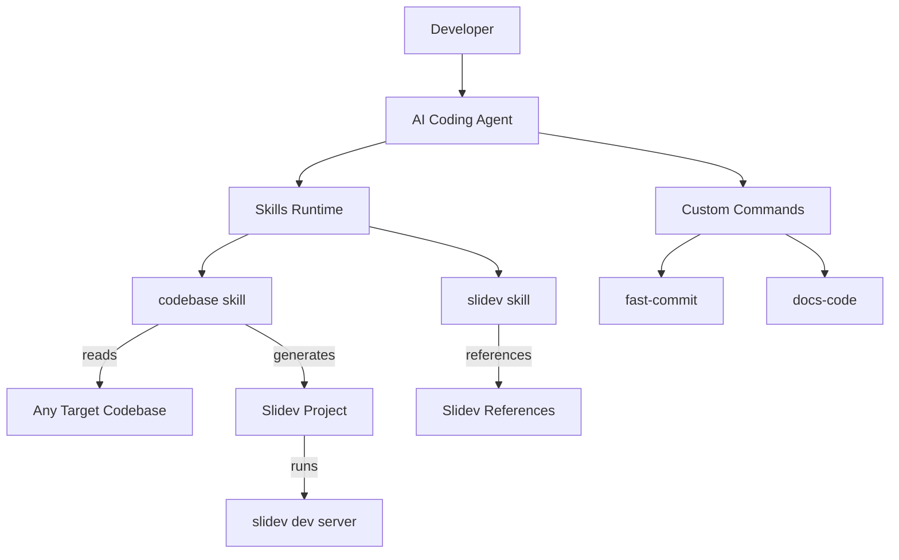
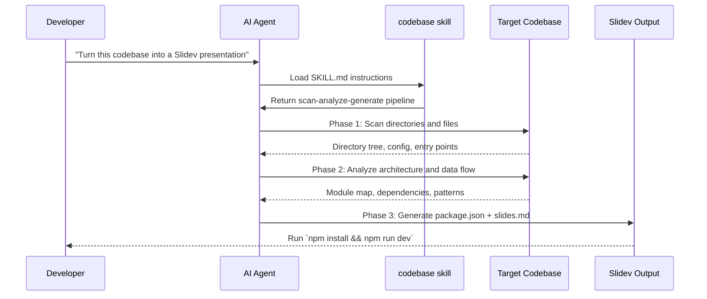
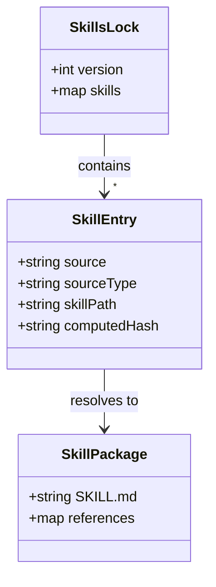

# Supermario

An AI coding agent skills framework for generating presentations and automating developer workflows

<div class="abs-br m-6 text-sm opacity-50">
  Markdown · Skill-driven
</div>

---

# What Is Supermario?

- **Problem it solves** — Provides reusable, prompt-driven skills that teach AI coding agents how to analyze codebases and generate Slidev presentations
- **Who uses it** — Developers working with OpenCode, Claude Code, or similar AI agents who want automated documentation and code walkthroughs
- **Key capability** — A zero-code skill architecture: SKILL.md prompt files + reference templates produce complete runnable Slidev projects from any codebase

---

# Tech Stack

- **Language:** Markdown (SKILL.md prompts), JSON (config)
- **Framework:** OpenCode / Claude Code skill system
- **Presentation:** Slidev (Vite + Vue + Markdown)
- **Diagrams:** Mermaid (embedded in slides)

::right::

# Key Dependencies

- `@slidev/cli` — Slidev CLI for dev server, build, and PDF export
- `@slidev/theme-default` — Default visual theme for generated presentations
- `@opencode-ai/plugin` — OpenCode agent plugin runtime
- Mermaid — Diagram engine embedded in Slidev slides

---

# Project Structure

```
supermario/
├── .agents/skills/    # Installed skills (slidev, codebase)
├── .opencode/         # OpenCode config + custom commands
├── docs/superpowers/  # Plans and design specs
├── skills/            # Skill source (codebase skill)
└── skills-lock.json   # Locked skill versions
```

::right::

# Key Directories

- **`.agents/skills/`** — Installed skill packages with SKILL.md + references
- **`.opencode/commands/`** — Custom slash-commands for the OpenCode agent
- **`skills/`** — Source skill definitions to be installed into agents
- **`docs/superpowers/`** — Implementation plans and design specifications

---

# System Architecture



<!-- The architecture is plugin-based. Skills are pure Markdown prompts (SKILL.md) that instruct the AI agent how to perform complex multi-step tasks. The codebase skill scans any target codebase and generates a Slidev project. The slidev skill provides syntax references for Slidev features. -->

---

# codebase Skill — Scan Analyze Generate

**Purpose:** Analyzes any codebase and produces a complete, runnable Slidev presentation with architecture diagrams, Mermaid flow charts, and code walkthroughs.

**Key concepts:**
- Three-phase pipeline: **Scan → Analyze → Generate**
- Pure prompt-driven — no executable code
- Copies `references/package.json` template to output
- Enforces real code snippets from actual files

::right::

```markdown filename="skills/codebase/SKILL.md"
## Phase 1: Scan

Before generating anything, thoroughly explore the codebase:

1. **Directory structure** — Read the root directory
2. **Entry files** — Find main.*, index.*, app.*
3. **Config files** — Read package.json, go.mod, etc.
4. **Routing** — Find route definitions
5. **Framework detection** — Identify language/framework
6. **Core modules** — Identify 3-8 most important dirs
```

---

# slidev Skill — Presentation References

**Purpose:** Provides the AI agent with complete Slidev syntax references so it can generate correct presentation code without guessing.

**Key files:**
- `SKILL.md` — Main skill entry point with feature index
- `references/` — 40+ reference files covering layouts, code highlighting, animations, diagrams, exporting, and more

**Key concepts:**
- Agents load references on-demand for specific features
- Covers: core syntax, headmatter, frontmatter, layouts, slots, Mermaid, animations, exporting

::right::

```markdown filename=".agents/skills/slidev/SKILL.md"
## Core References

| Topic | Reference |
|-------|-----------|
| Markdown Syntax | core-syntax |
| Headmatter | core-headmatter |
| Layouts | core-layouts |
| Layout Slots | layout-slots |
| Mermaid Diagrams | diagram-mermaid |
| Line Highlighting | code-line-highlighting |
| Exporting | core-exporting |
```

---

# Custom Commands — OpenCode Slash Commands

**Purpose:** Reusable prompt templates invoked via `/command` in the OpenCode agent interface.

**Key files:**
- `fast-commit.md` — Stages all changes, generates 3 commit message candidates, auto-commits the best one
- `docs-code.md` — Two-phase module analysis and code annotation pipeline

**Key concepts:**
- Commands have YAML frontmatter (`description`, `agent`)
- They define structured multi-step agent workflows
- No executable code — purely prompt-driven like skills

::right::

```markdown filename=".opencode/commands/fast-commit.md"
---
description: Stage all changes and commit with auto-selected message
agent: build
---
Stage ALL changes (untracked, modified, deleted) with `git add -A`.

Analyze the diff, then generate exactly 3 commit message
candidates. Each candidate must have a **title** (<=50 chars)
and a **body** (wrapped at 72 chars, explains why).

Pick the most appropriate one yourself (do NOT ask the user),
then commit with it immediately.
```

---

# Skill Lifecycle — From Source to Presentation



**Flow:**
1. Developer triggers the codebase skill via natural language
2. Agent loads the SKILL.md instructions and begins scanning
3. Three-phase pipeline produces a complete Slidev project
4. Developer runs the output and gets interactive slides

<!-- This is the primary user-facing flow. The key insight is that the skill is purely prompt-driven — there's no build step, no compilation. The AI agent reads the skill prompt and executes the pipeline using its own tools (file reading, glob, grep). -->

---

# Code Walkthrough: Skill Frontmatter

```yaml filename="skills/codebase/SKILL.md"
---
name: codebase
description: Analyze any codebase and generate a complete Slidev presentation with architecture diagrams, Mermaid flow charts, code walkthroughs, and extension guides.
---
```

Every skill starts with YAML frontmatter declaring its `name` and `description`. The skill registry uses these to match user intent to the right skill. The description contains trigger phrases that the agent matches against user requests like "turn this codebase into a Slidev presentation."

---

# Data Model: Skills Lock File



The `skills-lock.json` tracks installed skills with their source, type, and content hash. Each entry points to a skill directory containing a `SKILL.md` and optional `references/` folder with template files.

---

# How to Extend

**Add a new skill:**
1. Create `skills/<name>/SKILL.md` with YAML frontmatter (`name`, `description`)
2. Add optional `references/` directory with template files
3. Register the skill in `skills-lock.json`

**Add a new OpenCode command:**
1. Create `.opencode/commands/<name>.md` with YAML frontmatter (`description`, `agent`)
2. Write the prompt instructions in Markdown body
3. Invoke via `/<name>` in the OpenCode interface

::right::

```json filename="skills-lock.json"
{
  "version": 1,
  "skills": {
    "slidev": {
      "source": "slidevjs/slidev",
      "sourceType": "github",
      "skillPath": "skills/slidev/SKILL.md",
      "computedHash": "a495cfada5d3b29c..."
    }
  }
}
```

---

# Key Takeaways

- **Pure prompt architecture** — Skills are Markdown SKILL.md files with zero executable code; the AI agent is the runtime
- **Plugin ecosystem** — Skills install via `skills-lock.json` and compose together (codebase skill uses slidev skill references)
- **Multi-agent support** — Works across OpenCode, Claude Code, and any agent that supports the skill convention

<div class="abs-bl m-6 text-sm opacity-50">
  Supermario · Markdown · Skill-driven
</div>
