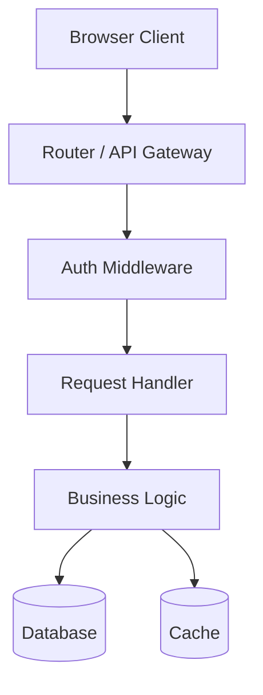
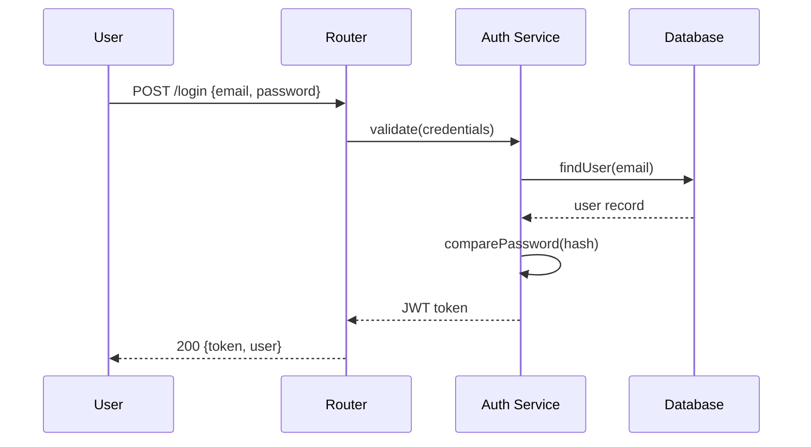
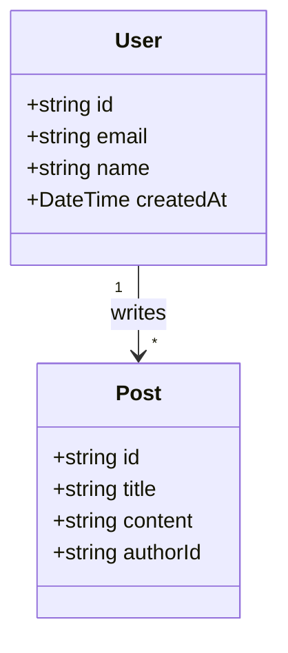
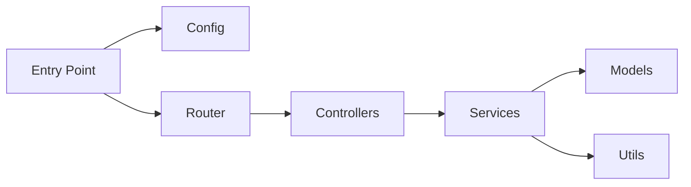
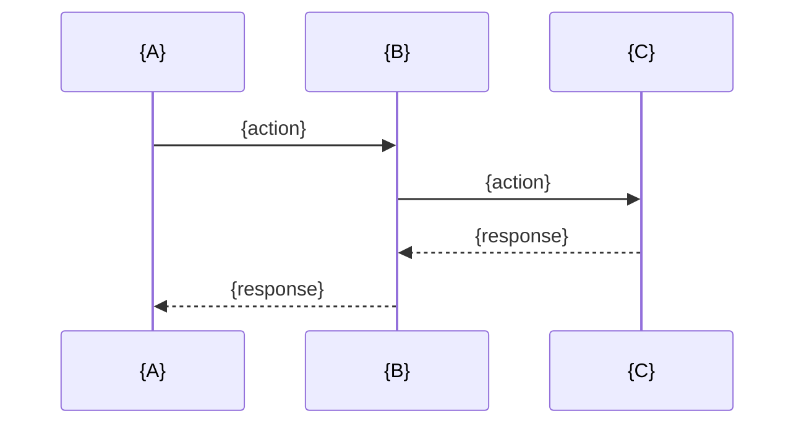

# Codebase to Slidev Implementation Plan

> **For agentic workers:** REQUIRED SUB-SKILL: Use superpowers:subagent-driven-development (recommended) or superpowers:executing-plans to implement this plan task-by-task. Steps use checkbox (`- [ ]`) syntax for tracking.

**Goal:** Build a Claude Code Skill that analyzes any codebase and generates a complete, runnable Slidev presentation project with architecture diagrams, flow charts, and code walkthroughs.

**Architecture:** Pure prompt-driven skill (SKILL.md) backed by reference template files (package.json, config examples, layout examples). No executable code — the skill instructs Claude to scan, analyze, and generate a Slidev project. Pre-configured template files ensure `npm install && npm run dev` works immediately.

**Tech Stack:** Claude Code Skill format, Slidev, Mermaid, Markdown

---

## File Structure

```
codebase-to-slidev/
├── SKILL.md                              # Core skill — analysis + generation instructions
└── references/
    ├── package.json                      # Pre-configured Slidev project dependencies
    ├── slidev-config-example.md          # Slidev frontmatter/config reference
    └── layout-examples.md                # Slidev layout patterns with Mermaid examples
```

All files are created in the skill directory. The skill is designed to be installed at `~/.claude/skills/codebase-to-slidev/`.

---

### Task 1: Create Skill Directory Structure

**Files:**
- Create: `codebase-to-slidev/SKILL.md` (empty placeholder)
- Create: `codebase-to-slidev/references/package.json` (empty placeholder)
- Create: `codebase-to-slidev/references/slidev-config-example.md` (empty placeholder)
- Create: `codebase-to-slidev/references/layout-examples.md` (empty placeholder)

- [ ] **Step 1: Create directory structure**

```bash
mkdir -p codebase-to-slidev/references
touch codebase-to-slidev/SKILL.md
touch codebase-to-slidev/references/package.json
touch codebase-to-slidev/references/slidev-config-example.md
touch codebase-to-slidev/references/layout-examples.md
```

- [ ] **Step 2: Verify structure**

Run: `find codebase-to-slidev -type f | sort`
Expected:
```
codebase-to-slidev/SKILL.md
codebase-to-slidev/references/layout-examples.md
codebase-to-slidev/references/package.json
codebase-to-slidev/references/slidev-config-example.md
```

- [ ] **Step 3: Commit**

```bash
git add codebase-to-slidev/
git commit -m "chore: scaffold codebase-to-slidev skill directory"
```

---

### Task 2: Create references/package.json

**Files:**
- Create: `codebase-to-slidev/references/package.json`

This is the template `package.json` that the skill copies to the output directory. It must include all Slidev dependencies and scripts so the user can run `npm install && npm run dev` immediately.

- [ ] **Step 1: Write package.json**

```json
{
  "name": "project-slides",
  "version": "1.0.0",
  "private": true,
  "scripts": {
    "dev": "slidev",
    "build": "slidev build",
    "export": "slidev export"
  },
  "dependencies": {
    "@slidev/cli": "^51.0.0",
    "@slidev/theme-default": "latest"
  }
}
```

- [ ] **Step 2: Validate JSON**

Run: `python3 -c "import json; json.load(open('codebase-to-slidev/references/package.json'))"` 
Expected: No output (valid JSON)

- [ ] **Step 3: Commit**

```bash
git add codebase-to-slidev/references/package.json
git commit -m "feat: add Slidev package.json template with dependencies"
```

---

### Task 3: Create references/slidev-config-example.md

**Files:**
- Create: `codebase-to-slidev/references/slidev-config-example.md`

This file documents all Slidev configuration options so the skill can reference them when generating the frontmatter of `slides.md` or a `slidev.config.yml`.

- [ ] **Step 1: Write config reference**

```markdown
# Slidev Configuration Reference

## Frontmatter (in slides.md)

```yaml
---
theme: default
title: Project Name - Architecture Overview
info: |
  Generated presentation explaining the codebase architecture
  and core workflows.
class: text-center
drawings:
  persist: false
transition: slide-left
mdc: true
---
```

## Common Options

| Option | Values | Description |
|--------|--------|-------------|
| `theme` | `default`, `seriph`, `apple-basic`, `bricks` | Visual theme |
| `title` | string | Presentation title (shown in browser tab) |
| `info` | string | Presentation description |
| `class` | `text-center`, `text-left` | Default text alignment |
| `drawings.persist` | `true`, `false` | Persist whiteboard drawings |
| `transition` | `slide-left`, `fade`, `slide-up`, `slide-down` | Slide transition |
| `mdc` | `true`, `false` | Enable Markdown Decorators |
| `exportFilename` | string | PDF export filename |
| `download` | `true`, `false` | Allow PDF download in SPA mode |
| `lineNumbers` | `true`, `false` | Show line numbers in code blocks |

## Speaker Notes

Add notes to any slide using the `<!-- -->` comment syntax:

```markdown
---
layout: default
---

# My Slide

Content here

<!-- This is a speaker note, only visible in presenter mode -->
```

## Per-Slide Overrides

Each slide can override global settings in its own frontmatter:

```markdown
---
layout: two-cols
transition: fade
class: text-center
---
```

## Custom CSS

Add global styles in the frontmatter:

```yaml
---
css: unocss
---
```

Or use inline `<style>` blocks within slides.
```

- [ ] **Step 2: Verify file is readable**

Run: `wc -l codebase-to-slidev/references/slidev-config-example.md`
Expected: ~70 lines

- [ ] **Step 3: Commit**

```bash
git add codebase-to-slidev/references/slidev-config-example.md
git commit -m "feat: add Slidev configuration reference for skill"
```

---

### Task 4: Create references/layout-examples.md

**Files:**
- Create: `codebase-to-slidev/references/layout-examples.md`

This file shows every Slidev layout the skill should use, with complete Markdown examples including Mermaid diagrams. The skill references this to produce correctly-formatted slides.

- [ ] **Step 1: Write layout examples**

```markdown
# Slidev Layout Examples

## Cover Layout

Use for the first slide (project title).

```markdown
---
layout: cover
---

# Project Name

One-line description of what the project does

<div class="abs-br m-6 text-sm">
  Generated by codebase-to-slidev
</div>
```

## Section Layout

Use for major section dividers (Architecture, Core Modules, etc.).

```markdown
---
layout: section
---

# Architecture Overview
```

## Default Layout

Standard content slide with title and body.

```markdown
---
layout: default
---

# What Does This Project Do?

- Bullet point one
- Bullet point two
- Key insight or takeaway
```

## Two Cols Layout

Side-by-side layout. Use for code + explanation pairs.

```markdown
---
layout: two-cols
---

<template v-slot:default>

# Module Name

- What this module does
- Why it exists
- Key responsibilities

</template>

<template v-slot:right>

```typescript
// Actual code from the codebase
export async function handler(req: Request) {
  const user = await authenticate(req)
  const data = await process(user)
  return response(data)
}
```

</template>
```

## Two Cols Header Layout

Two columns with a shared header. Good for "before/after" or "problem/solution".

```markdown
---
layout: two-cols-header
---

# How Authentication Works

::left::

**Step 1:** User sends credentials

```typescript
const token = await login(email, password)
```

::right::

**Step 2:** Server validates and returns JWT

```typescript
const payload = verify(token)
// { userId: 123, role: 'admin' }
```
```

## Center Layout

Centered content. Use for key facts or summary statements.

```markdown
---
layout: center
---

"Any sufficiently complex system can be understood by tracing its data flow."
```

## Fact Layout

Statistics or key metrics. Use for project overview facts.

```markdown
---
layout: fact
---

X core modules :: Y entry points :: Z dependencies
```

## Image Right Layout

Image/diagram on the right, text on the left.

```markdown
---
layout: image-right
image: /path/to/diagram.png
---

# Request Flow

When a user visits the homepage:

1. Request hits the router
2. Router dispatches to handler
3. Handler queries database
4. Response rendered and returned
```

## Mermaid Diagrams in Slides

### Architecture Diagram

```markdown
---
layout: default
---

# System Architecture


```

### Sequence Diagram (Request Trace)

```markdown
---
layout: default
---

# Request Lifecycle: User Login


```

### Class Diagram (Data Models)

```markdown
---
layout: default
---

# Data Models


```

### Flowchart (Module Dependencies)

```markdown
---
layout: default
---

# Module Dependencies


```

## Code Blocks with Highlighting

```markdown
---
layout: default
---

# Key Function

```typescript {2,5-7} filename="src/auth/login.ts"
export async function login(email: string, password: string) {
  const user = await db.users.findByEmail(email)     // highlighted
  if (!user) throw new AuthError('Not found')

  const valid = await compare(password, user.hash)
  if (!valid) throw new AuthError('Invalid password')  // highlighted
                                                        // highlighted
  return generateToken(user)                           // highlighted
}
```

Lines 2 and 5-7 are highlighted.
```

## Speaker Notes Pattern

Always add speaker notes to complex slides:

```markdown
---
layout: default
---

# Architecture


<!-- Speaker note: This diagram shows the high-level flow. The key thing to notice is that all requests go through the auth middleware before reaching handlers. -->
```
```

- [ ] **Step 2: Verify file is readable**

Run: `wc -l codebase-to-slidev/references/layout-examples.md`
Expected: ~200 lines

- [ ] **Step 3: Commit**

```bash
git add codebase-to-slidev/references/layout-examples.md
git commit -m "feat: add Slidev layout and Mermaid diagram examples"
```

---

### Task 5: Create SKILL.md

**Files:**
- Create: `codebase-to-slidev/SKILL.md`

This is the core skill file — the main prompt that drives Claude's behavior. It defines the three-phase process (Scan → Analyze → Generate), the output structure, and all rules for generating the Slidev project.

- [ ] **Step 1: Write SKILL.md**

```markdown
# Codebase to Slidev Skill

You are a presentation generator. Your job is to read a codebase, understand its architecture and workflows, and produce a complete Slidev presentation project that teaches others how the codebase works.

## Trigger Phrases

- "Turn this codebase into a Slidev presentation"
- "Generate a Slidev deck from this project"
- "Make a presentation about this codebase"
- "Create a Slidev walkthrough for this project"
- "Turn this into a slide deck"

## Language Detection

If the user specifies a language (e.g. "in Chinese", "en español", "in Japanese"), use that language for all slide content. Default is English.

Code snippets always keep their original comments and variable names regardless of language setting.

## Phase 1: Scan

Before generating anything, thoroughly explore the codebase:

1. **Directory structure** — Read the root directory, identify top-level folders and their purpose
2. **Entry files** — Find `main.*`, `index.*`, `app.*`, `server.*`, `cmd/`, or framework-specific entry points
3. **Config files** — Read `package.json`, `go.mod`, `Cargo.toml`, `pyproject.toml`, `pom.xml`, `Makefile`, `docker-compose.yml`, or equivalent
4. **Routing** — Find route definitions, API endpoints, or URL mappings
5. **Framework detection** — Identify the language, framework, and runtime from config and imports
6. **Core modules** — Identify the 3-8 most important source directories/files

Use Glob and Grep tools extensively. Read key files to understand their purpose. Do NOT guess — read actual code.

## Phase 2: Analyze

Based on the scan results:

1. **Architecture pattern** — Determine if the project is MVC, microservices, monolith, serverless, event-driven, etc.
2. **Data flow** — Trace the primary request path from entry to response
3. **Module dependencies** — Map how modules depend on each other
4. **Data models** — Identify database schemas, type definitions, or data structures
5. **Key abstractions** — Find interfaces, base classes, or core types that define the system's vocabulary

## Phase 3: Generate

Create the Slidev project in the current directory as `<project-name>-slides/`.

### Step 3.1: Create output directory

```
mkdir <project-name>-slides
```

### Step 3.2: Copy and customize package.json

Read `references/package.json` from this skill directory. Copy it to the output directory. Replace `"project-slides"` with the actual project name.

### Step 3.3: Generate slides.md

This is the main output. Follow the structure below exactly. Use Slidev layouts as specified. Use Mermaid for all diagrams.

#### Slide Structure (mandatory, in order)

**Slide 1: Cover**

```markdown
---
layout: cover
---

# {Project Name}

{One-line description of what the project does}

<div class="abs-br m-6 text-sm opacity-50">
  {Language / Framework} · Generated {date}
</div>
```

**Slide 2: Overview**

```markdown
---
layout: default
---

# What Is {Project Name}?

- {Problem it solves — one sentence}
- {Who uses it — one sentence}
- {Key capability — one sentence}
```

**Slide 3: Tech Stack**

```markdown
---
layout: two-cols
---

<template v-slot:default>

# Tech Stack

- **Language:** {language + version}
- **Framework:** {framework}
- **Database:** {database if any}
- **Runtime:** {Node/Go/Python/Java version}

</template>

<template v-slot:right>

# Key Dependencies

- `{dep1}` — {what it does}
- `{dep2}` — {what it does}
- `{dep3}` — {what it does}

</template>
```

**Slide 4: Directory Structure**

```markdown
---
layout: two-cols
---

<template v-slot:default>

# Project Structure

```
{project-name}/
├── {dir1}/       # {purpose}
├── {dir2}/       # {purpose}
├── {file1}       # {purpose}
└── {file2}       # {purpose}
```

</template>

<template v-slot:right>

# Key Directories

- **`{dir1}/`** — {2-3 word description}
- **`{dir2}/`** — {2-3 word description}

</template>
```

**Slide 5: Architecture Overview**

```markdown
---
layout: default
---

# System Architecture

```mermaid
graph TB
    {components and their connections}
```

<!-- Brief speaker note about the overall architecture -->
```

Use `graph TB` (top-to-bottom) for architecture diagrams. Use meaningful node labels. Group related components with subgraphs if the system is complex.

**Slides 6-N: Core Modules**

One slide (or slide pair) per major module. Use `two-cols` layout:

```markdown
---
layout: two-cols
---

<template v-slot:default>

# {Module Name}

**Purpose:** {one sentence}

**Key files:**
- `{file1}` — {what it does}
- `{file2}` — {what it does}

**Key concepts:**
- {concept 1}
- {concept 2}

</template>

<template v-slot:right>

```{language}
// Exact code from the actual codebase
{8-15 lines of the most important code in this module}
```

</template>
```

Rules for module slides:
- Code must be exact copies from real files — never modify or simplify
- Keep code snippets to 8-15 lines — use `{startLine}-{endLine}` to highlight key lines
- Add `filename="{path}"` to every code block
- If a module is complex, use two slides: one for the Mermaid diagram, one for the code

**Slide N+1: Request Trace (main flow)**

```markdown
---
layout: default
---

# Request Trace: {Scenario Name}



**Flow:**
1. {Step 1 description}
2. {Step 2 description}
3. {Step 3 description}

<!-- Speaker note explaining why this flow matters -->
```

Use `sequenceDiagram` for request traces. Pick the most important user-facing flow (e.g. "User logs in", "API request is processed", "Data is saved").

**Slide N+2: Request Trace Code Walkthrough**

```markdown
---
layout: default
---

# Code Walkthrough: {Scenario}

```{language} {highlight-lines} filename="{path}"
{actual code showing the request handler}
```

{2-3 sentences explaining what the code does in plain language}
```

**Slide N+3: Data Models** (if applicable)

```markdown
---
layout: default
---

# Data Models

```mermaid
classDiagram
    {class definitions and relationships}
```

{Brief explanation of key relationships}
```

If the project has no database or data models, skip this slide.

**Slide N+4: How to Extend**

```markdown
---
layout: two-cols
---

<template v-slot:default>

# How to Extend

**Add a new API endpoint:**
1. {step 1 — which file to modify}
2. {step 2 — what to add}
3. {step 3 — how to test}

**Add a new data model:**
1. {step 1}
2. {step 2}

</template>

<template v-slot:right>

```{language}
// Example: adding a new endpoint
{show the pattern with a concrete example}
```

</template>
```

**Slide N+5: Summary**

```markdown
---
layout: section
---

# Key Takeaways

- {Takeaway 1}
- {Takeaway 2}
- {Takeaway 3}

<div class="abs-bl m-6 text-sm opacity-50">
  {Project Name} · {Language/Framework}
</div>
```

### Step 3.4: Verify output

After generating `slides.md`, verify:
1. Every `---` separator is correct (each slide must start with `---`)
2. Every code block has a language identifier
3. Every Mermaid block has valid syntax
4. Every `two-cols` slide has both `<template v-slot:default>` and `<template v-slot:right>`
5. File paths in `filename=""` attributes match real files in the codebase

## Important Rules

1. **Real code only** — Never invent, simplify, or modify code. Copy exact snippets from actual files.
2. **Mermaid for every diagram** — Never use ASCII art or plain-text diagrams. Always use Mermaid.
3. **8-15 lines per code snippet** — If a function is longer, show only the most important part with a comment like `// ... (error handling omitted)`.
4. **Filename on every code block** — Always add `filename="path/to/file"` so the reader can find the source.
5. **Speaker notes on complex slides** — Add `<!-- speaker note -->` comments to slides with diagrams or complex flows.
6. **No more than 15 slides total** — Be selective. Cover the most important modules and flows. Quality over quantity.
7. **Check Mermaid syntax** — Ensure all Mermaid diagrams are valid before outputting. No unmatched brackets, missing semicolons in sequence diagrams, or invalid node shapes.

## References

When generating, consult these files in this skill directory:
- `references/package.json` — Copy to output, customize project name
- `references/slidev-config-example.md` — For frontmatter configuration options
- `references/layout-examples.md` — For correct layout syntax and Mermaid patterns
```

- [ ] **Step 2: Verify SKILL.md is complete**

Run: `wc -l codebase-to-slidev/SKILL.md`
Expected: ~250 lines

Run: `grep -c "```" codebase-to-slidev/SKILL.md`
Expected: Even number (all code blocks are closed)

- [ ] **Step 3: Commit**

```bash
git add codebase-to-slidev/SKILL.md
git commit -m "feat: add core SKILL.md with scan-analyze-generate instructions"
```

---

### Task 6: Manual Smoke Test

**Files:**
- No new files

Verify the skill works end-to-end by installing it and testing against a real project.

- [ ] **Step 1: Install skill locally**

```bash
cp -r codebase-to-slidev ~/.claude/skills/
```

- [ ] **Step 2: Verify skill files are in place**

Run: `ls -la ~/.claude/skills/codebase-to-slidev/ && ls -la ~/.claude/skills/codebase-to-slidev/references/`
Expected: `SKILL.md` plus 3 files in `references/`

- [ ] **Step 3: Verify package.json is valid**

Run: `python3 -c "import json; json.load(open('$HOME/.claude/skills/codebase-to-slidev/references/package.json'))"`
Expected: No output (valid JSON)

- [ ] **Step 4: Note for manual testing**

In a new Claude Code session, open any project and say:
> "Turn this codebase into a Slidev presentation"

Verify the output:
- `<project>-slides/` directory is created
- `package.json` exists and is valid
- `slides.md` exists and has proper `---` slide separators
- Mermaid diagrams are present and syntactically valid
- Code snippets reference real files from the project
- `npm install && npm run dev` starts the Slidev dev server

---

## Self-Review Checklist

- [x] Spec coverage: All spec sections map to tasks (directory structure → Task 1, package.json → Task 2, config reference → Task 3, layout examples → Task 4, SKILL.md → Task 5, verification → Task 6)
- [x] Placeholder scan: No TBD/TODO/placeholders — all code is complete
- [x] Type consistency: All file paths and references are consistent across tasks
