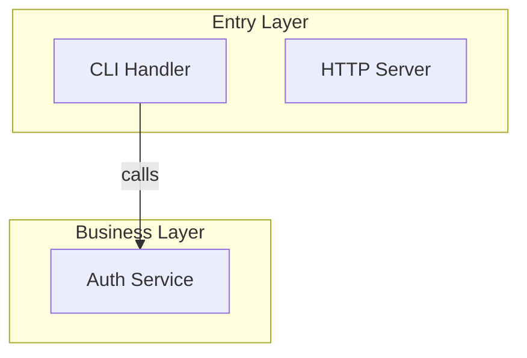

# Mermaid Course Essay Redesign Implementation Plan

> **For agentic workers:** REQUIRED SUB-SKILL: Use superpowers:subagent-driven-development (recommended) or superpowers:executing-plans to implement this plan task-by-task. Steps use checkbox (`- [ ]`) syntax for tracking.

**Goal:** Replace `codemermaid`'s click-explore template with a scrollable essay template (C′), driven by typed pedagogical units, with shared CSS/JS partials reused across index/perspective/module pages.

**Architecture:** Split the template source into composable partials (`_base.css`, `_essay.css`, `_index.css`, `_runtime.js`, `_essay.js`). Two shell templates (`template-essay.html`, `template-index.html`) declare slot markers (`{{COMMON_STYLES}}`, `{{PAGE_STYLES}}`, `{{COMMON_SCRIPTS}}`, `{{PAGE_SCRIPTS}}`) which Phase 6 fills by inlining partials. Each emitted HTML stays self-contained. A `validate-units.js` script enforces pedagogy rules. The reference implementation already exists at `docs/codebase-demo-mermaid-essay.html` — the templates are productized forks of it.

**Tech Stack:** Vanilla JS (no React, no build tools), Mermaid 10 via CDN, Raycast dark theme tokens, Node.js (for validator script).

**Spec:** `docs/superpowers/specs/2026-05-03-codemermaid-essay-design.md`
**Reference implementation:** `docs/codebase-demo-mermaid-essay.html`

---

## File Structure

```
skills/codemermaid/
  SKILL.md                                # EDIT — Phase 3, 4, 6, Output, Common Mistakes
  references/
    design-system.md                      # unchanged
    template-course.html                  # DELETE
    template-index.html                   # MOVE to templates/, EDIT
    units-examples.md                     # NEW
    voice-examples.md                     # NEW
  templates/                              # NEW dir
    template-essay.html                   # NEW (shell with slot markers)
    template-index.html                   # MOVED from references/, EDIT
    partials/
      _base.css                           # NEW — tokens, typography, layout, hero
      _essay.css                          # NEW — anchor diagram, unit renderers, zoom overlay
      _index.css                          # NEW — card grid
      _runtime.js                         # NEW — Mermaid init, markdown link parser, helpers
      _essay.js                           # NEW — scroll-link, stepped-walk, zoom controls
      _index.js                           # NEW — (placeholder; may stay near-empty)
  scripts/
    validate-units.js                     # NEW — pedagogy enforcement validator
    validate-units.test.js                # NEW — Node built-in test runner
```

---

## Task 1: Scaffold templates/ and partials/ directories

**Files:**
- Create: `skills/codemermaid/templates/.gitkeep`
- Create: `skills/codemermaid/templates/partials/.gitkeep`
- Create: `skills/codemermaid/scripts/.gitkeep`

- [ ] **Step 1: Create directories**

```bash
mkdir -p skills/codemermaid/templates/partials skills/codemermaid/scripts
touch skills/codemermaid/templates/.gitkeep skills/codemermaid/templates/partials/.gitkeep skills/codemermaid/scripts/.gitkeep
```

- [ ] **Step 2: Verify**

```bash
ls -la skills/codemermaid/templates/partials/ skills/codemermaid/scripts/
```

Expected: each directory exists, contains a `.gitkeep`.

- [ ] **Step 3: Commit**

```bash
git add skills/codemermaid/templates/ skills/codemermaid/scripts/
git commit -m ":construction: feat(codemermaid): scaffold templates and scripts dirs"
```

---

## Task 2: Extract shared base CSS into `_base.css`

Source: `docs/codebase-demo-mermaid-essay.html` lines 10–554 contains all CSS. Identify the *shared* portion: CSS variables (`:root`), typography (`html`, `body`, headings), layout container, hero block, anchor chips, footer. These are reused across both essay and index pages.

**Files:**
- Create: `skills/codemermaid/templates/partials/_base.css`

- [ ] **Step 1: Read the demo CSS**

```bash
sed -n '10,554p' docs/codebase-demo-mermaid-essay.html > /tmp/demo-css.css
```

(Use the Read tool on the demo file in your editor — bash here is just for reference.)

- [ ] **Step 2: Create `_base.css` with the shared portion**

Include exactly these rule blocks from the demo:
- `:root { ... }` — design tokens (colors, fonts, shadows, spacing)
- `*, *::before, *::after { box-sizing: border-box; }` and global resets
- `html, body` typography (`font-family`, `letter-spacing`, `line-height`, `color`, `background`)
- Headings (`h1`–`h4`)
- Inline code, links
- `.container` (page width)
- `.hero` block (title, learning promise, prereq chips)
- Footer / "next" link styling
- `.badge` and other tag pills

Do NOT include in this file:
- Anchor diagram styles (`.anchor`, `.mermaid` overrides) → goes to `_essay.css`
- Unit-renderer styles (`.unit-*`, `.code-walk`, `.split`, `.stepped`) → goes to `_essay.css`
- Zoom overlay (`.zoom-overlay`, `.zoom-stage`, `.zoom-controls`) → goes to `_essay.css`
- Card grid (`.card`, `.card-grid`) → goes to `_index.css`

- [ ] **Step 3: Verify the file is self-contained**

Open it in a browser test page (you can use a tiny `<style>@import url('_base.css')</style>` HTML in a scratch dir, or just paste into devtools). Verify:
- No undefined CSS variables.
- No selectors referencing classes that only exist in `_essay.css` or `_index.css`.

- [ ] **Step 4: Commit**

```bash
git add skills/codemermaid/templates/partials/_base.css
git commit -m ":sparkles: feat(codemermaid): extract shared base CSS partial"
```

---

## Task 3: Extract essay-specific CSS into `_essay.css`

**Files:**
- Create: `skills/codemermaid/templates/partials/_essay.css`

- [ ] **Step 1: Create `_essay.css` with essay-only rules**

From the demo CSS (lines 10–554), include:
- Anchor diagram block: `.anchor`, `.anchor svg`, `.anchor-node-active` (the `#FF6363` accent fill)
- Mermaid SVG defaults: `.mermaid svg { max-width: 100%; }` and node/edge color overrides
- Unit container shells: `.unit`, `.unit + .unit { margin-top: ... }`
- Per-kind: `.unit-concept`, `.unit-code-walk`, `.unit-guess-first` (collapsed/expanded), `.unit-compare`, `.unit-surprise` (the callout box), `.unit-takeaway`, `.unit-diagram`
- Code-walk layouts: `.layout-stacked` (default), `.layout-split` (sticky code + side prose, with `.wide` breakout), `.layout-stepped` (sticky code + scrolling beats)
- Stepped walk active-step state: `.step.active`, the highlight migration on the sticky code
- `.wide` breakout container (the `width: min(1100px, calc(100vw - 64px)); position: relative; left: 50%; transform: translateX(-50%)` pattern)
- Zoom overlay: `.zoom-overlay`, `.zoom-overlay.open`, `.zoom-stage` (with `transform-origin: center center`, NO `will-change`), `.zoom-controls`, `.zoom-svg-fix` (`shape-rendering: geometricPrecision; text-rendering: geometricPrecision; max-width: none !important`)
- Responsive breakpoint: `@media (max-width: 880px) { .layout-split, .layout-stepped { /* collapse to stacked */ } }`

- [ ] **Step 2: Verify no overlap with `_base.css`**

```bash
# Quick sanity check — no rule should exist in both files
diff <(grep -oE '^\.[a-z][a-zA-Z0-9_-]+' skills/codemermaid/templates/partials/_base.css | sort -u) \
     <(grep -oE '^\.[a-z][a-zA-Z0-9_-]+' skills/codemermaid/templates/partials/_essay.css | sort -u)
```

Expected: every selector appears in exactly one file.

- [ ] **Step 3: Commit**

```bash
git add skills/codemermaid/templates/partials/_essay.css
git commit -m ":sparkles: feat(codemermaid): extract essay-specific CSS partial"
```

---

## Task 4: Create `_index.css` for card grid

**Files:**
- Create: `skills/codemermaid/templates/partials/_index.css`

- [ ] **Step 1: Read existing index template CSS**

Use the Read tool on `skills/codemermaid/references/template-index.html`. Extract the `<style>` block.

- [ ] **Step 2: Create `_index.css` with index-only rules**

Include:
- `.card-grid` — CSS grid layout with responsive minmax columns
- `.card` — card shell (background, border, padding, hover state with multi-layer shadow)
- `.card-title`, `.card-description`, `.card-meta` (where `unitCount` is displayed)
- `.section-heading` if present in current template

Drop any rules that duplicate `_base.css` (typography, container, hero).

- [ ] **Step 3: Commit**

```bash
git add skills/codemermaid/templates/partials/_index.css
git commit -m ":sparkles: feat(codemermaid): extract index card-grid CSS partial"
```

---

## Task 5: Extract shared runtime JS into `_runtime.js`

Source: `docs/codebase-demo-mermaid-essay.html` lines 756–971 contains all JS.

**Files:**
- Create: `skills/codemermaid/templates/partials/_runtime.js`

- [ ] **Step 1: Create `_runtime.js` with shared helpers**

Include exactly these pieces from the demo JS (lines 756–971):

1. **Mermaid init**:

```javascript
mermaid.initialize({
  startOnLoad: false,
  theme: 'base',
  themeVariables: {
    primaryColor: '#0c0d10',
    primaryTextColor: '#e6e6e6',
    primaryBorderColor: '#26282d',
    lineColor: '#7a7d85',
    fontFamily: 'Inter, system-ui, sans-serif',
  },
});

async function renderMermaid(selector) {
  const nodes = document.querySelectorAll(selector);
  for (const node of nodes) {
    const id = 'm' + Math.random().toString(36).slice(2);
    const { svg } = await mermaid.render(id, node.textContent.trim());
    node.innerHTML = svg;
  }
}
```

2. **Markdown link parser** (used by `concept`, `surprise`, `takeaway` body fields and `PERSPECTIVE` cross-module links):

```javascript
function renderMarkdownLinks(text) {
  // [label](href) → <a href="href">label</a>
  return text.replace(/\[([^\]]+)\]\(([^)]+)\)/g, (_, label, href) =>
    `<a href="${href}">${label}</a>`);
}
```

3. **Code-block escaper**:

```javascript
function escapeHtml(s) {
  return s.replace(/&/g, '&amp;').replace(/</g, '&lt;').replace(/>/g, '&gt;');
}
```

4. **Highlight-line renderer** (turns `code` + `highlightLines` into `<pre>` with per-line classes):

```javascript
function renderCode(code, highlightLines = []) {
  const lines = code.split('\n');
  const set = new Set(highlightLines);
  return '<pre class="code-block">' + lines.map((line, i) => {
    const n = i + 1;
    const cls = set.has(n) ? 'line line-hl' : 'line';
    return `<span class="${cls}" data-line="${n}">${escapeHtml(line) || ' '}</span>`;
  }).join('\n') + '</pre>';
}
```

Do NOT include in this file:
- Scroll-link / IntersectionObserver logic → `_essay.js`
- Stepped-walk active-step tracking → `_essay.js`
- Zoom overlay open/close/wheel/pan → `_essay.js`
- `renderUnit` dispatcher → `_essay.js` (essay-specific)

- [ ] **Step 2: Smoke-test in a scratch HTML**

Create `/tmp/runtime-smoke.html` that loads `_runtime.js`, calls `renderMarkdownLinks("[a](b) and [c](d)")`, calls `renderCode("foo\nbar\nbaz", [2])`, and prints results to the page. Open it. Verify no console errors and outputs match.

- [ ] **Step 3: Commit**

```bash
git add skills/codemermaid/templates/partials/_runtime.js
git commit -m ":sparkles: feat(codemermaid): extract shared runtime JS partial"
```

---

## Task 6: Extract essay-specific JS into `_essay.js`

**Files:**
- Create: `skills/codemermaid/templates/partials/_essay.js`

- [ ] **Step 1: Create `_essay.js` with essay runtime**

Include exactly these from the demo JS (lines 756–971):

1. **`renderUnit(unit)` dispatcher** — switch on `unit.kind`, return HTML for each of `concept`, `code-walk`, `guess-first`, `compare`, `surprise`, `takeaway`, `diagram`. Honors `code-walk.layout` (`stacked` | `split` | `stepped`).

2. **Page bootstrap**:

```javascript
async function bootEssay(page) {
  // page = { learningPromise, prereqs, diagram?, units }
  document.querySelector('.units').innerHTML =
    page.units.map((u, i) => `<section class="unit unit-${u.kind}" data-unit-index="${i}" ${u.anchorNode ? `data-anchor-node="${u.anchorNode}"` : ''}>${renderUnit(u)}</section>`).join('');

  if (page.diagram) {
    document.querySelector('.anchor .mermaid').textContent = page.diagram;
    await renderMermaid('.anchor .mermaid');
    initAnchorScrollLink();
  }
  await renderMermaid('.unit-diagram .mermaid');
  initSteppedWalks();
  initZoomOverlay();
}
```

3. **`initAnchorScrollLink()`** — rAF loop polling `getBoundingClientRect()` of every `[data-anchor-node]` unit, finds the one nearest viewport center, applies `.anchor-node-active` to the matching SVG node. Tap on diagram node → smooth-scroll to bound unit.

4. **`initSteppedWalks()`** — for each `.layout-stepped`, rAF poll the `.step` nearest viewport center, swap `.line-hl` classes on the sticky code block to match `step.highlightLines`. Click on `.step` smooth-scrolls and centers it.

5. **`initZoomOverlay()`** — wires the "Zoom" button on every `.unit-diagram[data-zoomable="true"]`. Implements:
   - `openZoom(svg)`: clones SVG, sets explicit `width`/`height` attributes from `getBoundingClientRect()`, appends to `.zoom-stage`, resets transform, opens overlay, locks body scroll.
   - Wheel zoom anchored from center: see spec / demo lines for exact math (`cxFromCenter`, `cyFromCenter`, `factor = e.deltaY < 0 ? 1.12 : 1/1.12`, `ratio = newScale / scale`).
   - Drag-pan, +/− buttons, reset, Esc/backdrop close.

(Copy these blocks verbatim from `docs/codebase-demo-mermaid-essay.html` — they're already debugged.)

- [ ] **Step 2: Smoke-test by stitching together a one-off HTML**

Create `/tmp/essay-smoke.html` that inlines `_base.css`, `_essay.css`, `_runtime.js`, `_essay.js`, calls `bootEssay({ ... })` with a minimal page (one unit of each kind, anchor diagram with 3 nodes, one zoomable diagram unit, one stepped code-walk). Open it. Verify in browser:
- All 7 unit kinds render.
- Anchor diagram active-node highlight migrates as you scroll.
- Stepped walk highlight migrates as you scroll.
- Zoom button opens the overlay; wheel-zoom is crisp (no blur); Esc closes.

If any of these fail, fix in `_essay.js` (or `_essay.css`) until smoke passes. The demo is the working baseline — divergence means a port bug.

- [ ] **Step 3: Commit**

```bash
git add skills/codemermaid/templates/partials/_essay.js
git commit -m ":sparkles: feat(codemermaid): extract essay-specific JS partial"
```

---

## Task 7: Create empty `_index.js` placeholder

**Files:**
- Create: `skills/codemermaid/templates/partials/_index.js`

- [ ] **Step 1: Create `_index.js`**

```javascript
// Index page runtime. Currently no behavior beyond static rendering.
// Placeholder so Phase 6 can uniformly inject {{PAGE_SCRIPTS}} for every shell.
```

- [ ] **Step 2: Commit**

```bash
git add skills/codemermaid/templates/partials/_index.js
git commit -m ":sparkles: feat(codemermaid): add _index.js placeholder"
```

---

## Task 8: Build `template-essay.html` shell

**Files:**
- Create: `skills/codemermaid/templates/template-essay.html`

- [ ] **Step 1: Create the shell**

```html
<!DOCTYPE html>
<html lang="en">
<head>
<meta charset="UTF-8">
<meta name="viewport" content="width=device-width, initial-scale=1.0">
<title>{{PAGE_TITLE}} — {{PROJECT_NAME}}</title>
<script src="https://cdn.jsdelivr.net/npm/mermaid@10/dist/mermaid.min.js"></script>
<style>
{{COMMON_STYLES}}
{{PAGE_STYLES}}
</style>
</head>
<body>
<header class="topbar">
  <a class="back-link" href="{{BACK_LINK}}">← {{BACK_LABEL}}</a>
</header>

<main class="container">
  <section class="hero">
    <h1>{{PAGE_TITLE}}</h1>
    <p class="learning-promise">{{LEARNING_PROMISE}}</p>
    <ul class="prereqs">{{PREREQ_CHIPS}}</ul>
  </section>

  <section class="anchor">
    <div class="mermaid"></div>
  </section>

  <section class="units"></section>

  <footer class="page-footer">
    <a class="next-link" href="{{NEXT_LINK}}">{{NEXT_LABEL}} →</a>
    <p class="recap">{{LEARNING_PROMISE_RECAP}}</p>
  </footer>
</main>

<div class="zoom-overlay" hidden>
  <div class="zoom-stage"></div>
  <div class="zoom-controls">
    <button data-zoom-out>−</button>
    <button data-zoom-reset>Reset</button>
    <button data-zoom-in>+</button>
    <button data-zoom-close>Close</button>
  </div>
</div>

<script>
{{COMMON_SCRIPTS}}
{{PAGE_SCRIPTS}}

const PAGE = {{PAGE_DATA}};
bootEssay(PAGE);
</script>
</body>
</html>
```

- [ ] **Step 2: Verify slot markers**

```bash
grep -oE '\{\{[A-Z_]+\}\}' skills/codemermaid/templates/template-essay.html | sort -u
```

Expected output (exact list):
```
{{BACK_LABEL}}
{{BACK_LINK}}
{{COMMON_SCRIPTS}}
{{COMMON_STYLES}}
{{LEARNING_PROMISE}}
{{LEARNING_PROMISE_RECAP}}
{{NEXT_LABEL}}
{{NEXT_LINK}}
{{PAGE_DATA}}
{{PAGE_SCRIPTS}}
{{PAGE_STYLES}}
{{PAGE_TITLE}}
{{PREREQ_CHIPS}}
{{PROJECT_NAME}}
```

- [ ] **Step 3: Commit**

```bash
git add skills/codemermaid/templates/template-essay.html
git commit -m ":sparkles: feat(codemermaid): add template-essay.html shell"
```

---

## Task 9: Move and update `template-index.html`

**Files:**
- Move: `skills/codemermaid/references/template-index.html` → `skills/codemermaid/templates/template-index.html`
- Modify: `skills/codemermaid/templates/template-index.html`

- [ ] **Step 1: Move the file with git**

```bash
git mv skills/codemermaid/references/template-index.html skills/codemermaid/templates/template-index.html
```

- [ ] **Step 2: Edit it to use slot markers**

Replace its inline `<style>...</style>` with:

```html
<style>
{{COMMON_STYLES}}
{{PAGE_STYLES}}
</style>
```

Replace its inline `<script>...</script>` (the index runtime, if any) with:

```html
<script>
{{COMMON_SCRIPTS}}
{{PAGE_SCRIPTS}}

const INDEX = {{INDEX_DATA}};
renderIndex(INDEX);
</script>
```

Rename the data field `steps` → `unitCount` in the `INDEX` schema and in any rendering code that reads it (e.g., `card.steps` → `card.unitCount`). Update the card-meta string from `${m.steps} steps` to `${m.unitCount} units`.

Add `renderIndex(INDEX)` function inline (or move to `_index.js` if non-trivial — Task 7 leaves it empty so put it there if real logic).

- [ ] **Step 3: Verify slot markers**

```bash
grep -oE '\{\{[A-Z_]+\}\}' skills/codemermaid/templates/template-index.html | sort -u
```

Expected: `{{COMMON_SCRIPTS}}`, `{{COMMON_STYLES}}`, `{{INDEX_DATA}}`, `{{PAGE_SCRIPTS}}`, `{{PAGE_STYLES}}`, `{{PROJECT_NAME}}`, `{{PROJECT_DESCRIPTION}}`, `{{LANGUAGE}}`, `{{FRAMEWORK}}`.

- [ ] **Step 4: Commit**

```bash
git add skills/codemermaid/templates/template-index.html
git commit -m ":sparkles: feat(codemermaid): move and slot-ify template-index.html"
```

---

## Task 10: Delete `template-course.html`

**Files:**
- Delete: `skills/codemermaid/references/template-course.html`

- [ ] **Step 1: Verify nothing else in the skill references it**

```bash
grep -rn "template-course" skills/codemermaid/
```

Expected: only matches will be in `SKILL.md` (which we rewrite in Task 16) and the file itself.

- [ ] **Step 2: Remove**

```bash
git rm skills/codemermaid/references/template-course.html
```

- [ ] **Step 3: Commit**

```bash
git commit -m ":fire: feat(codemermaid): drop deprecated template-course.html"
```

---

## Task 11: Write `validate-units.js` — failing tests first (TDD)

**Files:**
- Create: `skills/codemermaid/scripts/validate-units.test.js`

- [ ] **Step 1: Write the failing tests**

```javascript
// skills/codemermaid/scripts/validate-units.test.js
import { test } from 'node:test';
import assert from 'node:assert/strict';
import { validateModule, validatePerspective } from './validate-units.js';

test('module: missing learningPromise fails', () => {
  const result = validateModule({ module: 'a', units: [{ kind: 'concept', body: 'x' }, { kind: 'takeaway', body: 'y' }] });
  assert.equal(result.ok, false);
  assert.match(result.errors.join('\n'), /learningPromise/);
});

test('module: missing guess-first AND surprise fails', () => {
  const result = validateModule({
    module: 'a',
    learningPromise: 'p',
    units: [{ kind: 'concept', body: 'x' }, { kind: 'takeaway', body: 'y' }],
  });
  assert.equal(result.ok, false);
  assert.match(result.errors.join('\n'), /guess-first.*surprise|surprise.*guess-first/);
});

test('module: missing trailing takeaway fails', () => {
  const result = validateModule({
    module: 'a',
    learningPromise: 'p',
    units: [{ kind: 'concept', body: 'x' }, { kind: 'surprise', body: 's' }],
  });
  assert.equal(result.ok, false);
  assert.match(result.errors.join('\n'), /takeaway/);
});

test('module: more than one stepped code-walk fails', () => {
  const result = validateModule({
    module: 'a',
    learningPromise: 'p',
    units: [
      { kind: 'concept', body: 'x' },
      { kind: 'code-walk', layout: 'stepped', steps: [] },
      { kind: 'code-walk', layout: 'stepped', steps: [] },
      { kind: 'surprise', body: 's' },
      { kind: 'takeaway', body: 't' },
    ],
  });
  assert.equal(result.ok, false);
  assert.match(result.errors.join('\n'), /stepped/);
});

test('module: more than 10 units fails', () => {
  const units = Array.from({ length: 11 }, (_, i) => ({ kind: 'concept', body: 'x' + i }));
  units[units.length - 1] = { kind: 'takeaway', body: 't' };
  units[5] = { kind: 'surprise', body: 's' };
  const result = validateModule({ module: 'a', learningPromise: 'p', units });
  assert.equal(result.ok, false);
  assert.match(result.errors.join('\n'), /unit budget|10/);
});

test('module: valid passes', () => {
  const result = validateModule({
    module: 'a',
    learningPromise: 'p',
    units: [
      { kind: 'concept', body: 'x' },
      { kind: 'guess-first', question: 'q', reveal: { explanation: 'e' } },
      { kind: 'surprise', body: 's' },
      { kind: 'takeaway', body: 't' },
    ],
  });
  assert.equal(result.ok, true, result.errors?.join('\n'));
});

test('perspective: must start with concept', () => {
  const result = validatePerspective({
    perspective: 'arch',
    learningPromise: 'p',
    units: [{ kind: 'surprise', body: 's' }, { kind: 'takeaway', body: 't' }],
  });
  assert.equal(result.ok, false);
  assert.match(result.errors.join('\n'), /start.*concept/);
});

test('perspective: valid passes', () => {
  const result = validatePerspective({
    perspective: 'arch',
    learningPromise: 'p',
    units: [{ kind: 'concept', body: 'x' }, { kind: 'takeaway', body: 't' }],
  });
  assert.equal(result.ok, true, result.errors?.join('\n'));
});
```

- [ ] **Step 2: Run tests — expect failure (file doesn't exist yet)**

```bash
node --test skills/codemermaid/scripts/validate-units.test.js
```

Expected: ERR_MODULE_NOT_FOUND for `./validate-units.js`.

- [ ] **Step 3: Commit the failing tests**

```bash
git add skills/codemermaid/scripts/validate-units.test.js
git commit -m ":white_check_mark: test(codemermaid): add validate-units failing tests"
```

---

## Task 12: Implement `validate-units.js` until tests pass

**Files:**
- Create: `skills/codemermaid/scripts/validate-units.js`

- [ ] **Step 1: Write the implementation**

```javascript
// skills/codemermaid/scripts/validate-units.js
const VALID_KINDS = new Set(['concept', 'code-walk', 'guess-first', 'compare', 'surprise', 'takeaway', 'diagram']);
const MAX_UNITS = 10;
const MAX_STEPPED_PER_MODULE = 1;

function commonChecks(page, kindLabel) {
  const errors = [];
  if (!page.learningPromise || !page.learningPromise.trim()) {
    errors.push(`${kindLabel} '${page.module || page.perspective}' missing learningPromise`);
  }
  const units = page.units || [];
  if (units.length === 0) {
    errors.push(`${kindLabel} '${page.module || page.perspective}' has no units`);
  }
  if (units.length > MAX_UNITS) {
    errors.push(`${kindLabel} '${page.module || page.perspective}' exceeds unit budget (${units.length} > ${MAX_UNITS})`);
  }
  for (const u of units) {
    if (!VALID_KINDS.has(u.kind)) {
      errors.push(`unknown unit kind '${u.kind}'`);
    }
  }
  const stepped = units.filter((u) => u.kind === 'code-walk' && u.layout === 'stepped').length;
  if (stepped > MAX_STEPPED_PER_MODULE) {
    errors.push(`too many stepped code-walks (${stepped}); max is ${MAX_STEPPED_PER_MODULE} per page`);
  }
  return errors;
}

export function validateModule(page) {
  const errors = commonChecks(page, 'module');
  const units = page.units || [];
  const hasEngagement = units.some((u) => u.kind === 'guess-first' || u.kind === 'surprise');
  if (!hasEngagement) {
    errors.push(`module '${page.module}' missing required guess-first OR surprise unit`);
  }
  if (units.length > 0 && units[units.length - 1].kind !== 'takeaway') {
    errors.push(`module '${page.module}' must end with a takeaway unit`);
  }
  return { ok: errors.length === 0, errors };
}

export function validatePerspective(page) {
  const errors = commonChecks(page, 'perspective');
  const units = page.units || [];
  if (units.length > 0 && units[0].kind !== 'concept') {
    errors.push(`perspective '${page.perspective}' must start with a concept unit`);
  }
  if (units.length > 0 && units[units.length - 1].kind !== 'takeaway') {
    errors.push(`perspective '${page.perspective}' must end with a takeaway unit`);
  }
  return { ok: errors.length === 0, errors };
}

// CLI: node validate-units.js path/to/page.json
if (import.meta.url === `file://${process.argv[1]}`) {
  const fs = await import('node:fs');
  const path = process.argv[2];
  if (!path) {
    console.error('usage: node validate-units.js <path-to-page.json>');
    process.exit(2);
  }
  const page = JSON.parse(fs.readFileSync(path, 'utf8'));
  const result = page.module ? validateModule(page) : validatePerspective(page);
  if (!result.ok) {
    console.error('Validation failed:');
    for (const e of result.errors) console.error(`  - ${e}`);
    process.exit(1);
  }
  console.log('OK');
}
```

- [ ] **Step 2: Run tests — expect pass**

```bash
node --test skills/codemermaid/scripts/validate-units.test.js
```

Expected: all 8 tests pass.

- [ ] **Step 3: Verify CLI works**

```bash
echo '{"module":"a","learningPromise":"p","units":[{"kind":"concept","body":"x"},{"kind":"surprise","body":"s"},{"kind":"takeaway","body":"t"}]}' > /tmp/page.json
node skills/codemermaid/scripts/validate-units.js /tmp/page.json
```

Expected: prints `OK`, exit 0.

```bash
echo '{"module":"a","units":[{"kind":"concept","body":"x"}]}' > /tmp/bad.json
node skills/codemermaid/scripts/validate-units.js /tmp/bad.json
echo "exit=$?"
```

Expected: prints validation errors, `exit=1`.

- [ ] **Step 4: Commit**

```bash
git add skills/codemermaid/scripts/validate-units.js
git commit -m ":sparkles: feat(codemermaid): implement validate-units pedagogy enforcement"
```

---

## Task 13: Write `references/units-examples.md`

**Files:**
- Create: `skills/codemermaid/references/units-examples.md`

- [ ] **Step 1: Write the file with 2–3 examples per unit kind**

Structure:

```markdown
# Unit Kind Examples

These are the concrete patterns the generator should imitate. Every unit kind has 2–3 worked examples drawn from real codebases. Voice rules live separately in `voice-examples.md`.

## concept

### Example 1 — Hono routing
{ kind: "concept", title: "Why a trie?", body: "Hono picks a trie for path matching. ..." }

### Example 2 — React fiber
{ kind: "concept", title: "Fiber as scheduling unit", body: "..." }

## code-walk (stacked)
[2 examples, 8–15 lines code each]

## code-walk (split)
[2 examples — explanation has multiple beats tied to specific lines]

## code-walk (stepped)
[1 example with 3–5 steps, each { highlightLines, beat }]

## guess-first
[2 examples — question + collapsible reveal]

## compare
[2 examples — left/right code blocks + lesson]

## surprise
[3 examples — 1–3 sentence callouts]

## takeaway
[2 examples — recap cards]

## diagram
[2 examples — one zoomable architecture flowchart, one sequence diagram]
```

Each example should be a complete JS object literal that would pass through `renderUnit()` unmodified. Source the examples from the demo HTML (`docs/codebase-demo-mermaid-essay.html`) and the spec voice examples — don't invent codebases.

- [ ] **Step 2: Commit**

```bash
git add skills/codemermaid/references/units-examples.md
git commit -m ":memo: docs(codemermaid): add units-examples reference"
```

---

## Task 14: Write `references/voice-examples.md`

**Files:**
- Create: `skills/codemermaid/references/voice-examples.md`

- [ ] **Step 1: Write the file**

Port the three flat-vs-pointed pairs from the spec (`docs/superpowers/specs/2026-05-03-codemermaid-essay-design.md`, "Voice" section):

```markdown
# Voice Examples

The voice is a teacher pointing at the thing. Not neutral docs prose. Signposted ("watch this", "the move is...", "here's where it gets clever"), opinionated, and constantly comparing to the reader's existing mental models.

## Pair 1 — Auth middleware

❌ Flat: *"This middleware validates the JWT token from the Authorization header. If valid, the user object is attached to the request context."*

✅ Pointed: *"Watch what they do here — the token check happens before any handler runs, but they don't throw on a malformed token, they `next()` with a null user. That's the move. ..."*

## Pair 2 — Router data structure

[paste from spec]

## Pair 3 — Async API shape

[paste from spec]

## Voice signposts to use

- "Watch what they do here..."
- "The move is..."
- "Here's where it gets clever..."
- "If you've used X you'll be surprised because..."
- "Notice the tradeoff..."

## Anti-patterns

- "This function does X." — neutral, drop it
- "It is important to note that..." — academic filler
- "As we can see..." — passive
- Pure description without comparison or stakes
```

- [ ] **Step 2: Commit**

```bash
git add skills/codemermaid/references/voice-examples.md
git commit -m ":memo: docs(codemermaid): add voice-examples reference"
```

---

## Task 15: Rewrite SKILL.md Phase 3

**Files:**
- Modify: `skills/codemermaid/SKILL.md` (Phase 3 section, lines 116–177)

- [ ] **Step 1: Replace the entire Phase 3 section**

Find the line `## Phase 3: Build COURSE Data` and replace through the end of "PERSPECTIVE Data" subsection (up to but not including `## Phase 4`) with:

````markdown
## Phase 3: Build Page Data

Each per-module and per-perspective page is one JS object with `learningPromise`, optional `prereqs`, optional anchor `diagram`, and a `units[]` array. Read `references/units-examples.md` for concrete patterns and `references/voice-examples.md` for tone.

### COURSE (per-module page, `module-<name>.html`)

```javascript
const COURSE = {
  module: "auth",
  learningPromise: "After reading, you'll understand how token validation flows through middleware before any handler runs.",
  prereqs: ["HTTP middleware", "JWT structure"],
  diagram: "graph TD ...",  // optional anchor diagram
  units: [ /* see UNIT shapes below */ ]
};
```

### PERSPECTIVE (per-perspective page, e.g. `architecture.html`)

```javascript
const PERSPECTIVE = {
  perspective: "architecture",
  learningPromise: "After reading, you'll see why this codebase splits responsibilities into 5 layers and what each one's actually for.",
  prereqs: ["MVC pattern"],
  diagram: "graph TD ...",  // REQUIRED for perspective pages
  units: [ /* same UNIT shapes; cross-module refs are inline markdown links in body fields */ ]
};
```

### INDEX (entry page, `index.html`)

```javascript
const INDEX = {
  project: { name, description, language, framework },
  perspectives: [{ title, description, page, unitCount }],
  modules:      [{ title, description, page, unitCount }]
};
```

### Unit kinds

```javascript
{ kind: "concept",     title, body }                                           // 60-150 words
{ kind: "code-walk",   title, file, code, highlightLines, explanation, layout?, steps?, anchorNode? }
{ kind: "guess-first", question, reveal: { code?, explanation } }              // collapsed
{ kind: "compare",     title, left: { label, code }, right: { label, code }, lesson }
{ kind: "surprise",    title, body }                                           // 1-3 sentences callout
{ kind: "takeaway",    body }                                                  // recap card
{ kind: "diagram",     title, mermaid, caption, zoomable? }                    // architecture/sequence figure; zoomable defaults true
```

### code-walk layouts

| Layout    | Shape                                                                 | Use when                                                       |
|-----------|-----------------------------------------------------------------------|----------------------------------------------------------------|
| `stacked` (default) | Single column: code, then prose                              | One short explanation, no per-line beats                       |
| `split`             | Sticky code left, prose right (collapses < 880px)            | Multiple beats tied to specific lines, would otherwise scroll-back |
| `stepped`           | Sticky code left, ordered `steps[]` right; scroll-driven highlight migration | One narrative walk through a function in 3-5 beats |

`stepped` requires `steps: [{ highlightLines, beat }]` instead of flat `highlightLines + explanation`. **Hard cap: at most one `stepped` code-walk per module.**

### Voice rules

A teacher pointing at the thing. Signposted, opinionated, comparing to familiar mental models. See `references/voice-examples.md` for flat-vs-pointed pairs the AI MUST imitate. Anti-patterns: neutral description, academic filler ("it is important to note"), passive voice ("as we can see").

### Per-unit budgets

| Unit | Limit |
|------|-------|
| `concept` | 60–150 words |
| `code-walk` | 8–15 lines code + 50–150 words explanation |
| `guess-first` | question ≤ 2 sentences, reveal ≤ 150 words |
| `compare` | ≤ 12 lines per side, lesson ≤ 80 words |
| `surprise` | 1–3 sentences |
| `takeaway` | 2–4 sentences |
| **Per page** | **4–8 units (hard max 10)** |

### Pedagogy enforcement (mandatory)

Every generated page MUST satisfy these rules. Run `node skills/codemermaid/scripts/validate-units.js path/to/page.json` after assembly; the build fails on violation:

- Every module MUST have a non-empty `learningPromise`.
- Every module's `units[]` MUST contain ≥ 1 `guess-first` OR ≥ 1 `surprise`.
- Every module's `units[]` MUST end with a `takeaway`.
- Every perspective's `units[]` MUST start with a `concept` and end with a `takeaway`.
- ≤ 1 `stepped` code-walk per page.
- ≤ 10 units per page.

### Real code only

`code-walk.code` must be exact copies from real source files. Never invent or simplify. If a function exceeds 15 lines, show the important slice with `// ...` to mark elision.
````

- [ ] **Step 2: Verify**

```bash
grep -n "## Phase" skills/codemermaid/SKILL.md
```

Expected: Phases 1, 2, 3, 4, 5, 6 all present in order, no orphan headings.

- [ ] **Step 3: Commit**

```bash
git add skills/codemermaid/SKILL.md
git commit -m ":memo: docs(codemermaid): rewrite Phase 3 around units schema"
```

---

## Task 16: Rewrite SKILL.md Phase 4

**Files:**
- Modify: `skills/codemermaid/SKILL.md` (Phase 4 section)

- [ ] **Step 1: Replace Phase 4**

Find `## Phase 4: Build Mermaid Graph` and replace through end-of-section (up to `## Phase 5`):

````markdown
## Phase 4: Build Mermaid Graphs

Mermaid plays two roles. Never share one graph between them.

### Role 1 — Anchor diagram

The page-level `diagram` field on COURSE/PERSPECTIVE. Job: orientation, not navigation.

- ≤ 8 nodes recommended (hard cap is reader patience).
- `graph TD` for layered architecture; `graph LR` for sequential flows.
- Use `["bracket labels"]` for readable node names.
- **No `click nodeId callback` directives.** Click handling is wired by `_essay.js` via the `anchorNode` binding on units.
- Optional. Omit if the page doesn't benefit from a mini-map.

To enable scroll-linked highlighting, set `anchorNode: "<mermaidNodeId>"` on the unit(s) you want bound. The reader's scroll position drives which node lights up; tap a node to scroll back. Units without `anchorNode` are ignored.

### Role 2 — Architecture / sequence / state figure

The new `diagram` unit kind. Lives inline in `units[]`.

```javascript
{ kind: "diagram", title: "Auth handshake", mermaid: "sequenceDiagram\n  ...", caption: "...", zoomable: true }
```

- Nodes represent real components, message flows, states, dependencies — independent of reading order.
- No scroll-linking. No `anchorNode`. Just a captioned figure.
- Counts toward the 4–8 unit budget.
- `zoomable` defaults to `true`; set `false` only for tiny figures where zoom would be theater.
- Other diagram types fit naturally here: `sequenceDiagram` (request flow), `classDiagram` (data models), `stateDiagram-v2` (lifecycle).

### Subgraph rules (Role 1, large repos)

For 8+ modules, group into `subgraph` blocks by layer. For 15+ modules, generate multiple narrower perspectives instead of one mega-diagram.



### Edge labels

`-->|"label"|` describes the relationship verb (reads, triggers, registers in, imports). `-.->` for optional/indirect dependencies.

### Cross-page node IDs

The same module uses the same node ID across all pages it appears on (e.g., `auth` is `auth` everywhere).
````

- [ ] **Step 2: Commit**

```bash
git add skills/codemermaid/SKILL.md
git commit -m ":memo: docs(codemermaid): rewrite Phase 4 with two Mermaid roles"
```

---

## Task 17: Rewrite SKILL.md Phase 5 and Phase 6

**Files:**
- Modify: `skills/codemermaid/SKILL.md` (Phase 5 and Phase 6 sections)

- [ ] **Step 1: Replace Phase 5**

Find `## Phase 5: Generate Page List` and replace its table:

```markdown
## Phase 5: Generate Page List

| File | Shell template | Page CSS partial | Page JS partial | Data | Condition |
|------|----------------|------------------|-----------------|------|-----------|
| `index.html`            | `template-index.html` | `_index.css` | `_index.js` | `INDEX`       | Always |
| `architecture.html`     | `template-essay.html` | `_essay.css` | `_essay.js` | `PERSPECTIVE` | Always |
| `<perspective>.html`    | `template-essay.html` | `_essay.css` | `_essay.js` | `PERSPECTIVE` | One per non-architecture perspective |
| `module-<name>.html`    | `template-essay.html` | `_essay.css` | `_essay.js` | `COURSE`      | One per discovered module |

All files go in `docs/codebase-course/`. Filenames are kebab-case except the fixed `index.html`.
```

- [ ] **Step 2: Replace Phase 6**

Find `## Phase 6: Assemble` and replace through end of section (up to `## Design System`):

````markdown
## Phase 6: Assemble

For each page in the file list (Phase 5):

1. **Read the shell template**: `templates/template-essay.html` or `templates/template-index.html`.
2. **Read the partials**:
   - `templates/partials/_base.css` (always)
   - `templates/partials/_essay.css` OR `_index.css` (per page kind)
   - `templates/partials/_runtime.js` (always)
   - `templates/partials/_essay.js` OR `_index.js` (per page kind)
3. **Inline the partials** by replacing slot markers in the shell:
   - `{{COMMON_STYLES}}` ← contents of `_base.css`
   - `{{PAGE_STYLES}}` ← contents of `_essay.css` or `_index.css`
   - `{{COMMON_SCRIPTS}}` ← contents of `_runtime.js`
   - `{{PAGE_SCRIPTS}}` ← contents of `_essay.js` or `_index.js`
4. **Fill page-specific slots** (see below).
5. **Validate** by piping the page-data object as JSON to `node skills/codemermaid/scripts/validate-units.js -`. Abort the build on failure.
6. **Write** the resolved HTML to `docs/codebase-course/<filename>.html`.

Every emitted HTML stays self-contained — partials are inlined at assembly time, not loaded at runtime. Shared CSS/JS lives in the skill's `partials/` for DRY authoring; the output is independent files.

### Page-specific slots — `template-essay.html`

| Slot | Source |
|------|--------|
| `{{PROJECT_NAME}}` | from Phase 1 |
| `{{PAGE_TITLE}}` | perspective title or module name |
| `{{LEARNING_PROMISE}}` | `page.learningPromise` |
| `{{LEARNING_PROMISE_RECAP}}` | shorter restatement of the promise (≤ 1 sentence) |
| `{{PREREQ_CHIPS}}` | `page.prereqs.map(p => '<li>' + p + '</li>').join('')` |
| `{{BACK_LINK}}` | `index.html` |
| `{{BACK_LABEL}}` | `Index` |
| `{{NEXT_LINK}}` | next page in reading order, or `index.html` |
| `{{NEXT_LABEL}}` | name of the next page |
| `{{PAGE_DATA}}` | the COURSE or PERSPECTIVE object as a valid JS literal (NOT a JSON string) |

### Page-specific slots — `template-index.html`

| Slot | Source |
|------|--------|
| `{{PROJECT_NAME}}` | from Phase 1 |
| `{{PROJECT_DESCRIPTION}}` | one-line description |
| `{{LANGUAGE}}` | from Phase 1 |
| `{{FRAMEWORK}}` | `<span class="badge">Next.js</span>` or empty string |
| `{{INDEX_DATA}}` | the INDEX object as a valid JS literal |
````

- [ ] **Step 3: Commit**

```bash
git add skills/codemermaid/SKILL.md
git commit -m ":memo: docs(codemermaid): rewrite Phases 5 and 6 for partial-based assembly"
```

---

## Task 18: Update SKILL.md remaining sections

**Files:**
- Modify: `skills/codemermaid/SKILL.md`

- [ ] **Step 1: Update the top-of-file description and "When to Use"**

Find lines 1–10 (frontmatter + intro paragraph). Replace the intro paragraph with:

```markdown
Generate a multi-page interactive HTML site that teaches a codebase as scrollable essays — Mermaid diagrams as anchors, typed pedagogical units (concept, code-walk, guess-first, compare, surprise, takeaway, diagram) carrying the lesson. Zero build tools, zero npm. Each output page is self-contained.
```

- [ ] **Step 2: Update "Output" section**

Same as before but add a note:

```markdown
## Output

Directory: `docs/codebase-course/`

  index.html                    <- Entry page (perspective + module cards)
  architecture.html             <- Architecture perspective (essay)
  <perspective>.html            <- Other perspectives (essays)
  module-<name>.html            <- Per-module deep dives (essays)

Each file is fully self-contained — CSS/JS inlined at build time from `templates/partials/`.
```

- [ ] **Step 3: Update "Important Rules"**

Replace rules 3 and the `securityLevel: 'loose'` mention. Final list:

```markdown
1. **Real code only** — never invent, simplify, or modify code snippets.
2. **Cover every module** — every module discovered in Phase 1 must appear in at least one perspective page AND have its own `module-<name>.html`.
3. **Self-contained output** — each emitted HTML inlines all CSS/JS. Partials live in the skill's `templates/partials/` for DRY authoring, not at runtime.
4. **Vanilla JS only** — no React, no build tools.
5. **No Mermaid click directives** on essay pages. Anchor-diagram navigation comes from `_essay.js` reading `anchorNode` bindings on units.
6. **Validate before writing** — `node scripts/validate-units.js` must pass for every page.
7. **Test in browser** — open each generated `.html` and verify scroll-link, stepped-walk, and zoom interactions.
8. **Consistent node IDs** — same module = same node ID across all pages.
9. **User perspective overrides** — user-specified perspectives are mandatory; auto-inferred are supplementary.
```

- [ ] **Step 4: Update "Common Mistakes"**

Replace the table:

```markdown
| Mistake | Fix |
|---------|-----|
| Anchor highlight doesn't migrate | Check unit has `anchorNode` matching a node ID in the page's `diagram` |
| Stepped code-walk highlight stuck | Each `steps[]` item must have `highlightLines` (array, 1-based) and `beat` (prose) |
| Zoomed Mermaid SVG looks blurry | Ensure `_essay.css` has NO `will-change: transform` on `.zoom-stage`; keep `shape-rendering: geometricPrecision` |
| Zoom opens to empty stage | SVG clone must get explicit `width`/`height` attributes from `getBoundingClientRect()` of the source |
| Validator fails on a module | Read the error — usually missing `guess-first`/`surprise`, missing trailing `takeaway`, or > 1 stepped walk |
| Code block unreadable | `_base.css` sets `font-family: Geist Mono, line-height: 1.7` on `pre.code-block` |
| Cross-module link in body doesn't render | Use markdown link syntax `[label](module-foo.html)`; `renderMarkdownLinks()` parses it |
```

- [ ] **Step 5: Update "File Organization"**

```markdown
## File Organization

```
skills/codemermaid/
  SKILL.md                            # This file (6-phase workflow)
  references/
    design-system.md                  # CSS/typography/shadow reference
    units-examples.md                 # 2-3 examples per unit kind
    voice-examples.md                 # Flat-vs-pointed prose pairs
  templates/
    template-essay.html               # Shell for perspective and module pages
    template-index.html               # Shell for the entry page
    partials/
      _base.css                       # Shared tokens, typography, layout, hero
      _essay.css                      # Anchor diagram, units, zoom overlay
      _index.css                      # Card grid
      _runtime.js                     # Mermaid init, markdown link parser, helpers
      _essay.js                       # Scroll-link, stepped-walk, zoom controls
      _index.js                       # Index runtime (currently minimal)
  scripts/
    validate-units.js                 # Pedagogy enforcement
    validate-units.test.js            # Tests for the validator
```
```

- [ ] **Step 6: Commit**

```bash
git add skills/codemermaid/SKILL.md
git commit -m ":memo: docs(codemermaid): update intro, rules, mistakes, file map"
```

---

## Task 19: End-to-end smoke — assemble one essay page by hand

**Files:**
- (Generates) `/tmp/smoke/architecture.html`

- [ ] **Step 1: Create a tiny PERSPECTIVE fixture**

```bash
mkdir -p /tmp/smoke
cat > /tmp/smoke/perspective.json <<'EOF'
{
  "perspective": "architecture",
  "learningPromise": "After reading, you'll see why codemermaid splits scan from render.",
  "prereqs": ["JavaScript modules"],
  "diagram": "graph TD\n  Scan[\"Scan\"]\n  Render[\"Render\"]\n  Scan -->|feeds| Render",
  "units": [
    { "kind": "concept", "title": "Two halves", "body": "The skill has two halves: scan and render. Scan reads the codebase. Render emits HTML." },
    { "kind": "surprise", "title": "Render is dumb", "body": "Render does no analysis — every decision happens in scan. That's why the validator can run between them." },
    { "kind": "takeaway", "body": "Scan finds units; render dumps them. Validator gates the handoff." }
  ]
}
EOF
```

- [ ] **Step 2: Validate the fixture**

```bash
node skills/codemermaid/scripts/validate-units.js /tmp/smoke/perspective.json
```

Expected: prints `OK`.

- [ ] **Step 3: Assemble the page by hand (simulate Phase 6)**

Use a quick shell script to inline partials and slot in the page data:

```bash
cat > /tmp/smoke/assemble.sh <<'EOF'
#!/usr/bin/env bash
set -euo pipefail
SKILL=skills/codemermaid
T=$SKILL/templates/template-essay.html
P=$SKILL/templates/partials
DATA=$(cat /tmp/smoke/perspective.json)
node -e "
const fs = require('fs');
let html = fs.readFileSync('$T', 'utf8');
const map = {
  COMMON_STYLES: fs.readFileSync('$P/_base.css', 'utf8'),
  PAGE_STYLES:   fs.readFileSync('$P/_essay.css', 'utf8'),
  COMMON_SCRIPTS: fs.readFileSync('$P/_runtime.js', 'utf8'),
  PAGE_SCRIPTS:  fs.readFileSync('$P/_essay.js', 'utf8'),
  PROJECT_NAME: 'codemermaid',
  PAGE_TITLE: 'Architecture',
  LEARNING_PROMISE: 'After reading, you...',
  LEARNING_PROMISE_RECAP: 'Scan vs render.',
  PREREQ_CHIPS: '<li>JavaScript modules</li>',
  BACK_LINK: 'index.html',
  BACK_LABEL: 'Index',
  NEXT_LINK: 'index.html',
  NEXT_LABEL: 'Index',
  PAGE_DATA: $DATA,
};
for (const [k, v] of Object.entries(map)) {
  html = html.replaceAll('{{' + k + '}}', typeof v === 'string' ? v : JSON.stringify(v, null, 2));
}
fs.writeFileSync('/tmp/smoke/architecture.html', html);
console.log('wrote /tmp/smoke/architecture.html');
"
EOF
chmod +x /tmp/smoke/assemble.sh
/tmp/smoke/assemble.sh
```

- [ ] **Step 4: Verify in browser**

```bash
open /tmp/smoke/architecture.html
```

Verify:
- Hero renders with title and prereq chip.
- Anchor Mermaid diagram renders with two nodes and an edge.
- Three units render in order: concept, surprise (with distinct callout style), takeaway.
- No console errors.
- Page is fully self-contained (no `<link>` or `<script src>` to local files; only Mermaid CDN).

If anything fails, fix the relevant partial or the shell template, re-run, re-verify.

- [ ] **Step 5: Commit nothing (smoke is throwaway)**

No git changes from this task. If smoke fails and you fix a partial, that's a separate commit on the affected partial's task.

---

## Task 20: Update the existing multi-perspective spec to point at this one

**Files:**
- Modify: `docs/superpowers/specs/2026-05-02-codemermaid-multi-perspective-design.md`

- [ ] **Step 1: Add a status banner near the top**

Insert after the existing `**Status:** Draft` line:

```markdown
**Superseded (in part):** by `2026-05-03-codemermaid-essay-design.md` — the multi-page output structure stays; the per-page click-explore template is replaced by scrollable essays.
```

- [ ] **Step 2: Commit**

```bash
git add docs/superpowers/specs/2026-05-02-codemermaid-multi-perspective-design.md
git commit -m ":memo: docs(specs): cross-link multi-perspective spec to essay redesign"
```

---

## Self-Review Checklist (perform before handing off)

- [ ] Spec coverage — every section of `2026-05-03-codemermaid-essay-design.md` maps to a task above (Page Shape→Task 8; Schema→Task 15; Mermaid two roles→Tasks 6+16; Voice→Task 14; Budgets→Task 15 table; Pedagogy enforcement→Tasks 11+12; Locked decisions→Tasks 10, 15, 16; SKILL.md changes→Tasks 15-18; File changes→all of Tasks 1-12).
- [ ] No placeholders — every step contains real code, real commands, real expected output.
- [ ] Type consistency — `validateModule`/`validatePerspective` names match between Tasks 11 and 12; slot marker names (`{{COMMON_STYLES}}`, `{{PAGE_STYLES}}`, etc.) match between Tasks 8, 9, and 17.
- [ ] Reuse goal — partials structure is established in Tasks 2–7, applied in shells in Tasks 8–9, documented in SKILL.md in Task 17.

---

## Out of Scope (deferred)

- Migration of existing generated courses (regenerate from scratch).
- Slidev / orientation-tour split — handled by `presentation` skill.
- Margin-note annotations on `code-walk` — defer until basic `highlightLines + explanation` proves insufficient.
- Layered subgraphs for 30+ module repos — defer until a real repo forces the call.
