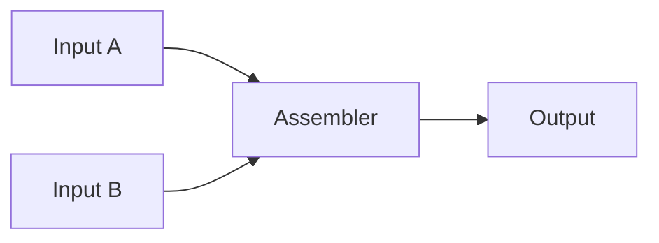
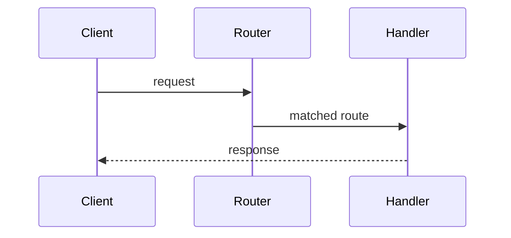
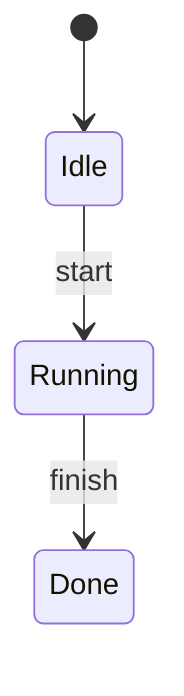

# Mermaid Course Storyboard Implementation Plan

> **For agentic workers:** REQUIRED SUB-SKILL: Use superpowers:subagent-driven-development (recommended) or superpowers:executing-plans to implement this plan task-by-task. Steps use checkbox (`- [ ]`) syntax for tracking.

**Goal:** Add Mermaid storyboard units to `skills/codemermaid` so generated essay pages can teach a system through compact multi-scene diagrams with optional paired code and per-line annotations.

**Architecture:** Keep the current zero-build essay architecture. Add `storyboard` as one more unit kind in the existing renderer, validator, CSS partial, and skill prompt; do not introduce React, canvas libraries, or a new template system. The storyboard runtime renders one active scene at a time, reuses Mermaid rendering and the existing zoom overlay, and uses a desktop-only Cinema Strip layout with a collapsible code drawer.

**Tech Stack:** Vanilla JavaScript, Mermaid CDN, self-contained HTML templates, Node.js built-in test runner, CSS partials in the Raycast-inspired design system.

---

## Design References

The storyboard UI must follow the approved Variant B wireframes in `/Volumes/ORICO/Users/jiangwei/.gstack/projects/supermario/designs/mermaid-storyboard-wireframe-v2-20260504/`:

- Primary layout reference: `/Volumes/ORICO/Users/jiangwei/.gstack/projects/supermario/designs/mermaid-storyboard-wireframe-v2-20260504/variant-B-cinema-strip.html`
- Drawer and annotation states reference: `file:///Volumes/ORICO/Users/jiangwei/.gstack/projects/supermario/designs/mermaid-storyboard-wireframe-v2-20260504/variant-B-states.html`
- Approval record: `/Volumes/ORICO/Users/jiangwei/.gstack/projects/supermario/designs/mermaid-storyboard-wireframe-v2-20260504/approved.json`

Locked direction: **Variant B · Cinema Strip** with **P3 aside-panel annotations**. The implementation should preserve the visual hierarchy from the wireframes: large top Mermaid stage, scene strip below, collapsible code drawer beneath, and a 280px annotation aside beside code when notes exist.

## File Structure

- Modify `skills/codemermaid/templates/template-essay.html`
  - Upgrade Mermaid from v10 to a v11 release that supports image/icon flowchart shapes.
- Modify `skills/codemermaid/templates/partials/_essay.js`
  - Add `storyboard` to `renderUnit()`.
  - Add `renderStoryboard(unit)`, `renderStoryboardCode(scene)`, `renderStoryboardAnnotationList(highlights)`, `initStoryboards()`, and `setStoryboardScene(root, index)`.
  - Extend `bootEssay()` so storyboard Mermaid diagrams render after scene changes and zoom triggers are rebound.
- Modify `skills/codemermaid/templates/partials/_essay.css`
  - Add Cinema Strip storyboard styling, desktop-only guard, drawer states, and line annotation affordances.
- Modify `skills/codemermaid/scripts/validate-units.js`
  - Add schema validation for `storyboard` units and `code.highlights`.
  - Enforce `<= 3` storyboard units per page.
  - Enforce at least one non-storyboard text unit between storyboard units.
  - Reject remote Mermaid image URLs in storyboard scenes.
- Modify `skills/codemermaid/scripts/validate-units.test.js`
  - Add tests for valid storyboard data and every new validation rule.
- Modify `skills/codemermaid/SKILL.md`
  - Teach the generator when and how to write storyboard units.
  - Replace the old `highlightLines` storyboard draft with `code.highlights`.
- Modify `skills/codemermaid/references/units-examples.md`
  - Add one complete storyboard example: Phase 6 pipeline with three scenes, a no-code scene, a collapsed-code scene, and an annotated code scene.
- Create `skills/codemermaid/references/storyboard-patterns.md`
  - Document recommended Mermaid scene patterns and the Cinema Strip schema.

## Task 1: Upgrade Mermaid CDN For Storyboard Image Shapes

**Files:**
- Modify: `skills/codemermaid/templates/template-essay.html`

- [ ] **Step 1: Update the Mermaid script tag**

Replace this line in `skills/codemermaid/templates/template-essay.html`:

```html
<script src="https://cdn.jsdelivr.net/npm/mermaid@10/dist/mermaid.min.js"></script>
```

with:

```html
<script src="https://cdn.jsdelivr.net/npm/mermaid@11.4.1/dist/mermaid.min.js"></script>
```

- [ ] **Step 2: Verify the template references Mermaid 11**

Run:

```bash
rg "mermaid@" skills/codemermaid/templates/template-essay.html
```

Expected output:

```text
<script src="https://cdn.jsdelivr.net/npm/mermaid@11.4.1/dist/mermaid.min.js"></script>
```

- [ ] **Step 3: Commit**

```bash
git add skills/codemermaid/templates/template-essay.html
git commit -m "feat(codemermaid): upgrade mermaid for storyboards"
```

## Task 2: Add Storyboard Validator Tests

**Files:**
- Modify: `skills/codemermaid/scripts/validate-units.test.js`

- [ ] **Step 1: Add a reusable valid storyboard fixture**

Insert this helper after the imports in `skills/codemermaid/scripts/validate-units.test.js`:

```javascript
function validStoryboardUnit(overrides = {}) {
  return {
    kind: 'storyboard',
    title: 'Phase 6 pipeline',
    caption: 'The page appears after template slots, partials, and validation line up.',
    scenes: [
      {
        name: 'Read shell',
        mermaid: 'flowchart LR\n  A["template-essay.html"] --> B["slot markers"]',
        explanation: 'The shell owns the page structure before content exists.',
      },
      {
        name: 'Inline partials',
        mermaid: 'flowchart LR\n  A["_base.css"] --> C["HTML"]\n  B["_essay.js"] --> C',
        code: {
          file: 'skills/codemermaid/SKILL.md',
          lang: 'markdown',
          source: '1. Read shell template\n2. Read partials\n3. Inline partials',
          highlights: [
            { line: 2, note: 'Reusable CSS and JS become page-local assets.' },
            { line: 3, note: 'The output stays self-contained after replacement.' },
          ],
        },
        explanation: 'This is where reusable pieces become one file.',
      },
    ],
    ...overrides,
  };
}
```

- [ ] **Step 2: Add passing validation tests**

Append these tests to `skills/codemermaid/scripts/validate-units.test.js`:

```javascript
test('module: valid storyboard unit passes', () => {
  const result = validateModule({
    module: 'renderer',
    learningPromise: 'p',
    units: [
      { kind: 'concept', body: 'x' },
      validStoryboardUnit(),
      { kind: 'surprise', body: 's' },
      { kind: 'takeaway', body: 't' },
    ],
  });
  assert.equal(result.ok, true, result.errors?.join('\n'));
});

test('perspective: valid storyboard unit passes', () => {
  const result = validatePerspective({
    perspective: 'architecture',
    learningPromise: 'p',
    units: [
      { kind: 'concept', body: 'x' },
      validStoryboardUnit(),
      { kind: 'takeaway', body: 't' },
    ],
  });
  assert.equal(result.ok, true, result.errors?.join('\n'));
});
```

- [ ] **Step 3: Add failing validation tests**

Append these tests to `skills/codemermaid/scripts/validate-units.test.js`:

```javascript
test('storyboard: requires at least two scenes', () => {
  const result = validateModule({
    module: 'renderer',
    learningPromise: 'p',
    units: [
      { kind: 'concept', body: 'x' },
      validStoryboardUnit({ scenes: [{ name: 'Only', mermaid: 'flowchart LR\nA-->B' }] }),
      { kind: 'surprise', body: 's' },
      { kind: 'takeaway', body: 't' },
    ],
  });
  assert.equal(result.ok, false);
  assert.match(result.errors.join('\n'), /storyboard.*at least 2 scenes/i);
});

test('storyboard: scene requires name and mermaid', () => {
  const result = validateModule({
    module: 'renderer',
    learningPromise: 'p',
    units: [
      { kind: 'concept', body: 'x' },
      validStoryboardUnit({
        scenes: [
          { name: '', mermaid: 'flowchart LR\nA-->B' },
          { name: 'Missing mermaid', mermaid: '' },
        ],
      }),
      { kind: 'surprise', body: 's' },
      { kind: 'takeaway', body: 't' },
    ],
  });
  assert.equal(result.ok, false);
  assert.match(result.errors.join('\n'), /scene 1.*name/i);
  assert.match(result.errors.join('\n'), /scene 2.*mermaid/i);
});

test('storyboard: code source and highlight notes are validated', () => {
  const unit = validStoryboardUnit();
  unit.scenes[1].code = {
    file: 'x.js',
    lang: 'js',
    source: '',
    highlights: [
      { line: 0, note: 'bad line' },
      { lines: [2, 0], note: '' },
    ],
  };
  const result = validateModule({
    module: 'renderer',
    learningPromise: 'p',
    units: [
      { kind: 'concept', body: 'x' },
      unit,
      { kind: 'surprise', body: 's' },
      { kind: 'takeaway', body: 't' },
    ],
  });
  assert.equal(result.ok, false);
  assert.match(result.errors.join('\n'), /code.source/i);
  assert.match(result.errors.join('\n'), /highlight.*positive integers/i);
  assert.match(result.errors.join('\n'), /highlight.*note/i);
});

test('storyboard: remote image URLs are rejected', () => {
  const unit = validStoryboardUnit();
  unit.scenes[0].mermaid = 'flowchart LR\n  A@{ img: "https://example.com/a.png", label: "Remote", pos: "t", w: 220, h: 140 }';
  const result = validateModule({
    module: 'renderer',
    learningPromise: 'p',
    units: [
      { kind: 'concept', body: 'x' },
      unit,
      { kind: 'surprise', body: 's' },
      { kind: 'takeaway', body: 't' },
    ],
  });
  assert.equal(result.ok, false);
  assert.match(result.errors.join('\n'), /remote image URL/i);
});

test('storyboard: page allows at most three storyboard units', () => {
  const result = validateModule({
    module: 'renderer',
    learningPromise: 'p',
    units: [
      { kind: 'concept', body: 'x' },
      validStoryboardUnit({ title: 'one' }),
      { kind: 'surprise', body: 's' },
      validStoryboardUnit({ title: 'two' }),
      { kind: 'concept', body: 'between' },
      validStoryboardUnit({ title: 'three' }),
      { kind: 'concept', body: 'between again' },
      validStoryboardUnit({ title: 'four' }),
      { kind: 'takeaway', body: 't' },
    ],
  });
  assert.equal(result.ok, false);
  assert.match(result.errors.join('\n'), /too many storyboard units/i);
});

test('storyboard: adjacent storyboard units require a text unit between them', () => {
  const result = validateModule({
    module: 'renderer',
    learningPromise: 'p',
    units: [
      { kind: 'concept', body: 'x' },
      validStoryboardUnit({ title: 'one' }),
      validStoryboardUnit({ title: 'two' }),
      { kind: 'surprise', body: 's' },
      { kind: 'takeaway', body: 't' },
    ],
  });
  assert.equal(result.ok, false);
  assert.match(result.errors.join('\n'), /text unit between storyboard units/i);
});
```

- [ ] **Step 4: Run tests and verify they fail before implementation**

Run:

```bash
node --test skills/codemermaid/scripts/validate-units.test.js
```

Expected: FAIL with messages that include `unknown unit kind 'storyboard'`.

- [ ] **Step 5: Commit**

```bash
git add skills/codemermaid/scripts/validate-units.test.js
git commit -m "test(codemermaid): cover storyboard validation"
```

## Task 3: Implement Storyboard Validation

**Files:**
- Modify: `skills/codemermaid/scripts/validate-units.js`
- Test: `skills/codemermaid/scripts/validate-units.test.js`

- [ ] **Step 1: Add storyboard to the valid kind set**

Change `VALID_KINDS` in `skills/codemermaid/scripts/validate-units.js` to:

```javascript
const VALID_KINDS = new Set([
  'concept',
  'code-walk',
  'guess-first',
  'compare',
  'surprise',
  'takeaway',
  'diagram',
  'storyboard',
]);
```

- [ ] **Step 2: Add constants for storyboard budgets**

Insert these constants after `MAX_STEPPED_PER_MODULE`:

```javascript
const MAX_STORYBOARDS_PER_PAGE = 3;
const TEXT_UNIT_KINDS = new Set(['concept', 'code-walk', 'guess-first', 'compare', 'surprise', 'takeaway', 'diagram']);
```

- [ ] **Step 3: Add storyboard validation helpers**

Insert these functions above `commonChecks(page, kindLabel)`:

```javascript
function isPositiveIntegerArray(value) {
  return Array.isArray(value) && value.length > 0 && value.every((n) => Number.isInteger(n) && n > 0);
}

function hasRemoteMermaidImage(mermaid) {
  return /@\{\s*img:\s*["']https?:\/\//i.test(String(mermaid || ''));
}

function validateStoryboard(unit, unitIndex) {
  const errors = [];
  const label = `storyboard unit ${unitIndex + 1}`;
  const scenes = unit.scenes || [];

  if (!unit.title || !String(unit.title).trim()) {
    errors.push(`${label} missing title`);
  }
  if (!Array.isArray(unit.scenes)) {
    errors.push(`${label} scenes must be an array`);
    return errors;
  }
  if (scenes.length < 2) {
    errors.push(`${label} must have at least 2 scenes`);
  }

  scenes.forEach((scene, sceneIndex) => {
    const sceneLabel = `${label} scene ${sceneIndex + 1}`;
    if (!scene.name || !String(scene.name).trim()) {
      errors.push(`${sceneLabel} missing name`);
    }
    if (!scene.mermaid || !String(scene.mermaid).trim()) {
      errors.push(`${sceneLabel} missing mermaid`);
    }
    if (hasRemoteMermaidImage(scene.mermaid)) {
      errors.push(`${sceneLabel} uses a remote image URL; use a local path or data URL`);
    }
    if (scene.code) {
      if (!scene.code.source || !String(scene.code.source).trim()) {
        errors.push(`${sceneLabel} code.source must be non-empty`);
      }
      if (scene.code.highlights !== undefined) {
        if (!Array.isArray(scene.code.highlights)) {
          errors.push(`${sceneLabel} code.highlights must be an array`);
        } else {
          scene.code.highlights.forEach((highlight, highlightIndex) => {
            const highlightLabel = `${sceneLabel} highlight ${highlightIndex + 1}`;
            const hasLine = Number.isInteger(highlight.line) && highlight.line > 0;
            const hasLines = isPositiveIntegerArray(highlight.lines);
            if (!hasLine && !hasLines) {
              errors.push(`${highlightLabel} must define line or lines as positive integers`);
            }
            if (!highlight.note || !String(highlight.note).trim()) {
              errors.push(`${highlightLabel} missing note`);
            }
          });
        }
      }
    }
  });

  return errors;
}

function validateStoryboardPlacement(units, kindLabel, name) {
  const errors = [];
  const storyboardIndexes = units
    .map((unit, index) => unit.kind === 'storyboard' ? index : -1)
    .filter((index) => index !== -1);

  if (storyboardIndexes.length > MAX_STORYBOARDS_PER_PAGE) {
    errors.push(`${kindLabel} '${name}' has too many storyboard units (${storyboardIndexes.length} > ${MAX_STORYBOARDS_PER_PAGE})`);
  }

  for (let i = 1; i < storyboardIndexes.length; i++) {
    const previous = storyboardIndexes[i - 1];
    const current = storyboardIndexes[i];
    const between = units.slice(previous + 1, current);
    if (!between.some((unit) => TEXT_UNIT_KINDS.has(unit.kind))) {
      errors.push(`${kindLabel} '${name}' must include a text unit between storyboard units`);
    }
  }

  return errors;
}
```

- [ ] **Step 4: Call storyboard validation from commonChecks**

In `commonChecks(page, kindLabel)`, after the loop that checks `VALID_KINDS`, insert:

```javascript
  units.forEach((u, i) => {
    if (u.kind === 'storyboard') {
      errors.push(...validateStoryboard(u, i));
    }
  });
  errors.push(...validateStoryboardPlacement(units, kindLabel, name));
```

- [ ] **Step 5: Run validator tests**

Run:

```bash
node --test skills/codemermaid/scripts/validate-units.test.js
```

Expected: PASS with all existing and new tests passing.

- [ ] **Step 6: Commit**

```bash
git add skills/codemermaid/scripts/validate-units.js skills/codemermaid/scripts/validate-units.test.js
git commit -m "feat(codemermaid): validate storyboard units"
```

## Task 4: Add Storyboard Runtime Rendering

**Files:**
- Modify: `skills/codemermaid/templates/partials/_essay.js`

- [ ] **Step 1: Add storyboard to the render dispatcher**

Change `renderUnit(unit)` in `skills/codemermaid/templates/partials/_essay.js` so the switch includes:

```javascript
    case 'storyboard':   return renderStoryboard(unit);
```

The full switch should read:

```javascript
function renderUnit(unit) {
  switch (unit.kind) {
    case 'concept':      return renderConcept(unit);
    case 'code-walk':    return renderCodeWalk(unit);
    case 'guess-first':  return renderGuessFirst(unit);
    case 'compare':      return renderCompare(unit);
    case 'surprise':     return renderSurprise(unit);
    case 'takeaway':     return renderTakeaway(unit);
    case 'diagram':      return renderDiagram(unit);
    case 'storyboard':   return renderStoryboard(unit);
    default:
      return `<p style="color:#ff8a8a">Unknown unit kind: ${escapeHtml(unit.kind)}</p>`;
  }
}
```

- [ ] **Step 2: Add storyboard render functions**

Insert these functions after `renderDiagram(u)`:

```javascript
function renderStoryboard(u) {
  const scenes = u.scenes || [];
  const titleHtml = u.title ? `<h2>${escapeHtml(u.title)}</h2>` : '';
  const captionHtml = u.caption ? `<p class="storyboard-caption">${renderMarkdownLinks(escapeHtml(u.caption))}</p>` : '';
  return `
    <span class="unit-kind">storyboard</span>${titleHtml}${captionHtml}
    <div class="storyboard wide" data-storyboard>
      <div class="storyboard-mobile-guard">
        Storyboard units are designed for desktop-width reading. Open this page on a wider screen to step through the diagrams and code.
      </div>
      <div class="storyboard-shell">
        <div class="storyboard-stage">
          <div class="storyboard-scene-label">
            <span data-storyboard-scene-count>Scene 1 of ${scenes.length}</span>
            <button class="zoom-btn storyboard-zoom" data-zoom-trigger>Zoom</button>
          </div>
          <div class="storyboard-mermaid"><div class="mermaid"></div></div>
          <div class="storyboard-explanation" data-storyboard-explanation></div>
        </div>
        <div class="storyboard-strip" role="tablist" aria-label="${escapeHtml(u.title || 'Storyboard scenes')}">
          ${scenes.map((scene, i) => `
            <button
              class="storyboard-tab${i === 0 ? ' active' : ''}"
              type="button"
              role="tab"
              aria-selected="${i === 0 ? 'true' : 'false'}"
              data-storyboard-tab="${i}">
              <span class="storyboard-tab-num">${String(i + 1).padStart(2, '0')}</span>
              <span>${escapeHtml(scene.name || `Scene ${i + 1}`)}</span>
            </button>
          `).join('')}
        </div>
        <div class="storyboard-code-slot" data-storyboard-code-slot></div>
      </div>
      <script type="application/json" data-storyboard-scenes>${escapeHtml(JSON.stringify(scenes))}</script>
    </div>`;
}

function renderStoryboardCode(scene) {
  if (!scene.code) return '';
  const code = scene.code;
  const highlights = code.highlights || [];
  const lineNumbers = new Set();
  highlights.forEach((h) => {
    if (Number.isInteger(h.line)) lineNumbers.add(h.line);
    if (Array.isArray(h.lines)) h.lines.forEach((n) => lineNumbers.add(n));
  });
  const sortedLines = Array.from(lineNumbers).sort((a, b) => a - b);
  const noteCount = highlights.length;
  const lineCount = String(code.source || '').split('\n').length;
  const defaultOpen = noteCount > 0 ? ' open' : '';
  return `
    <details class="storyboard-code-drawer"${defaultOpen}>
      <summary>
        <span>${escapeHtml(code.file || 'source')}</span>
        <span>${lineCount} lines · ${noteCount} notes</span>
      </summary>
      <div class="storyboard-code-grid">
        <div class="codewalk">
          <div class="codewalk-head">
            <span>${escapeHtml(code.file || '')}</span>
            <span>${escapeHtml(code.lang || 'text')}</span>
          </div>
          ${renderCode(code.source || '', sortedLines)}
        </div>
        ${renderStoryboardAnnotationList(highlights)}
      </div>
    </details>`;
}

function renderStoryboardAnnotationList(highlights) {
  if (!highlights || highlights.length === 0) return '<aside class="storyboard-notes empty">No annotations for this scene.</aside>';
  return `
    <aside class="storyboard-notes">
      ${highlights.map((h) => {
        const lines = Array.isArray(h.lines) ? h.lines : [h.line];
        const rangeClass = lines.length > 1 ? ' range' : '';
        const label = lines.length > 1 ? `L${lines[0]}-${lines[lines.length - 1]}` : `L${lines[0]}`;
        return `
          <div class="storyboard-note${rangeClass}">
            <span class="storyboard-note-line">${escapeHtml(label)}</span>
            <p>${renderMarkdownLinks(escapeHtml(h.note || ''))}</p>
          </div>`;
      }).join('')}
    </aside>`;
}
```

- [ ] **Step 3: Add storyboard interaction functions**

Insert these functions before the `/* ------- Single rAF scroll loop ------- */` comment:

```javascript
async function setStoryboardScene(root, index) {
  const scenesEl = root.querySelector('[data-storyboard-scenes]');
  if (!scenesEl) return;
  const scenes = JSON.parse(scenesEl.textContent || '[]');
  const scene = scenes[index];
  if (!scene) return;

  root.querySelectorAll('[data-storyboard-tab]').forEach((tab) => {
    const active = Number(tab.dataset.storyboardTab) === index;
    tab.classList.toggle('active', active);
    tab.setAttribute('aria-selected', active ? 'true' : 'false');
  });

  const countEl = root.querySelector('[data-storyboard-scene-count]');
  if (countEl) countEl.textContent = `Scene ${index + 1} of ${scenes.length}`;

  const mermaidEl = root.querySelector('.storyboard-mermaid .mermaid');
  if (mermaidEl) {
    mermaidEl.textContent = scene.mermaid || '';
    await renderMermaidElement(mermaidEl);
    applyStoryboardFocus(mermaidEl, scene.focus);
  }

  const explanationEl = root.querySelector('[data-storyboard-explanation]');
  if (explanationEl) {
    explanationEl.innerHTML = scene.explanation
      ? renderMarkdownLinks(escapeBodyParagraphs(scene.explanation))
      : '';
  }

  const codeSlot = root.querySelector('[data-storyboard-code-slot]');
  if (codeSlot) codeSlot.innerHTML = renderStoryboardCode(scene);
}

function applyStoryboardFocus(root, focus) {
  if (!focus) return;
  root.querySelectorAll('g.node').forEach((g) => {
    const matched = g.id.includes(`-${focus}-`) || g.id.endsWith(`-${focus}`);
    g.classList.toggle('active', matched);
  });
}

function initStoryboards() {
  document.querySelectorAll('[data-storyboard]').forEach((root) => {
    root.querySelectorAll('[data-storyboard-tab]').forEach((tab) => {
      tab.addEventListener('click', () => {
        setStoryboardScene(root, Number(tab.dataset.storyboardTab));
      });
    });
    setStoryboardScene(root, 0);
  });
}
```

- [ ] **Step 4: Add a single-element Mermaid render helper**

Insert this function after `renderDiagram(u)` or before `setStoryboardScene(root, index)`:

```javascript
async function renderMermaidElement(node) {
  const src = node.textContent.trim();
  if (!src) return;
  const id = 'm' + Math.random().toString(36).slice(2);
  const { svg } = await mermaid.render(id, src);
  node.innerHTML = svg;
}
```

- [ ] **Step 5: Initialize storyboards from bootEssay**

In `bootEssay(page)`, replace:

```javascript
  await renderMermaid('.unit-diagram .mermaid, .figure .mermaid');
  initSteppedWalks();
  initZoomOverlay();
  startScrollLoop();
```

with:

```javascript
  await renderMermaid('.unit-diagram .mermaid, .figure .mermaid');
  initSteppedWalks();
  initStoryboards();
  initZoomOverlay();
  startScrollLoop();
```

- [ ] **Step 6: Verify runtime syntax**

Run:

```bash
node --check skills/codemermaid/templates/partials/_essay.js
```

Expected output: no output and exit code `0`.

- [ ] **Step 7: Commit**

```bash
git add skills/codemermaid/templates/partials/_essay.js
git commit -m "feat(codemermaid): render storyboard units"
```

## Task 5: Add Cinema Strip CSS

**Files:**
- Modify: `skills/codemermaid/templates/partials/_essay.css`

- [ ] **Step 1: Add storyboard CSS before the zoom overlay section**

Before editing CSS, open the approved visual references and keep the implementation aligned with them:

```bash
sed -n '1,220p' /Volumes/ORICO/Users/jiangwei/.gstack/projects/supermario/designs/mermaid-storyboard-wireframe-v2-20260504/variant-B-cinema-strip.html
sed -n '1,260p' /Volumes/ORICO/Users/jiangwei/.gstack/projects/supermario/designs/mermaid-storyboard-wireframe-v2-20260504/variant-B-states.html
```

Expected: the first file shows the approved top-stage + scene-strip + drawer layout; the second shows the drawer states and P3 aside-panel annotation behavior.

Insert this CSS before the `/* ZOOM OVERLAY */` comment:

```css
/* STORYBOARD unit — Cinema Strip with optional paired code */
.storyboard {
  margin: 24px 0 18px;
}
.storyboard-mobile-guard {
  display: none;
  background: var(--surface);
  border: 1px solid var(--border);
  border-radius: 12px;
  padding: 18px 20px;
  color: var(--text-dim);
  line-height: 1.55;
}
.storyboard-shell {
  background: var(--surface);
  border: 1px solid var(--border);
  border-radius: 16px;
  box-shadow: var(--shadow-card);
  overflow: hidden;
}
.storyboard-caption {
  color: var(--text-dim);
  font-size: 15px;
  margin: -4px 0 18px;
}
.storyboard-stage {
  position: relative;
  min-height: 430px;
  padding: 28px 32px 22px;
  background: linear-gradient(180deg, rgba(255,255,255,0.025), rgba(255,255,255,0));
}
.storyboard-scene-label {
  display: flex;
  justify-content: space-between;
  align-items: center;
  margin-bottom: 18px;
  color: var(--text-faint);
  font-family: var(--font-mono);
  font-size: 12px;
}
.storyboard-zoom {
  position: static;
}
.storyboard-mermaid {
  display: flex;
  justify-content: center;
  align-items: center;
  min-height: 300px;
}
.storyboard-mermaid svg {
  max-width: 100%;
  height: auto;
}
.storyboard-explanation {
  margin-top: 18px;
  color: var(--text-dim);
  font-size: 15px;
  line-height: 1.6;
  max-width: 760px;
}
.storyboard-explanation p {
  margin-bottom: 0;
}
.storyboard-strip {
  display: flex;
  gap: 8px;
  padding: 12px;
  border-top: 1px solid var(--border);
  border-bottom: 1px solid var(--border);
  background: var(--code-bg);
  overflow-x: auto;
}
.storyboard-tab {
  display: inline-flex;
  align-items: center;
  gap: 8px;
  white-space: nowrap;
  color: var(--text-dim);
  background: var(--surface);
  border: 1px solid var(--border);
  border-radius: 6px;
  padding: 9px 12px;
  font-family: var(--font-primary);
  font-size: 13px;
  cursor: pointer;
  transition: color 0.15s, border-color 0.15s, background 0.15s;
}
.storyboard-tab:hover {
  color: var(--text);
  border-color: var(--text-faint);
}
.storyboard-tab.active {
  color: var(--text);
  border-color: var(--accent);
  background: var(--accent-soft);
}
.storyboard-tab-num {
  font-family: var(--font-mono);
  font-size: 11px;
  color: var(--text-faint);
}
.storyboard-code-slot {
  background: var(--surface);
}
.storyboard-code-drawer {
  border-top: 1px solid var(--border);
}
.storyboard-code-drawer summary {
  display: flex;
  justify-content: space-between;
  gap: 16px;
  cursor: pointer;
  list-style: none;
  padding: 12px 18px;
  color: var(--text-dim);
  font-family: var(--font-mono);
  font-size: 12px;
  background: var(--surface-2);
}
.storyboard-code-drawer summary::-webkit-details-marker {
  display: none;
}
.storyboard-code-drawer summary::after {
  content: '⌄';
  color: var(--text-faint);
}
.storyboard-code-drawer[open] summary::after {
  content: '⌃';
}
.storyboard-code-grid {
  display: grid;
  grid-template-columns: minmax(0, 1fr) 280px;
  gap: 0;
  align-items: stretch;
}
.storyboard-code-grid .codewalk {
  margin: 0;
  border: 0;
  border-radius: 0;
  box-shadow: none;
}
.storyboard-notes {
  border-left: 1px solid var(--border);
  padding: 14px;
  background: var(--surface);
}
.storyboard-notes.empty {
  color: var(--text-faint);
  font-size: 13px;
}
.storyboard-note {
  position: relative;
  border-left: 2px solid var(--accent);
  padding: 8px 0 8px 12px;
  margin-bottom: 10px;
}
.storyboard-note.range {
  border-left-color: var(--info, #55b3ff);
}
.storyboard-note-line {
  display: inline-block;
  font-family: var(--font-mono);
  font-size: 10.5px;
  color: var(--text-faint);
  margin-bottom: 5px;
}
.storyboard-note p {
  margin: 0;
  color: var(--text-dim);
  font-size: 13px;
  line-height: 1.45;
}
```

- [ ] **Step 2: Add the desktop-only guard media query**

Append this media query after the existing `@media (max-width: 880px)` block:

```css
@media (max-width: 760px) {
  .storyboard {
    width: 100%;
    left: 0;
    transform: none;
  }
  .storyboard-mobile-guard {
    display: block;
  }
  .storyboard-shell {
    display: none;
  }
}
```

- [ ] **Step 3: Verify CSS references storyboard classes**

Run:

```bash
rg "storyboard" skills/codemermaid/templates/partials/_essay.css
```

Expected: output includes `.storyboard-shell`, `.storyboard-strip`, `.storyboard-code-drawer`, and `.storyboard-mobile-guard`.

- [ ] **Step 4: Verify the plan-specific design references remain discoverable**

Run:

```bash
rg "variant-B-cinema-strip|variant-B-states|P3 aside-panel" docs/superpowers/plans/2026-05-05-codemermaid-storyboard.md
```

Expected: output includes the primary layout reference, the states reference, and the locked P3 aside-panel annotation direction.

- [ ] **Step 5: Commit**

```bash
git add skills/codemermaid/templates/partials/_essay.css
git commit -m "feat(codemermaid): style storyboard cinema strip"
```

## Task 6: Document Storyboard Authoring Rules In The Skill

**Files:**
- Modify: `skills/codemermaid/SKILL.md`
- Modify: `skills/codemermaid/references/units-examples.md`
- Create: `skills/codemermaid/references/storyboard-patterns.md`

- [ ] **Step 1: Add storyboard to the unit kind list in SKILL.md**

In the `### Unit kinds` code block in `skills/codemermaid/SKILL.md`, add this line after the `diagram` unit:

```javascript
{ kind: "storyboard", title, caption?, scenes: [{ name, mermaid, explanation?, code?, focus? }] } // multi-scene Mermaid player with optional paired code
```

- [ ] **Step 2: Add storyboard schema section to SKILL.md**

Insert this section after `### Real code only`:

````markdown
### Storyboard units

Use `storyboard` when the reader needs to watch a system change across 2-5 scenes. Good fits: template assembly, request lifecycle, state transitions, build pipelines, parser phases, data synchronization. Bad fits: one static architecture overview, long prose explanations, or anything that needs arbitrary 2D canvas layout.

```javascript
{
  kind: "storyboard",
  title: "How Phase 6 assembles one page",
  caption: "One output page is slot replacement plus validation.",
  scenes: [
    {
      name: "Read shell",
      mermaid: "flowchart LR\n  A[template-essay.html] --> B[slot markers]",
      explanation: "The shell owns page structure. The content is still missing."
    },
    {
      name: "Inline partials",
      mermaid: "flowchart LR\n  A[_base.css] --> C[HTML]\n  B[_essay.js] --> C",
      code: {
        file: "skills/codemermaid/SKILL.md",
        lang: "markdown",
        source: "1. Read the shell template\n2. Read the partials\n3. Inline the partials",
        highlights: [
          { line: 2, note: "Reusable CSS and JS become page-local assets." },
          { line: 3, note: "The output stays self-contained after replacement." }
        ]
      },
      explanation: "This is where reusable pieces become one file."
    }
  ]
}
```

Storyboard rules:

- `scenes.length` is 2-5. Use 3 scenes as the default.
- Every scene has a short `name` and non-empty `mermaid`.
- `explanation` is 1-3 sentences.
- `code.source` is copied from real source or from the current skill instructions. Do not invent code.
- Use `code.highlights`, not `highlightLines`, for storyboard code.
- A single-line annotation uses `{ line, note }`.
- A multi-line annotation uses `{ lines: [start, ...end], note }`.
- Cap annotations at 5 per scene; split the scene when more are needed.
- Use Mermaid image nodes only for local paths or data URLs. Do not use remote image URLs.
- Page budget: at most 3 storyboard units per page, with at least one text unit between storyboard units.
````

- [ ] **Step 3: Create storyboard-patterns.md**

Create `skills/codemermaid/references/storyboard-patterns.md` with:

````markdown
# Storyboard Patterns

Storyboard units are compact scene players. They keep the essay shape but add choreography: each scene changes the Mermaid diagram at the moment the explanation changes.

## Pattern 1: Pipeline Assembly

Use for build systems, template renderers, code generation, and deploy flows.

Scene order:

1. Inputs enter the pipeline.
2. Transformation joins or validates inputs.
3. Output is emitted.

Preferred Mermaid:



## Pattern 2: Request Lifecycle

Use for HTTP servers, CLIs, message queues, and event handlers.

Scene order:

1. Entry point receives work.
2. Middleware or routing chooses behavior.
3. Handler produces result.

Preferred Mermaid:



## Pattern 3: State Transition

Use for workflows, parsers, auth sessions, and lifecycle managers.

Scene order:

1. Initial state.
2. Transition trigger.
3. Final or error state.

Preferred Mermaid:



## Annotation Rules

Use annotations only when the code explains something the diagram cannot. The diagram teaches relationships; the code drawer teaches source-level proof.

```javascript
code: {
  file: "skills/codemermaid/scripts/validate-units.js",
  lang: "js",
  source: "if (!result.ok) {\n  console.error('Validation failed:');\n  process.exit(1);\n}",
  highlights: [
    { line: 1, note: "Validation owns the gate before output is written." },
    { lines: [2, 3], note: "All failures print before the process exits." }
  ]
}
```
````

- [ ] **Step 4: Add storyboard example to units-examples.md**

Append this section to `skills/codemermaid/references/units-examples.md`:

````markdown
---

## storyboard

Multi-scene Mermaid player with optional paired code. Use when a static diagram would hide the sequence of moves.

```javascript
{
  kind: "storyboard",
  title: "How Phase 6 assembles one page",
  caption: "The page appears when the shell, partials, data, and validator line up.",
  scenes: [
    {
      name: "Read shell",
      mermaid:
`flowchart LR
  A["template-essay.html"] --> B["slot markers"]
  B --> C["empty page shell"]`,
      explanation:
        "Start with the shell. It owns the document structure, but it is still hollow: title slots, CSS slots, JS slots, and one PAGE_DATA slot."
    },
    {
      name: "Inline partials",
      mermaid:
`flowchart LR
  A["_base.css"] --> C["self-contained HTML"]
  B["_essay.css"] --> C
  D["_runtime.js"] --> C
  E["_essay.js"] --> C`,
      code: {
        file: "skills/codemermaid/SKILL.md",
        lang: "markdown",
        source: "1. Read template-essay.html\n2. Read _base.css and _essay.css\n3. Read _runtime.js and _essay.js\n4. Replace template slots",
        highlights: [
          { line: 2, note: "CSS partials define the Raycast-themed reading surface." },
          { line: 3, note: "Runtime partials keep each output page interactive without a build step." }
        ]
      },
      explanation:
        "This is the key move: reusable partials become inline page assets, so the final course page opens as one file."
    },
    {
      name: "Validate before emit",
      mermaid:
`flowchart LR
  A["PAGE_DATA"] --> B["validate-units.js"]
  B -->|ok| C["write HTML"]
  B -->|errors| D["stop"]`,
      code: {
        file: "skills/codemermaid/scripts/validate-units.js",
        lang: "js",
        source: "if (!result.ok) {\n  console.error('Validation failed:');\n  for (const e of result.errors) console.error(`  - ${e}`);\n  process.exit(1);\n}\nconsole.log('OK');",
        highlights: [
          { line: 1, note: "Validation gates output instead of warning after the page exists." },
          { lines: [2, 3, 4], note: "The run prints every failure, then exits once." }
        ]
      },
      explanation:
        "Bad pedagogy fails before the page is written. That keeps the generator honest when it starts producing richer units."
    }
  ]
}
```
````

- [ ] **Step 5: Verify docs mention storyboard**

Run:

```bash
rg "storyboard" skills/codemermaid/SKILL.md skills/codemermaid/references
```

Expected: output includes `Storyboard units`, `storyboard-patterns.md`, and `kind: "storyboard"`.

- [ ] **Step 6: Commit**

```bash
git add skills/codemermaid/SKILL.md skills/codemermaid/references/units-examples.md skills/codemermaid/references/storyboard-patterns.md
git commit -m "docs(codemermaid): teach storyboard authoring"
```

## Task 7: Run Full Verification And Manual Smoke Check

**Files:**
- Verify: `skills/codemermaid/templates/template-essay.html`
- Verify: `skills/codemermaid/templates/partials/_essay.js`
- Verify: `skills/codemermaid/templates/partials/_essay.css`
- Verify: `skills/codemermaid/scripts/validate-units.js`
- Verify: `skills/codemermaid/SKILL.md`

- [ ] **Step 1: Run validator tests**

Run:

```bash
node --test skills/codemermaid/scripts/validate-units.test.js
```

Expected: PASS.

- [ ] **Step 2: Run JS syntax check**

Run:

```bash
node --check skills/codemermaid/templates/partials/_essay.js
node --check skills/codemermaid/templates/partials/_runtime.js
node --check skills/codemermaid/scripts/validate-units.js
```

Expected: each command exits with code `0`.

- [ ] **Step 3: Validate a storyboard JSON sample**

Create a temporary sample at `/tmp/mermaid-storyboard-page.json`:

```json
{
  "module": "renderer",
  "learningPromise": "After reading, you will understand how storyboard scenes prove a generated page is assembled.",
  "units": [
    { "kind": "concept", "body": "The storyboard is for moments where order matters. A static diagram can show the pieces, but it cannot show the handoff between shell, partials, validation, and output." },
    {
      "kind": "storyboard",
      "title": "Phase 6 pipeline",
      "caption": "One page, three moves.",
      "scenes": [
        {
          "name": "Read shell",
          "mermaid": "flowchart LR\n  A[template-essay.html] --> B[slot markers]",
          "explanation": "The shell owns page structure."
        },
        {
          "name": "Inline partials",
          "mermaid": "flowchart LR\n  A[_base.css] --> C[HTML]\n  B[_essay.js] --> C",
          "code": {
            "file": "skills/codemermaid/SKILL.md",
            "lang": "markdown",
            "source": "1. Read shell template\n2. Read partials\n3. Inline partials",
            "highlights": [
              { "line": 2, "note": "Reusable assets become local to the page." },
              { "line": 3, "note": "The final artifact stays self-contained." }
            ]
          },
          "explanation": "The reusable pieces become one page."
        }
      ]
    },
    { "kind": "surprise", "body": "The storyboard adds choreography without changing the output model: it is still a single self-contained HTML file." },
    { "kind": "takeaway", "body": "Use storyboards when the lesson is a sequence of transformations, not just a map of parts." }
  ]
}
```

Then run:

```bash
node skills/codemermaid/scripts/validate-units.js /tmp/mermaid-storyboard-page.json
```

Expected output:

```text
OK
```

- [ ] **Step 4: Inspect final diff**

Run:

```bash
git diff -- skills/codemermaid
```

Expected: diff only includes Mermaid v11 upgrade, storyboard renderer/CSS, validator/tests, and storyboard docs.

- [ ] **Step 5: Compare implementation against approved Variant B references**

Open these local files in a browser or inspect them directly before final handoff:

```bash
open /Volumes/ORICO/Users/jiangwei/.gstack/projects/supermario/designs/mermaid-storyboard-wireframe-v2-20260504/variant-B-cinema-strip.html
open /Volumes/ORICO/Users/jiangwei/.gstack/projects/supermario/designs/mermaid-storyboard-wireframe-v2-20260504/variant-B-states.html
```

Expected: the implemented storyboard layout matches the Variant B structure: large top Mermaid stage, timeline strip, collapsible drawer, hidden drawer for no-code scenes, open drawer when annotations exist, and 280px annotation aside for line notes.

- [ ] **Step 6: Final commit if verification changed files**

If any verification-only edits were needed, commit them:

```bash
git add skills/codemermaid
git commit -m "chore(codemermaid): verify storyboard support"
```

If no files changed during verification, do not create an empty commit.

## Self-Review

Spec coverage:

- Mermaid v11 image/icon support: Task 1.
- Storyboard unit schema: Tasks 2, 3, and 6.
- Approved Variant B Cinema Strip references are explicit in the Design References section and Task 5.
- Cinema Strip layout with P3 aside-panel annotations: Tasks 4, 5, and 7.
- Optional paired code panel and no-code scenes: Tasks 4, 5, and 6.
- Collapsed drawer default open when annotations exist: Task 4.
- Single-line and multi-line annotations: Tasks 2, 3, 4, 5, and 6.
- Page caps and text unit between storyboard units: Tasks 2 and 3.
- Local/data URL image rule: Tasks 2, 3, and 6.
- No canvas, no React, no build step: preserved by the file structure and runtime choices.

Placeholder scan:

- No forbidden placeholder tokens or vague deferred-work phrases are present.
- Code and command steps include concrete snippets and expected results.

Type consistency:

- The plan uses `code.highlights` consistently for storyboard scenes.
- Highlight objects use `{ line, note }` and `{ lines, note }` consistently.
- Runtime names are consistent: `renderStoryboard`, `renderStoryboardCode`, `renderStoryboardAnnotationList`, `initStoryboards`, `setStoryboardScene`, `renderMermaidElement`, and `applyStoryboardFocus`.
