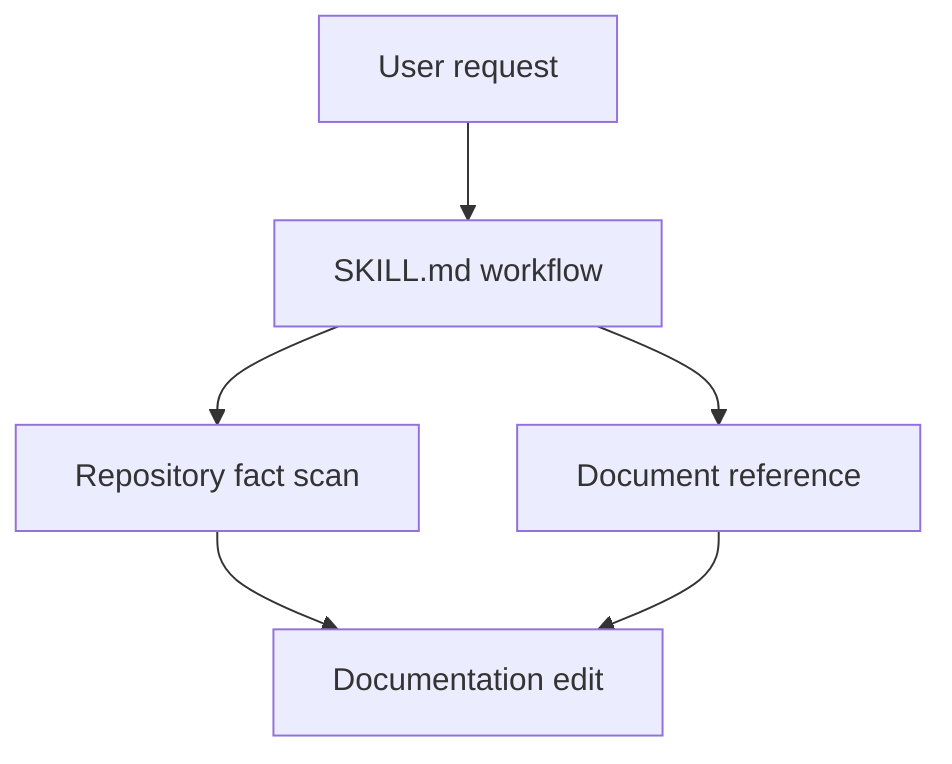

# Write Docs Skill Implementation Plan

> **For agentic workers:** REQUIRED SUB-SKILL: Use superpowers:subagent-driven-development (recommended) or superpowers:executing-plans to implement this plan task-by-task. Steps use checkbox (`- [ ]`) syntax for tracking.

**Goal:** Build a lightweight `write-docs` skill that audits and writes README, architecture, contributing, and tutorial documentation from repository facts.

**Architecture:** Add one focused skill directory under `skills/write-docs/`. Keep `SKILL.md` responsible for workflow, document-type routing, fact gathering, and final reporting; keep document-specific writing rules in `references/`. The first version is rule-based and does not add scripts or a generated documentation site.

**Tech Stack:** Markdown skill files, local repository scanning with shell commands, existing Codex skill conventions.

---

## Scope Check

The approved spec covers one subsystem: a new documentation-writing skill. It does not need to be split into separate plans because all files ship together and the result is testable as a single skill directory.

## File Structure

- Create: `skills/write-docs/SKILL.md`
  - Owns skill metadata, trigger phrases, workflow, fact scan checklist, reference routing, filename casing, options table requirement, README badge/signature behavior, and final response requirements.
- Create: `skills/write-docs/references/elements-of-style.md`
  - Defines concise writing rules used by every document type.
- Create: `skills/write-docs/references/readme.md`
  - Defines README structure decisions, badge rules, configuration table rules, documentation map guidance, and cat signature behavior.
- Create: `skills/write-docs/references/architecture.md`
  - Defines architecture documentation scope, diagrams, module/data-flow explanations, decisions, extension points, and non-goals.
- Create: `skills/write-docs/references/contributing.md`
  - Defines contribution workflow content: setup, commands, tests, style, PRs, issues, and option-change documentation.
- Create: `skills/write-docs/references/tutorial.md`
  - Defines tutorial content: one real path, prerequisites, steps, verification, troubleshooting, and next steps.

## Task 1: Create Skill Shell

**Files:**
- Create: `skills/write-docs/SKILL.md`

- [ ] **Step 1: Create the skill directory**

Run:

```bash
mkdir -p skills/write-docs/references
```

Expected: the command exits with status 0.

- [ ] **Step 2: Write `SKILL.md`**

Create `skills/write-docs/SKILL.md` with this content:

```markdown
---
name: write-docs
description: Write or improve project documentation from repository facts. Use when asked to create, rewrite, audit, or maintain README, ARCHITECTURE, CONTRIBUTING, or TUTORIAL docs.
---

# Write Docs

Write useful project documentation by reading the repository first. Default to improving existing docs before creating new files.

## When to Use

- "Write a README"
- "Improve the README"
- "Create architecture docs"
- "Write CONTRIBUTING.md"
- "Make a tutorial"
- "Audit these docs"
- "Document these options"

## Supported Documents

Canonical filenames:

```text
README.md
ARCHITECTURE.md
CONTRIBUTING.md
TUTORIAL.md
```

If creating a new document, use the canonical filename. If editing an existing document with different casing, preserve that file unless the user asks to normalize names or the repository already has a clear casing convention.

## Required References

Always read `references/elements-of-style.md`.

Then read the matching document reference:

| Target | Reference |
| --- | --- |
| `README.md` | `references/readme.md` |
| `ARCHITECTURE.md` | `references/architecture.md` |
| `CONTRIBUTING.md` | `references/contributing.md` |
| `TUTORIAL.md` | `references/tutorial.md` |

If the user asks for another document type, use `references/elements-of-style.md`, scan the repository, and adapt the closest supported reference. Tell the user which reference you used.

## Workflow

### Phase 1: Identify the Target

Determine the requested document type from the user's words or the target filename.

If multiple documents are requested, handle them in this order unless the user gives another order:

1. `README.md`
2. `ARCHITECTURE.md`
3. `CONTRIBUTING.md`
4. `TUTORIAL.md`

### Phase 2: Audit Existing Docs

Before writing, search for existing documentation:

```bash
rg --files -g 'README*' -g 'ARCHITECTURE*' -g 'CONTRIBUTING*' -g 'TUTORIAL*' -g 'docs/**'
```

Read any existing target document. Preserve accurate project-specific content. Remove or rewrite content that conflicts with current repository facts.

### Phase 3: Scan Repository Facts

Use `rg` and direct file reads before drafting. Look for:

- Top-level directory structure.
- Existing docs and docs navigation.
- Package, build, and runtime config.
- Install, development, test, lint, build, and deploy commands.
- Entry points and important source directories.
- CI, license, package, or version sources for badges.
- Options, configuration, schema, or environment definitions.

Useful searches:

```bash
rg --files -g 'package.json' -g 'pnpm-lock.yaml' -g 'package-lock.json' -g 'yarn.lock' -g 'pyproject.toml' -g 'Cargo.toml' -g 'go.mod' -g 'Makefile' -g '.env.example' -g 'LICENSE*'
rg -n "scripts|dev|test|lint|build|start|serve|deploy" package.json Makefile pyproject.toml Cargo.toml go.mod 2>/dev/null
rg -n "options|config|schema|default|env" .
```

Do not invent commands, defaults, paths, badges, options, or capabilities.

### Phase 4: Write or Edit

Use the matching reference and `references/elements-of-style.md`.

When documenting repository options or configuration in a table, always use this column order:

```markdown
| Option | Type | Default | Example | Description |
| --- | --- | --- | --- | --- |
```

Every option row must be traceable to source, schema, config, or documented behavior. If a default is computed at runtime, explain the source or mark it as derived.

### Phase 5: Self-Check

Before finishing, check:

- Commands, paths, options, defaults, and examples come from the repository.
- Sections serve reader tasks instead of a fixed template.
- Generic filler, passive phrasing, and repeated setup prose are removed.
- Every options table uses `Option | Type | Default | Example | Description`.
- README badges are true and restrained.
- README cat signature appears only at the end.
- Internal links use correct path casing.
- Instructions for adding options or workflows mention related docs or tests when relevant.

### Phase 6: Report

In the final response, say:

- Which document changed.
- Which repository facts supported the content.
- Which details could not be verified.
- Which checks or commands were run.

If no file changed, say what blocked the edit and what facts were missing.
```

- [ ] **Step 3: Verify the skill metadata and workflow anchors**

Run:

```bash
sed -n '1,220p' skills/write-docs/SKILL.md
rg -n "name: write-docs|Supported Documents|Workflow|Self-Check|Option \\| Type \\| Default \\| Example \\| Description" skills/write-docs/SKILL.md
```

Expected: the first command prints the full skill shell; the second command prints matches for every listed pattern.

- [ ] **Step 4: Commit**

```bash
git add skills/write-docs/SKILL.md
git commit -m "feat(write-docs): add documentation skill shell"
```

## Task 2: Add Elements of Style Reference

**Files:**
- Create: `skills/write-docs/references/elements-of-style.md`

- [ ] **Step 1: Write the style reference**

Create `skills/write-docs/references/elements-of-style.md` with this content:

```markdown
# Elements of Style for Project Docs

Use these rules for every document written by the `write-docs` skill.

## Core Rules

1. Start with the reader's next useful action.
2. Prefer concrete nouns and active verbs.
3. Say what this project does, not what projects like it usually do.
4. Keep paragraphs short enough to scan.
5. Use examples that can be copied or verified.
6. Delete generic welcome, marketing, and filler text.
7. Use lists for choices, commands, or checks; use prose for explanation.
8. Name files, commands, options, and outputs exactly.
9. Mark uncertainty instead of hiding it.
10. Keep personality as a light accent, not the main content.

## Strong Sentences

Write like this:

```text
Run `pnpm test` before opening a pull request.
```

Not like this:

```text
It is recommended that tests are run before contribution work is submitted.
```

Write like this:

```text
`outputDir` controls where generated files are written.
```

Not like this:

```text
The `outputDir` option is an important configuration value that can be used for output-related behavior.
```

## Structure

Use headings that name reader tasks:

- Quick Start
- Configuration
- Development
- Testing
- Architecture
- Release Process
- Troubleshooting

Avoid headings that only name document chores:

- Introduction
- Overview
- More Information
- Miscellaneous

Use a brief overview only when it helps the reader choose what to do next.

## Facts First

Every command, option, path, default, badge, and claim must come from repository evidence.

Good evidence includes:

- Source code.
- Config files.
- Package scripts.
- Lockfiles.
- CI workflows.
- Existing docs.
- `.env.example`.
- Test files.

When a detail cannot be verified, write that limitation plainly or omit the detail.

## Options Tables

Any options or configuration table must use this exact column order:

```markdown
| Option | Type | Default | Example | Description |
| --- | --- | --- | --- | --- |
```

Rules:

- `Option` names the exact option or environment variable.
- `Type` uses the source type when available.
- `Default` names the literal default, `none`, `required`, or `derived`.
- `Example` shows a realistic value.
- `Description` explains the behavior in one sentence.

Do not guess types, defaults, or examples.

## Personality Without Noise

Personality can make docs feel cared for. It must not hide the useful path.

Allowed:

- A small number of true Shields.io badges.
- One README cat signature at the end.
- Human, direct phrasing.

Avoid:

- Badge walls.
- Decorative claims with no source.
- Long jokes before setup instructions.
- Signature text outside README unless the user asks for it.
```

- [ ] **Step 2: Verify required style rules exist**

Run:

```bash
rg -n "Facts First|Options Tables|Personality Without Noise|Do not guess|Option \\| Type \\| Default \\| Example \\| Description" skills/write-docs/references/elements-of-style.md
```

Expected: matches for every required style section and the fixed options table header.

- [ ] **Step 3: Commit**

```bash
git add skills/write-docs/references/elements-of-style.md
git commit -m "docs(write-docs): add style rules"
```

## Task 3: Add README Reference

**Files:**
- Create: `skills/write-docs/references/readme.md`

- [ ] **Step 1: Write the README reference**

Create `skills/write-docs/references/readme.md` with this content:

````markdown
# README Reference

README is the project entry point. It should help a new reader decide whether the project matters to them, run it quickly, and find deeper docs.

## Reader Questions

Answer these questions in this order:

1. What is this project?
2. Who is it for?
3. How do I run it quickly?
4. What commands will I use often?
5. What configuration matters first?
6. Where do I read more?

## Recommended Shape

Choose sections by project need. Do not force every section into every README.

Useful sections:

- Title.
- Shields.io badges.
- One sharp description sentence.
- Quick Start.
- Usage.
- Configuration.
- Development.
- Documentation.
- License or Status.
- Cat signature.

For small projects, combine sections. For complex projects, keep README short and link to `ARCHITECTURE.md`, `CONTRIBUTING.md`, or `TUTORIAL.md`.

## Opening

Start with the project name and a one-sentence description:

```markdown
# Project Name

Project Name turns source facts into concise documentation that stays close to the code.
```

Avoid vague openings:

```markdown
# Project Name

Welcome to Project Name, a powerful and flexible tool designed to help users with many workflows.
```

## Shields.io Badges

Use badges only when they communicate true project facts.

Functional badges come first:

- Status.
- Version.
- License.
- Language.
- Package manager.
- Tests.
- Build.
- Docs.

Personal badges are allowed after functional badges, but keep them rare.

Badge examples:

```markdown
[](LICENSE)
[](package.json)
[](docs/)
```

Rules:

- Do not invent CI, package, license, or version badges.
- Use `style=flat-square` unless the repository already uses another style.
- Use small icons when they improve recognition.
- Do not imply official certification, sponsorship, compatibility, or support that does not exist.

## Quick Start

Quick Start should get a reader to a useful result fast.

Use commands from repository facts:

```markdown
## Quick Start

```bash
pnpm install
pnpm test
```
```

If the project has no runnable command, say what the reader can inspect or use instead.

## Usage

Show one realistic path. Prefer one good example over several weak examples.

```markdown
## Usage

```bash
pnpm run docs
```

The command writes generated docs to `docs/`.
```

## Configuration

README should list only the most important options. If the option list is long, include 3-7 core options and link to source or a deeper config document.

Every options table must use:

```markdown
| Option | Type | Default | Example | Description |
| --- | --- | --- | --- | --- |
| `outputDir` | `string` | `docs/site` | `docs/course` | Directory where generated files are written. |
```

Every row must be traceable to a source file, schema, config, or documented behavior.

## Development

List the commands contributors need most:

```markdown
## Development

```bash
pnpm install
pnpm test
pnpm run lint
```
```

Omit commands that do not exist.

## Documentation Map

If deeper docs exist, link them:

```markdown
## Documentation

- [Architecture](ARCHITECTURE.md)
- [Contributing](CONTRIBUTING.md)
- [Tutorial](TUTORIAL.md)
```

Use exact path casing.

## Cat Signature

README may end with one cat signature:

```markdown
---

Built with love <cat>
```

Use one cat token from this list:

```text
🐱
=^._.^=
(=｀ェ´=)
ฅ(=｀ω´=)ฅ
/ᐠ｡ꞈ｡ᐟ\
/ᐠ - ˕ -マ
```

Rules:

- Only the cat token varies.
- Preserve an existing valid cat signature.
- Do not add more than one signature.
- Keep the signature at the end of README.

## README Self-Check

Before finishing, verify:

- The first sentence says what this project actually does.
- Quick Start commands exist.
- Badges are true and restrained.
- Options tables use `Option | Type | Default | Example | Description`.
- Documentation links use exact path casing.
- The cat signature appears only once and only at the end.
````

- [ ] **Step 2: Verify README-specific rules exist**

Run:

```bash
rg -n "Shields.io|style=flat-square|Cat Signature|Built with love|Option \\| Type \\| Default \\| Example \\| Description|README Self-Check" skills/write-docs/references/readme.md
```

Expected: matches for badges, fixed options table, and cat signature rules.

- [ ] **Step 3: Commit**

```bash
git add skills/write-docs/references/readme.md
git commit -m "docs(write-docs): add readme reference"
```

## Task 4: Add Architecture Reference

**Files:**
- Create: `skills/write-docs/references/architecture.md`

- [ ] **Step 1: Write the architecture reference**

Create `skills/write-docs/references/architecture.md` with this content:

````markdown
# Architecture Reference

Architecture docs explain the system shape so a reader can make changes without reading every file first.

## Reader Questions

Answer:

1. What is inside the system boundary?
2. What is outside the boundary?
3. What are the main modules?
4. How does data or control move through the system?
5. Which design decisions matter?
6. Where should a new feature fit?

## Recommended Shape

Use sections that match the repository:

- System Boundary.
- Module Map.
- Data Flow or Request Flow.
- Key Decisions.
- Extension Points.
- Non-Goals.
- Operational Notes.

Skip sections that do not apply.

## System Boundary

State what the project owns and what it relies on:

```markdown
## System Boundary

This package owns documentation generation from local repository files. It does not host documentation, publish packages, or manage remote CI state.
```

## Module Map

Name modules from real directories or files. Include each module's responsibility.

```markdown
| Module | Responsibility |
| --- | --- |
| `skills/write-docs/SKILL.md` | Routes document requests and defines the writing workflow. |
| `skills/write-docs/references/` | Stores document-specific writing rules. |
```

## Diagrams

Use Mermaid when a diagram reduces reading effort.

Prefer this:



Do not draw diagrams from guesses. Read the files first.

## Data Flow or Request Flow

Trace one real path:

```markdown
## Documentation Flow

1. The user names a document or target file.
2. The skill infers the document type.
3. The skill scans repository facts.
4. The skill reads the matching reference.
5. The skill writes or edits the document.
6. The skill self-checks facts, style, options, and links.
```

## Key Decisions

Explain decisions with consequences:

```markdown
## Key Decisions

### References Stay Separate

`SKILL.md` handles workflow, while `references/*.md` handles document-specific judgment. This keeps the skill readable and lets README rules evolve without rewriting architecture or tutorial guidance.
```

## Options and Configuration

If architecture explains configuration, connect options to design:

```markdown
Configuration is normalized at startup, then passed into the renderer as a single object. This keeps output deterministic and prevents deep modules from reading environment state directly.
```

If an options table appears, use:

```markdown
| Option | Type | Default | Example | Description |
| --- | --- | --- | --- | --- |
```

## Architecture Self-Check

Before finishing, verify:

- Every module name comes from a real file or directory.
- Every diagram matches the described modules.
- Data flow steps name real boundaries.
- Key decisions explain trade-offs, not preferences alone.
- Non-goals prevent common misreadings.
````

- [ ] **Step 2: Verify architecture-specific rules exist**

Run:

```bash
rg -n "System Boundary|Module Map|Mermaid|Key Decisions|Non-Goals|Architecture Self-Check|Option \\| Type \\| Default \\| Example \\| Description" skills/write-docs/references/architecture.md
```

Expected: matches for architecture sections, diagram guidance, and fixed options table header.

- [ ] **Step 3: Commit**

```bash
git add skills/write-docs/references/architecture.md
git commit -m "docs(write-docs): add architecture reference"
```

## Task 5: Add Contributing Reference

**Files:**
- Create: `skills/write-docs/references/contributing.md`

- [ ] **Step 1: Write the contributing reference**

Create `skills/write-docs/references/contributing.md` with this content:

````markdown
# Contributing Reference

CONTRIBUTING docs make collaboration executable. The reader should know how to set up the project, run checks, change code, and submit work.

## Reader Questions

Answer:

1. What tools do I need?
2. How do I install dependencies?
3. How do I run the project locally?
4. How do I run tests and checks?
5. What style or workflow rules matter?
6. How do I open a useful pull request?
7. How do I update docs when behavior changes?

## Recommended Shape

Use sections that match the repository:

- Prerequisites.
- Setup.
- Local Development.
- Tests and Checks.
- Code Style.
- Branches and Commits.
- Pull Requests.
- Issues.
- Updating Options and Docs.

## Commands

Use commands from package scripts, Makefiles, task runners, or existing docs.

```markdown
## Tests and Checks

```bash
pnpm test
pnpm run lint
```
```

Do not list commands that are absent from the repository.

## Pull Requests

Make expectations concrete:

```markdown
## Pull Requests

Before opening a pull request:

1. Run the test command listed above.
2. Update docs for behavior, command, or option changes.
3. Include a short summary and verification notes in the PR description.
```

## Updating Options and Docs

When contributors add or change an option, require synchronized updates:

```markdown
## Updating Options

When adding an option:

1. Update the source schema or default definition.
2. Add or update tests that cover the option.
3. Update any README or tutorial section that mentions the option.
4. Use the required options table columns when documenting it.
```

If an options table appears, use:

```markdown
| Option | Type | Default | Example | Description |
| --- | --- | --- | --- | --- |
```

## Tone

Keep encouragement short. The useful content is the workflow.

Write:

```text
Open an issue with the failing command, expected result, and actual output.
```

Avoid:

```text
We warmly welcome all contributions from everyone in the community.
```

## Contributing Self-Check

Before finishing, verify:

- Setup commands exist.
- Test and lint commands exist before listing them.
- Contribution steps are ordered from local setup to PR.
- Option changes mention source, tests, and docs.
- The document avoids empty encouragement as primary content.
````

- [ ] **Step 2: Verify contributing-specific rules exist**

Run:

```bash
rg -n "Prerequisites|Tests and Checks|Pull Requests|Updating Options|Option \\| Type \\| Default \\| Example \\| Description|Contributing Self-Check" skills/write-docs/references/contributing.md
```

Expected: matches for contributing workflow sections and fixed options table header.

- [ ] **Step 3: Commit**

```bash
git add skills/write-docs/references/contributing.md
git commit -m "docs(write-docs): add contributing reference"
```

## Task 6: Add Tutorial Reference

**Files:**
- Create: `skills/write-docs/references/tutorial.md`

- [ ] **Step 1: Write the tutorial reference**

Create `skills/write-docs/references/tutorial.md` with this content:

````markdown
# Tutorial Reference

Tutorial docs help the reader complete one real path. A tutorial is not a feature list.

## Reader Questions

Answer:

1. What will I finish?
2. What do I need before starting?
3. What files or commands will I touch?
4. What should I see after each major step?
5. How do I verify the result?
6. What should I try next?

## Recommended Shape

Use this shape when it fits:

- Goal.
- Prerequisites.
- Starting State.
- Steps.
- Verify the Result.
- Troubleshooting.
- Next Steps.

## Goal

State the finished outcome:

```markdown
## Goal

You will create a new README from repository facts, then verify that the documented commands and links match the project.
```

## Prerequisites

List only required knowledge, tools, files, or commands:

```markdown
## Prerequisites

- Node.js 20 or newer.
- `pnpm install` has completed.
- The repository has a `package.json`.
```

## Steps

Each step should pair an action with an expected result:

```markdown
## Step 1: Inspect available commands

```bash
cat package.json
```

Expected: the `scripts` field lists the commands this tutorial uses.
```

Do not ask readers to run commands that were not found in the repository.

## Options in Tutorials

Introduce only the options needed for the tutorial path.

If a table appears, use:

```markdown
| Option | Type | Default | Example | Description |
| --- | --- | --- | --- | --- |
```

If one option appears in prose, include its default or source when that helps the reader avoid mistakes.

## Troubleshooting

Troubleshooting entries should connect symptoms to actions:

```markdown
| Symptom | Check |
| --- | --- |
| `pnpm test` is missing | Re-open `package.json` and confirm the repository exposes a test script. |
```

## Next Steps

Point to one or two real next moves:

```markdown
## Next Steps

- Read [Architecture](ARCHITECTURE.md) to see how the workflow is organized.
- Read [Contributing](CONTRIBUTING.md) before changing documented options.
```

## Tutorial Self-Check

Before finishing, verify:

- The tutorial completes one concrete task.
- Prerequisites are real and necessary.
- Every command exists or is clearly marked as user-provided input.
- Each major step has an expected result.
- Links use exact path casing.
- The tutorial does not become a feature list.
````

- [ ] **Step 2: Verify tutorial-specific rules exist**

Run:

```bash
rg -n "Goal|Prerequisites|Steps|Verify the Result|Troubleshooting|Next Steps|Option \\| Type \\| Default \\| Example \\| Description|Tutorial Self-Check" skills/write-docs/references/tutorial.md
```

Expected: matches for tutorial workflow sections and fixed options table header.

- [ ] **Step 3: Commit**

```bash
git add skills/write-docs/references/tutorial.md
git commit -m "docs(write-docs): add tutorial reference"
```

## Task 7: Verify Skill Completeness

**Files:**
- Verify: `skills/write-docs/SKILL.md`
- Verify: `skills/write-docs/references/elements-of-style.md`
- Verify: `skills/write-docs/references/readme.md`
- Verify: `skills/write-docs/references/architecture.md`
- Verify: `skills/write-docs/references/contributing.md`
- Verify: `skills/write-docs/references/tutorial.md`

- [ ] **Step 1: Confirm all expected files exist**

Run:

```bash
find skills/write-docs -maxdepth 3 -type f | sort
```

Expected output:

```text
skills/write-docs/SKILL.md
skills/write-docs/references/architecture.md
skills/write-docs/references/contributing.md
skills/write-docs/references/elements-of-style.md
skills/write-docs/references/readme.md
skills/write-docs/references/tutorial.md
```

- [ ] **Step 2: Confirm fixed filename casing is documented**

Run:

```bash
rg -n "README.md|ARCHITECTURE.md|CONTRIBUTING.md|TUTORIAL.md" skills/write-docs/SKILL.md
```

Expected: all four canonical filenames appear.

- [ ] **Step 3: Confirm the options table rule appears everywhere it is needed**

Run:

```bash
rg -l "Option \\| Type \\| Default \\| Example \\| Description" skills/write-docs
```

Expected output includes:

```text
skills/write-docs/SKILL.md
skills/write-docs/references/architecture.md
skills/write-docs/references/contributing.md
skills/write-docs/references/elements-of-style.md
skills/write-docs/references/readme.md
skills/write-docs/references/tutorial.md
```

- [ ] **Step 4: Confirm README personality rules are constrained**

Run:

```bash
rg -n "Shields.io|style=flat-square|Built with love|cat signature|Preserve an existing valid cat signature" skills/write-docs/references/readme.md skills/write-docs/SKILL.md
```

Expected: matches show badge guidance, the fixed signature sentence, and the preserve-existing rule.

- [ ] **Step 5: Scan for unresolved planning markers**

Run:

```bash
rg -n "T[B]D|T[O]DO|F[I]XME|place[Hh]older|fill[ -]in|implement[ -]later|should[ -]probably|may[Bb]e" skills/write-docs docs/superpowers/plans/2026-05-05-write-docs-skill.md
```

Expected: no output.

- [ ] **Step 6: Commit verification polish if needed**

If any command above fails, edit the affected file and rerun the failed command. Then commit the fix:

```bash
git add skills/write-docs docs/superpowers/plans/2026-05-05-write-docs-skill.md
git commit -m "docs(write-docs): verify skill references"
```

If every command passes and there are no changes, do not create an empty commit.

## Spec Coverage Review

- Skill workflow: Task 1.
- Document references: Tasks 2-6.
- Built-in Elements of Style: Task 2.
- Fixed filename casing: Task 1 and Task 7.
- README badge guidance: Task 3 and Task 7.
- README cat signature: Task 3 and Task 7.
- Options table format: Tasks 1-7.
- No validation script: All tasks use Markdown and shell verification only.
- Self-check and final reporting: Task 1 and Task 7.
