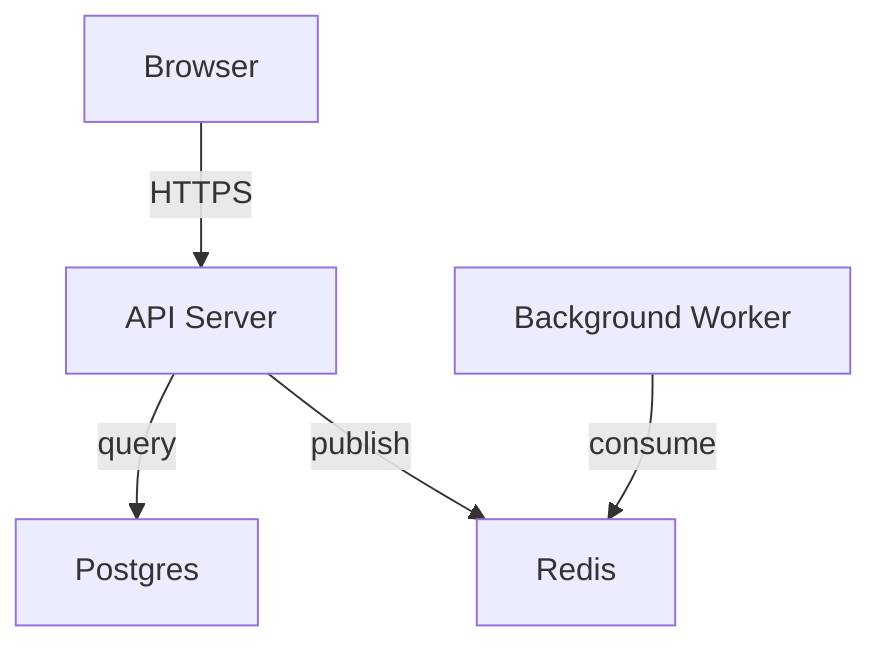
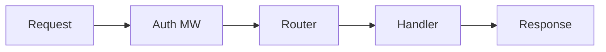
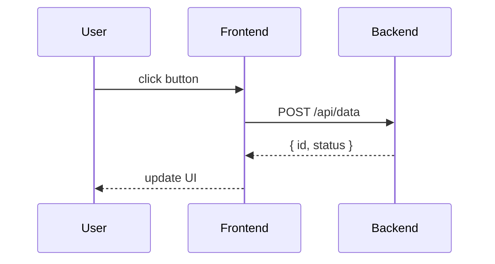
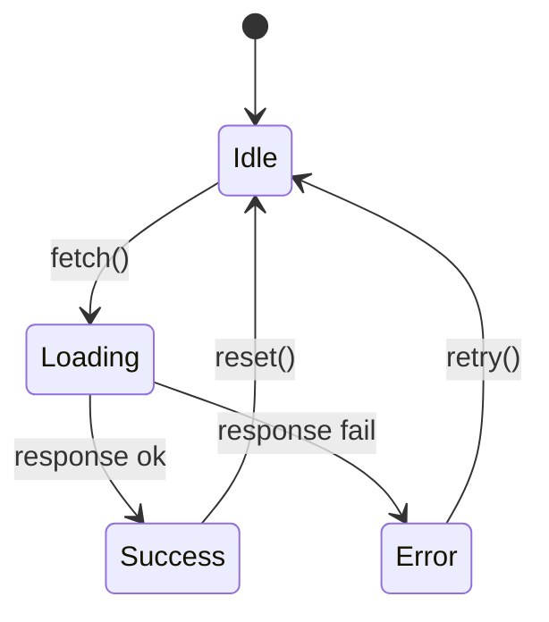

# CodeMermaid Skill Updates Implementation Plan

> **For agentic workers:** REQUIRED SUB-SKILL: Use superpowers:subagent-driven-development (recommended) or superpowers:executing-plans to implement this plan task-by-task. Steps use checkbox (`- [ ]`) syntax for tracking.

**Goal:** Update the codemermaid skill to use Mermaid.js for diagrams, linked (non-inlined) CSS/JS assets, annotation alignment in runtime, and updated reference docs.

**Architecture:** Replace raw SVG diagram guidance with Mermaid.js syntax throughout SKILL.md and references. Switch from inlining CSS/JS into each HTML page to linking them as separate files copied to the output directory. Port `alignAnnotations()` into runtime.js. Add double-escape self-validation to subagent protocol.

**Tech Stack:** Mermaid.js v11 (CDN), vanilla JS, CSS (no build tools)

---

## File Structure

| File | Action | Responsibility |
|------|--------|---------------|
| `skills/codemermaid/assets/skeleton-essay.html` | Modify | Replace inline markers with `<link>` + `<script src>`, add Mermaid CDN |
| `skills/codemermaid/assets/skeleton-index.html` | Modify | Same changes as skeleton-essay |
| `skills/codemermaid/assets/runtime.js` | Modify | Add `alignAnnotations()`, update header comment |
| `skills/codemermaid/assets/style.css` | Modify | Change `.codewalk-annotations` gap to 0, add Mermaid CSS overrides |
| `skills/codemermaid/SKILL.md` | Modify | Major rewrite: frontmatter, Mermaid, linked assets, rules, templates |
| `skills/codemermaid/references/svg-patterns.md` | Rewrite | Replace SVG patterns with Mermaid syntax, keep SVG for code-graph |
| `skills/codemermaid/references/units-examples.md` | Modify | Update diagram examples, fix code-walk format to match SKILL.md |
| `skills/codemermaid/references/subagent-generation.md` | Modify | Add double-escape self-validation to Output Contract |

---

## Task 1: Update skeleton-essay.html — linked assets + Mermaid CDN

**Files:**
- Modify: `skills/codemermaid/assets/skeleton-essay.html`

The skeleton currently has `<style>/* STYLE_INLINE */</style>` and `<script>/* RUNTIME_INLINE */</script>`. Replace with linked files + add Mermaid CDN script before closing `</body>`.

- [ ] **Step 1: Replace the full file contents**

```html
<!DOCTYPE html>
<html lang="en">
<head>
<meta charset="UTF-8">
<meta name="viewport" content="width=device-width, initial-scale=1.0">
<title><!-- SLOT:PAGE_TITLE --> — <!-- SLOT:PROJECT_NAME --></title>
<link rel="preconnect" href="https://fonts.googleapis.com">
<link rel="preconnect" href="https://fonts.gstatic.com" crossorigin>
<link href="https://fonts.googleapis.com/css2?family=Inter:wght@400;500;600&family=Geist+Mono:wght@400;500&display=swap" rel="stylesheet">
<link rel="stylesheet" href="style.css">
<script src="https://cdn.jsdelivr.net/npm/mermaid@11/dist/mermaid.min.js"></script>
<script>mermaid.initialize({startOnLoad:true,securityLevel:'loose',theme:'dark',themeVariables:{fontSize:'16px',primaryColor:'#161718',primaryTextColor:'#f9f9f9',primaryBorderColor:'#252829',lineColor:'#9c9c9d',activeBkgColor:'#FF6363',activeTextColor:'#fff',nodeTextColor:'#f9f9f9',clusterBkg:'#101111',clusterBorder:'#252829'}});</script>
</head>
<body>
<header class="topbar">
  <a class="back-link" href="<!-- SLOT:BACK_LINK -->">← <!-- SLOT:BACK_LABEL --></a>
</header>

<main class="container">
  <!-- SLOT:HERO -->
  <!-- SLOT:TOC -->
  <!-- SLOT:UNITS -->
  <!-- SLOT:FOOTER -->
</main>

<div class="zoom-overlay" hidden>
  <div class="zoom-stage"></div>
  <div class="zoom-controls">
    <button data-zoom-out aria-label="Zoom out" title="Zoom out">
      <svg viewBox="0 0 24 24" aria-hidden="true"><path d="M5 12h14"/></svg>
    </button>
    <span class="zoom-level" data-zoom-level>100%</span>
    <button data-zoom-reset aria-label="Reset zoom" title="Reset zoom">
      <svg viewBox="0 0 24 24" aria-hidden="true"><path d="M3 12a9 9 0 1 0 3-6.7"/><path d="M3 4v6h6"/></svg>
    </button>
    <button data-zoom-in aria-label="Zoom in" title="Zoom in">
      <svg viewBox="0 0 24 24" aria-hidden="true"><path d="M12 5v14"/><path d="M5 12h14"/></svg>
    </button>
    <button data-zoom-close aria-label="Close zoom" title="Close zoom">
      <svg viewBox="0 0 24 24" aria-hidden="true"><path d="M18 6 6 18"/><path d="m6 6 12 12"/></svg>
    </button>
  </div>
</div>

<script src="runtime.js"></script>
</body>
</html>
```

- [ ] **Step 2: Verify the file**

Open `skills/codemermaid/assets/skeleton-essay.html` and confirm:
- No `/* STYLE_INLINE */` or `/* RUNTIME_INLINE */` markers remain
- `<link rel="stylesheet" href="style.css">` is present in `<head>`
- `<script src="runtime.js"></script>` is present before `</body>`
- Mermaid CDN `<script>` is in `<head>` with `mermaid.initialize(...)` call
- All `<!-- SLOT:... -->` markers are preserved unchanged

- [ ] **Step 3: Commit**

```bash
git add skills/codemermaid/assets/skeleton-essay.html
git commit -m "refactor(codemermaid): switch essay skeleton to linked CSS/JS + Mermaid CDN"
```

---

## Task 2: Update skeleton-index.html — linked assets + Mermaid CDN

**Files:**
- Modify: `skills/codemermaid/assets/skeleton-index.html`

Same pattern as Task 1. The index page also gets linked assets.

- [ ] **Step 1: Replace the full file contents**

```html
<!DOCTYPE html>
<html lang="en">
<head>
<meta charset="UTF-8">
<meta name="viewport" content="width=device-width, initial-scale=1.0">
<title><!-- SLOT:PROJECT_NAME --> — Codebase Course</title>
<link rel="preconnect" href="https://fonts.googleapis.com">
<link rel="preconnect" href="https://fonts.gstatic.com" crossorigin>
<link href="https://fonts.googleapis.com/css2?family=Inter:wght@400;500;600&family=Geist+Mono:wght@400;500&display=swap" rel="stylesheet">
<link rel="stylesheet" href="style.css">
</head>
<body>
<main class="container">
  <!-- SLOT:INDEX_HEADER -->
  <!-- SLOT:PERSPECTIVE_CARDS -->
  <!-- SLOT:MODULE_CARDS -->
</main>

<script src="runtime.js"></script>
</body>
</html>
```

Note: The index page does NOT need Mermaid CDN because index pages contain no diagram units. Only essay/perspective/module pages render diagrams.

- [ ] **Step 2: Verify the file**

Confirm:
- No `/* STYLE_INLINE */` or `/* RUNTIME_INLINE */` markers remain
- `<link rel="stylesheet" href="style.css">` is present
- `<script src="runtime.js"></script>` is present
- No Mermaid CDN (index pages have no diagrams)
- All `<!-- SLOT:... -->` markers are preserved

- [ ] **Step 3: Commit**

```bash
git add skills/codemermaid/assets/skeleton-index.html
git commit -m "refactor(codemermaid): switch index skeleton to linked CSS/JS"
```

---

## Task 3: Update runtime.js — add alignAnnotations()

**Files:**
- Modify: `skills/codemermaid/assets/runtime.js`

Add `alignAnnotations()` function that vertically aligns annotation cards with their corresponding code lines in `codewalk-split` containers. This was previously injected via sed into each fixture — now it becomes a permanent runtime feature.

- [ ] **Step 1: Update the header comment**

Replace line 1-3:

```javascript
/* runtime.js — minimal interactive runtime for codemermaid v2.
   Handles: TOC scroll, quiz, annotation alignment, annotation clicks, code-graph sync, zoom.
   Linked via <script src="runtime.js"> in each generated HTML page. */
```

- [ ] **Step 2: Add alignAnnotations function after bindAnnotationClicks (after line 103)**

Insert the following function between the closing `}` of `bindAnnotationClicks` (line 103) and `initCodeWalkAnnotations` (line 105):

```javascript
function alignAnnotations(container) {
  var annotations = container.querySelectorAll('.codewalk-annotation');
  var codeLines = container.querySelectorAll('.code-block .line');
  if (annotations.length === 0 || codeLines.length === 0) return;
  var preBlock = container.querySelector('pre.code-block');
  if (!preBlock) return;
  var preTop = preBlock.getBoundingClientRect().top;
  var annoPanel = container.querySelector('.codewalk-annotations');
  if (!annoPanel) return;
  var panelTop = annoPanel.getBoundingClientRect().top;
  var offset = preTop - panelTop;
  var minGap = 6;
  var prevBottom = offset;
  for (var i = 0; i < annotations.length; i++) {
    var noteLines = String(annotations[i].dataset.noteLines || '').split(',');
    var firstLine = noteLines[0];
    var targetLine = null;
    for (var j = 0; j < codeLines.length; j++) {
      if (codeLines[j].dataset.line === firstLine) { targetLine = codeLines[j]; break; }
    }
    if (!targetLine) { prevBottom += annotations[i].offsetHeight + minGap; continue; }
    var targetTop = targetLine.getBoundingClientRect().top - preTop + offset;
    var marginTop = Math.max(minGap, targetTop - prevBottom);
    annotations[i].style.marginTop = marginTop + 'px';
    prevBottom = targetTop + annotations[i].offsetHeight + minGap;
  }
}
```

- [ ] **Step 3: Call alignAnnotations from initCodeWalkAnnotations**

Replace `initCodeWalkAnnotations` (currently lines 105-110):

```javascript
function initCodeWalkAnnotations() {
  var containers = document.querySelectorAll('.codewalk-split');
  for (var i = 0; i < containers.length; i++) {
    bindAnnotationClicks(containers[i]);
    alignAnnotations(containers[i]);
  }
}
```

- [ ] **Step 4: Add resize listener for re-alignment**

Add a `initAnnotationResize` function after `initCodeWalkAnnotations`:

```javascript
function initAnnotationResize() {
  var ticking = false;
  window.addEventListener('resize', function() {
    if (ticking) return;
    ticking = true;
    requestAnimationFrame(function() {
      var containers = document.querySelectorAll('.codewalk-split');
      for (var i = 0; i < containers.length; i++) {
        alignAnnotations(containers[i]);
      }
      ticking = false;
    });
  });
}
```

- [ ] **Step 5: Add initAnnotationResize to bootPage**

Update `bootPage` to include the new function:

```javascript
function bootPage() {
  initTocScroll();
  initQuiz();
  initCodeWalkAnnotations();
  initAnnotationResize();
  initCodeGraphSync();
  initZoomOverlay();
}
```

- [ ] **Step 6: Verify the file**

Read the complete runtime.js and confirm:
- Header comment updated (no "Inlined into each generated HTML page")
- `alignAnnotations` function exists between `bindAnnotationClicks` and `initCodeWalkAnnotations`
- `initCodeWalkAnnotations` calls both `bindAnnotationClicks` and `alignAnnotations`
- `initAnnotationResize` exists and calls `alignAnnotations` on all containers
- `bootPage` calls `initAnnotationResize`

- [ ] **Step 7: Commit**

```bash
git add skills/codemermaid/assets/runtime.js
git commit -m "feat(codemermaid): add alignAnnotations to runtime.js for code-walk alignment"
```

---

## Task 4: Update style.css — annotation gap + Mermaid overrides

**Files:**
- Modify: `skills/codemermaid/assets/style.css`

Two changes: (1) change annotation gap from 10px to 0 so JS controls spacing, (2) add Mermaid SVG style overrides.

- [ ] **Step 1: Change annotation gap to 0**

In `.codewalk-annotations` (line 555-562), change `gap: 10px` to `gap: 0`:

```css
.codewalk-annotations {
  display: flex;
  flex-direction: column;
  gap: 0;
  padding: 14px;
  background: var(--surface-2);
  overflow-y: auto;
}
```

- [ ] **Step 2: Add Mermaid CSS overrides at end of file (before responsive section)**

Insert before the `/* ===== RESPONSIVE ===== */` section (before line 808):

```css
/* ===== MERMAID DIAGRAM OVERRIDES ===== */
pre.mermaid {
  background: transparent;
  margin: 0;
  display: flex;
  justify-content: center;
}
pre.mermaid svg {
  min-width: 680px;
  max-width: 100%;
  height: auto;
}
pre.mermaid .node rect,
pre.mermaid .node polygon,
pre.mermaid .node circle {
  stroke-width: 1.5px;
}
pre.mermaid .edgeLabel {
  font-size: 12px;
  background: transparent;
}
pre.mermaid .label {
  font-family: var(--font-primary);
  color: var(--text);
  font-size: 13px;
}
pre.mermaid .cluster-label {
  color: var(--text-faint);
  font-size: 11px;
  font-weight: 600;
  letter-spacing: 1px;
  text-transform: uppercase;
}
pre.mermaid line,
pre.mermaid path {
  stroke: var(--text-dim);
}
pre.mermaid .marker {
  fill: var(--text-dim);
  stroke: var(--text-dim);
}
pre.mermaid .edge-pattern-solid {
  stroke: var(--text-dim);
}
pre.mermaid .edge-pattern-dotted {
  stroke: var(--text-dim);
  stroke-dasharray: 4 3;
}
.figure-diagram pre.mermaid {
  padding: 0;
}
.figure-diagram pre.mermaid svg {
  min-width: 0;
}

/* ===== RESPONSIVE ===== */
```

- [ ] **Step 3: Verify the file**

Confirm:
- `.codewalk-annotations` has `gap: 0` (not `gap: 10px`)
- Mermaid overrides block exists before the RESPONSIVE section
- No other CSS rules were changed

- [ ] **Step 4: Commit**

```bash
git add skills/codemermaid/assets/style.css
git commit -m "feat(codemermaid): zero-gap annotations + Mermaid CSS overrides in style.css"
```

---

## Task 5: Update SKILL.md — frontmatter, Mermaid, linked assets, rules

**Files:**
- Modify: `skills/codemermaid/SKILL.md`

This is the largest change. Multiple sections need updating. Each step handles one section.

- [ ] **Step 1: Update frontmatter (lines 1-5)**

Replace:

```markdown
---
name: codemermaid
description: Generates interactive multi-page HTML codebase courses with Mermaid.js diagrams, architecture walkthroughs, module dependency tutorials, data-flow views, and per-module deep dives. Use when asked to teach, map, explain, or visually tour a repository.
compatibility: Generated HTML uses Google Fonts CDN (Inter + Geist Mono) and Mermaid.js v11 CDN for diagrams. Zero npm, zero build tools. CSS and runtime JS are linked (not inlined).
---
```

- [ ] **Step 2: Update opening paragraph (line 9)**

Replace line 9:

```markdown
Generate a multi-page interactive HTML site that teaches a codebase as scrollable essays — Mermaid.js diagrams, typed pedagogical units (concept, quiz, takeaway, diagram, code-walk, code-graph) carrying the lesson. Zero build tools, zero npm. Each output page links shared CSS and runtime JS; Mermaid.js renders diagrams via CDN.
```

- [ ] **Step 3: Update Output section (lines 24-35)**

Replace lines 24-35:

```markdown
## Output

Directory: `docs/codebase-course/`

```
style.css                     <- Copied from assets/style.css
runtime.js                    <- Copied from assets/runtime.js
index.html                    <- Entry page (perspective + module cards)
architecture.html             <- Architecture perspective (essay)
<perspective>.html            <- Other perspectives (essays)
module-<name>.html            <- Per-module deep dives (essays)
```

Each HTML page links `style.css` and `runtime.js` via `<link>` and `<script src>`. Diagrams use Mermaid.js via CDN. The assembly process copies `assets/style.css` and `assets/runtime.js` to the output directory alongside the HTML files.
```

- [ ] **Step 4: Update Phase 1.3 dependency mapping (line 90)**

Replace line 90:

```markdown
This becomes the edge list for Mermaid diagrams. Use Glob and Grep extensively. Read actual code. Do NOT guess.
```

- [ ] **Step 5: Update Unit kinds — diagram unit (line 164)**

Replace line 164:

```javascript
{ kind: "diagram",     title, mermaid, caption, zoomable? }               // Mermaid syntax, zoomable defaults true
```

- [ ] **Step 6: Update Diagram units section (lines 263-279)**

Replace lines 263-279:

```markdown
### Diagram units

```javascript
{
  kind: "diagram",
  title: "Request flow path",
  mermaid:
`graph TD
  Client["Browser"] -->|"HTTPS"| CDN["Edge CDN"]
  CDN -->|"forwards"| App["app.fetch()"]
  App -->|"runs middleware"| Auth["auth middleware"]
  Auth -->|"sets ctx.user"| Handler["protected handler"]`,
  caption: "Request flows from Client through Auth MW to Handler. Auth MW annotates, doesn't block.",
  zoomable: true
}
```

Diagram rules:
- `mermaid` is Mermaid.js syntax. Read `references/svg-patterns.md` for diagram type templates and styling tokens.
- `zoomable` defaults to `true`.
- Nodes represent real components. Use descriptive kebab-case IDs.
- `caption` is 1-2 sentences.
- Supported diagram types: `graph TD` (flowchart), `graph LR` (left-to-right), `sequenceDiagram`, `stateDiagram-v2`. Choose the type that best fits the content.
```

- [ ] **Step 7: Update Code-graph diagram template (lines 470-477)**

Replace lines 470-477:

```html
**diagram:**
```html
<figure class="figure">
  {ZOOMABLE ? '<button class="zoom-btn" data-zoom-trigger>Zoom</button>' : ''}
  <div class="figure-diagram"><pre class="mermaid">{MERMAID_CODE}</pre></div>
  <figcaption>{CAPTION}</figcaption>
</figure>
```
```

- [ ] **Step 8: Update Phase 4 — Build Diagrams (lines 346-357)**

Replace lines 346-357:

```markdown
## Phase 4: Build Mermaid Diagrams

All `diagram` units use Mermaid.js syntax rendered via CDN. Read `references/svg-patterns.md` for Mermaid diagram types, node styling, and dark theme tokens.

Key rules:
- Use `graph TD` for top-down architecture diagrams, `graph LR` for data flow, `sequenceDiagram` for interactions, `stateDiagram-v2` for state machines.
- Node IDs are kebab-case and must be consistent across pages (same module = same node ID everywhere).
- Use descriptive node labels: `Auth["auth middleware"]` not just `A["auth"]`.
- Edge labels use pipe syntax: `A -->|"label"| B`.
- Dashed edges for optional/indirect: `A -.->|"optional"| B`.
- The dark theme is configured in the skeleton template's `mermaid.initialize()` call. Node fill, text, and edge colors are set there — do NOT inline theme overrides in individual diagrams.
- Keep diagrams ≤ 8 nodes for readability. If a graph exceeds 8 nodes, split into multiple diagram units or use subgraphs.

`code-graph` units still use raw inline SVG for their mini call-graph because the runtime needs `data-node-id` attributes for click-sync between code lines and graph nodes. Mermaid cannot produce these attributes. See `references/svg-patterns.md` for the minimal SVG reference for code-graph.
```

- [ ] **Step 9: Update Phase 5 — add asset copy step (lines 359-368)**

Replace lines 359-368:

```markdown
## Phase 5: Generate Page List

| File | Skeleton | Condition |
|------|----------|-----------|
| `index.html`            | `skeleton-index.html` | Always |
| `architecture.html`     | `skeleton-essay.html` | Always |
| `<perspective>.html`    | `skeleton-essay.html` | One per non-architecture perspective |
| `module-<name>.html`    | `skeleton-essay.html` | One per discovered module |

All generated course files go in `docs/codebase-course/`. Filenames are kebab-case except the fixed `index.html`.

Before generating HTML pages, copy shared assets to the output directory:
1. Copy `assets/style.css` → `docs/codebase-course/style.css`
2. Copy `assets/runtime.js` → `docs/codebase-course/runtime.js`

These are linked by every generated HTML page.
```

- [ ] **Step 10: Update Phase 6 assembly process (lines 374-390)**

Replace lines 374-390:

```markdown
### Assembly process

1. **Read the skeleton template**: `assets/skeleton-essay.html` or `assets/skeleton-index.html`
2. **Generate content HTML** for each `<!-- SLOT:... -->` marker (see below)
3. **Replace all slots** with their content HTML
4. **Pre-flight verification** (mandatory — do not skip):
   - [ ] Every `highlights[].line` points to an existing, non-blank line in its snippet
   - [ ] Every code snippet is an exact copy from source (no invented lines, no reordered statements)
   - [ ] No `href="#"` placeholders — all back/next links point to real files
   - [ ] No `**bold**` markdown — use `<strong></strong>` instead
   - [ ] Inside `<pre class="code-block">`, `.line` spans are adjacent with NO whitespace between them
   - [ ] Quiz has exactly 1 option with `data-correct="true"`
   - [ ] No double HTML entity escaping — scan for `&amp;#` or `&amp;lt;` or `&amp;gt;` patterns and fix them
   - [ ] Mermaid syntax is valid — no unclosed brackets, no missing quotes in edge labels
5. **Dispatch a subagent reviewer** to validate the generated HTML
6. **Write** the completed HTML to `docs/codebase-course/<filename>.html`
```

- [ ] **Step 11: Update Important Rules (lines 547-557)**

Replace lines 547-557:

```markdown
## Important Rules

1. **Real code only** — never invent, simplify, or modify code snippets.
2. **Cover every module** — every module discovered in Phase 1 must appear in at least one perspective page AND have its own `module-<name>.html`.
3. **Linked shared assets** — copy `style.css` and `runtime.js` to the output directory. Each HTML links them via `<link>` and `<script src>`.
4. **Vanilla JS only** — no React, no build tools.
5. **Mermaid.js via CDN** — all `diagram` units use Mermaid syntax. `code-graph` mini-graphs use raw SVG (for `data-node-id` click-sync).
6. **Pre whitespace rule** — inside `<pre class="code-block">`, `.line` spans must be adjacent with NO whitespace between them.
7. **Quiz correctness** — every quiz must have exactly 1 option with `data-correct="true"`.
8. **Consistent node IDs** — same module = same node ID across all pages.
9. **User perspective overrides** — user-specified perspectives are mandatory; auto-inferred are supplementary.
10. **Annotation alignment** — the runtime's `alignAnnotations()` handles vertical positioning. CSS `gap` on `.codewalk-annotations` must be `0`.
```

- [ ] **Step 12: Update Common Mistakes table (lines 559-570)**

Replace lines 559-570:

```markdown
## Common Mistakes

| Mistake | Fix |
|---------|-----|
| Blank lines between code lines | `.line` spans inside `<pre>` must be adjacent — no newlines or spaces between them. |
| Highlight points to wrong line | Count lines within the extracted snippet, not the original source file. |
| Code snippet has invented lines | Paste the snippet back into a temp file and run the type checker. |
| `href="#"` in links | Replace with actual relative paths. Never leave placeholder links. |
| Side-by-side code looks cramped | Ensure `grid-template-columns: minmax(0, 1fr) 300px` is applied. |
| Quiz has no correct answer | Exactly 1 option must have `data-correct="true"`. |
| Double HTML entity escaping | Scan output for `&amp;#`, `&amp;lt;`, `&amp;gt;` — these are wrong. The correct forms are `&#39;`, `&lt;`, `&gt;`. |
| Mermaid edge label missing quotes | Use pipe syntax: `A -->|"label text"| B` not `A -->|label text| B`. |
| Annotations not aligned with code | Confirm CSS `.codewalk-annotations { gap: 0 }` and runtime.js `alignAnnotations()` runs on DOMContentLoaded. |
```

- [ ] **Step 13: Update File Organization section (lines 572-592)**

Replace lines 572-592:

```markdown
## File Organization

```
skills/codemermaid/
  SKILL.md                            # This file (6-phase workflow)
  references/
    design-system.md                  # CSS/typography/shadow reference
    DESIGN.md                         # Design rationale
    svg-patterns.md                   # Mermaid diagram patterns + minimal SVG for code-graph
    subagent-generation.md            # Optional parallel generation protocol
    units-examples.md                 # 2-3 examples per unit kind
    voice-examples.md                 # Flat-vs-pointed prose pairs
  assets/
    skeleton-essay.html               # Shell for essay pages (linked CSS/JS, Mermaid CDN)
    skeleton-index.html               # Shell for index page (linked CSS/JS, no Mermaid)
    style.css                         # Full design system CSS + Mermaid overrides
    runtime.js                        # Runtime: TOC, quiz, annotation alignment/clicks, code-graph sync, zoom
  tests/
    fixtures/
      test-page-v2.html               # Visual test page exercising all unit types
```
```

- [ ] **Step 14: Verify the complete SKILL.md**

Read the full file and confirm:
- Frontmatter says "Mermaid.js diagrams" and "linked (not inlined)"
- No references to `/* STYLE_INLINE */` or `/* RUNTIME_INLINE */`
- Phase 4 title says "Build Mermaid Diagrams"
- Diagram unit kind uses `mermaid` field (not `svg`)
- Diagram HTML template uses `<pre class="mermaid">` (not `{SVG}`)
- Phase 5 includes asset copy step
- Phase 6 assembly no longer has inline replacement steps (steps 2-3 removed)
- Pre-flight verification includes double-escape check
- Important Rules updated (no "No external JS libraries" rule)
- Common Mistakes table has Mermaid and annotation alignment entries
- Code-walk rules no longer mention `stacked` layout — only `split` (layout field still exists but `split` is the only documented option)

- [ ] **Step 15: Commit**

```bash
git add skills/codemermaid/SKILL.md
git commit -m "feat(codemermaid): rewrite SKILL.md for Mermaid diagrams + linked assets"
```

---

## Task 6: Rewrite svg-patterns.md for Mermaid

**Files:**
- Rewrite: `skills/codemermaid/references/svg-patterns.md`

Replace the entire file. The new content documents Mermaid diagram patterns for `diagram` units and keeps a minimal SVG reference for `code-graph` mini-graphs.

- [ ] **Step 1: Replace the full file contents**

```markdown
# Diagram Patterns

## Mermaid Diagram Types (for `diagram` units)

All `diagram` units use Mermaid.js syntax. The dark theme is configured in the skeleton template — do NOT inline theme variables in individual diagrams.

### Flowchart — top-down architecture (graph TD)



Mermaid syntax:
```
graph TD
  Client["Browser"] -->|"HTTPS"| Server["API Server"]
  Server -->|"query"| DB["Postgres"]
  Server -->|"publish"| Queue["Redis"]
  Worker["Background Worker"] -->|"consume"| Queue
```

### Flowchart — left-to-right data flow (graph LR)



Mermaid syntax:
```
graph LR
  Input["Request"] --> Middleware["Auth MW"]
  Middleware --> Router["Router"]
  Router --> Handler["Handler"]
  Handler --> Response["Response"]
```

### Sequence diagram (sequenceDiagram)

For request/response flows, login sequences, cross-service interactions.



Mermaid syntax:
```
sequenceDiagram
  participant U as User
  participant F as Frontend
  participant API as Backend
  U->>F: click button
  F->>API: POST /api/data
  API-->>F: { id, status }
  F-->>U: update UI
```

Arrow types:
- `->>` solid arrow (request)
- `-->>` dashed arrow (response)
- `--)` open arrow (async)

### State diagram (stateDiagram-v2)

For state machines, lifecycle flows, modal states.



Mermaid syntax:
```
stateDiagram-v2
  [*] --> Idle
  Idle --> Loading: fetch()
  Loading --> Success: response ok
  Loading --> Error: response fail
  Success --> Idle: reset()
  Error --> Idle: retry()
```

### Subgraphs (grouped nodes)

For layer diagrams grouping modules into architectural tiers.

```
graph TD
  subgraph Entry["Entry Layer"]
    HTTP["HTTP Handlers"]
    CLI["CLI Commands"]
  end
  subgraph Core["Core Layer"]
    Auth["Auth Service"]
    User["User Service"]
  end
  subgraph Data["Data Layer"]
    DB["Postgres"]
    Cache["Redis"]
  end
  HTTP --> Auth
  CLI --> User
  Auth --> DB
  User --> Cache
```

## Mermaid Edge Styles

| Style | Syntax | Use for |
|-------|--------|---------|
| Solid arrow | `A --> B` | Direct dependency |
| Labeled arrow | `A -->\|"label"\| B` | Described relationship |
| Dashed arrow | `A -.-> B` | Optional/indirect dependency |
| Dashed labeled | `A -.->\|"optional"\| B` | Optional with description |
| Bidirectional | `A <--> B` | Two-way dependency |

## Mermaid Node Rules

- Node IDs are kebab-case: `auth-mw`, `user-store`, `api-server`
- Node labels use bracket syntax: `AuthMW["auth middleware"]`
- Same module = same node ID across all pages
- Keep ≤ 8 nodes per diagram; split larger graphs into subgraphs or multiple diagrams
- Edge labels use pipe-quote syntax: `A -->|"descriptive label"| B`

## Minimal SVG Reference (for `code-graph` units only)

`code-graph` units use raw SVG because the runtime needs `data-node-id` attributes for click-sync between code lines and graph nodes. Mermaid cannot produce these attributes.

### SVG Skeleton

```html
<svg viewBox="0 0 {WIDTH} {HEIGHT}" xmlns="http://www.w3.org/2000/svg" shape-rendering="geometricPrecision" text-rendering="geometricPrecision">
  <defs>
    <marker id="arrowhead" viewBox="0 0 10 7" refX="10" refY="3.5" markerWidth="8" markerHeight="6" orient="auto-start-reverse">
      <polygon points="0 0, 10 3.5, 0 7" fill="#9c9c9d"/>
    </marker>
  </defs>
  <!-- Nodes and edges here -->
</svg>
```

### Node

```html
<g class="node" data-node-id="auth-service">
  <rect x="0" y="0" width="140" height="40" rx="8" fill="#161718" stroke="#252829" stroke-width="1.5"/>
  <text x="70" y="25" text-anchor="middle" fill="#f9f9f9" font-family="Inter, sans-serif" font-size="13" font-weight="500">AuthService</text>
</g>
```

### Edge

```html
<line x1="140" y1="20" x2="200" y2="20" stroke="#9c9c9d" stroke-width="1.5" marker-end="url(#arrowhead)"/>
```

### Design Tokens

| Token | Value |
|-------|-------|
| Node fill | `#161718` |
| Node stroke | `#252829` |
| Node text | `#f9f9f9`, Inter 13px/500 |
| Active node fill | `#FF6363` |
| Edge line | `#9c9c9d`, 1.5px |
| Edge arrow | `#9c9c9d` |
```

- [ ] **Step 2: Verify the file**

Confirm:
- Title says "Diagram Patterns" (not "SVG Diagram Patterns")
- Mermaid section covers all 4 diagram types: graph TD, graph LR, sequenceDiagram, stateDiagram-v2
- Mermaid section documents edge styles and node rules
- SVG section is clearly labeled "for code-graph units only"
- SVG section retains the skeleton, node, edge, and design token references

- [ ] **Step 3: Commit**

```bash
git add skills/codemermaid/references/svg-patterns.md
git commit -m "refactor(codemermaid): rewrite svg-patterns.md for Mermaid + minimal SVG reference"
```

---

## Task 7: Update units-examples.md

**Files:**
- Modify: `skills/codemermaid/references/units-examples.md`

The diagram examples already use `mermaid` field — they're correct. The main issue is that `code-walk` examples use the old `highlightLines` + `explanation` format instead of the current `highlights: [{line, note}]` format that SKILL.md documents. Update code-walk examples to match SKILL.md.

- [ ] **Step 1: Replace code-walk (stacked) examples (lines 37-87)**

The "stacked" layout is no longer documented in SKILL.md (only `split` exists). Replace both stacked examples with a single note pointing to the split format:

Replace lines 37-87:

```markdown
## code-walk (split)

Sticky code on the left, annotation cards on the right. Each annotation references a specific code line. Use when explanation has 2+ beats tied to specific lines.

### Example 1 — Auth middleware (split)

```javascript
{
  kind: "code-walk",
  title: "Token check before any handler",
  file: "src/middleware/auth.ts",
  code:
`export const auth: Middleware = async (c, next) => {
  const token = c.req.header('Authorization')?.slice(7);
  if (!token) { c.set('user', null); return next(); }
  try {
    const user = await verify(token);
    c.set('user', user);
  } catch {
    c.set('user', null);
  }
  return next();
};`,
  highlights: [
    { line: 2, note: "Optional chaining — no crash if header is missing." },
    { line: 5, note: "verify() throws on malformed tokens — caught below." },
    { line: 8, note: "Does NOT throw — sets null user, continues. Downstream decides." }
  ]
}
```

### Example 2 — Router trie builder (split)

```javascript
{
  kind: "code-walk",
  title: "Building the trie",
  file: "src/router.ts",
  code:
`function add(path: string, handler: Handler) {
  const segments = path.split('/').filter(Boolean);
  let node = root;
  for (const seg of segments) {
    const isParam = seg.startsWith(':');
    const key = isParam ? '*' : seg;
    if (!node.children[key]) node.children[key] = makeNode();
    if (isParam) node.children[key].param = seg.slice(1);
    node = node.children[key];
  }
  node.handler = handler;
}`,
  highlights: [
    { line: 4, note: "Walk every path segment, descending into the trie." },
    { line: 5, note: "Param segments (starting with :) collapse to a single wildcard key '*'." },
    { line: 8, note: "The wildcard child remembers its original param name for lookup." },
    { line: 11, note: "Handlers live only at leaf nodes — no ambiguous routes." }
  ]
}
```

### Example 3 — Repository read (split)

```javascript
{
  kind: "code-walk",
  title: "Read-through cache pattern",
  file: "src/repo/user.ts",
  code:
`export async function findUser(id: string) {
  const cached = cache.get(id);
  if (cached) return cached;
  const row = await db.users.findById(id);
  cache.set(id, row, { ttl: 60_000 });
  return row;
}`,
  highlights: [
    { line: 2, note: "Cache check is synchronous — instant return on hit." },
    { line: 3, note: "Early return avoids the DB query entirely." },
    { line: 5, note: "Short TTL (60s) because this table mutates often." }
  ]
}
```
```

- [ ] **Step 2: Remove the old "code-walk (split)" section header (lines 91-128)**

Since we just added the split examples above, the old separate "code-walk (split)" section (lines 91-128 in the original) is now a duplicate. Delete the section from `## code-walk (split)` through the end of its example (ending at the `---` before `## code-walk (stepped)`).

- [ ] **Step 3: Remove the "code-walk (stepped)" section (lines 130-162)**

The "stepped" layout is not in the current SKILL.md. Remove the entire `## code-walk (stepped)` section.

- [ ] **Step 4: Update the source note at line 5**

Replace line 5:

```markdown
> Source: examples drawn from scanned codebases. Don't invent codebases — only use repos you've actually scanned.
```

- [ ] **Step 5: Verify the file**

Confirm:
- No `highlightLines` field anywhere (all code-walk examples use `highlights: [{line, note}]`)
- No `explanation` field on code-walk examples (that was the stacked format)
- No `## code-walk (stacked)` or `## code-walk (stepped)` sections
- Diagram examples still use `mermaid` field (already correct)
- Other unit types (concept, quiz, takeaway, guess-first, compare, surprise, storyboard) unchanged

- [ ] **Step 6: Commit**

```bash
git add skills/codemermaid/references/units-examples.md
git commit -m "fix(codemermaid): update code-walk examples to match SKILL.md highlights format"
```

---

## Task 8: Update subagent-generation.md — double-escape self-validation

**Files:**
- Modify: `skills/codemermaid/references/subagent-generation.md`

Add a self-validation check for double HTML entity escaping in the Output Contract section.

- [ ] **Step 1: Add double-escape check to Output Contract**

In the `## Output Contract` section, after the existing `## Validation` block (after line 153), add a self-check step. Find the validation block:

```markdown
## Validation

- Command: `node skills/codemermaid/scripts/validate-units.js <path-or-stdin>`
- Result: PASS | FAIL | NOT_RUN
- Notes: <exact errors if failed>
```

Replace with:

```markdown
## Validation

- Command: `node skills/codemermaid/scripts/validate-units.js <path-or-stdin>`
- Result: PASS | FAIL | NOT_RUN
- Notes: <exact errors if failed>
- Double-escape self-check: scan generated HTML for `&amp;#`, `&amp;lt;`, `&amp;gt;`, `&amp;mdash;`, `&amp;nbsp;` patterns. If any found, the output has been double-escaped. Fix by replacing with the single-escaped forms (`&#39;`, `&lt;`, `&gt;`, `&mdash;`, `&nbsp;`). This is a common subagent artifact where already-escaped content gets escaped again.
```

- [ ] **Step 2: Add double-escape entry to Common Mistakes table**

In the `## Common Mistakes` table (lines 181-188), add a row at the end. After the existing last row:

```markdown
| Worker skips validation | Reject generated pages without validation |
```

Add:

```markdown
| Worker skips validation | Reject generated pages without validation |
| Double-escaped entities in output | Worker must self-check for `&amp;#`, `&amp;lt;`, `&amp;gt;` patterns and fix before reporting. Caused by escaping already-escaped content. |
```

- [ ] **Step 3: Verify the file**

Confirm:
- Output Contract Validation section includes double-escape self-check
- Common Mistakes table has the double-escape row
- No other content was changed

- [ ] **Step 4: Commit**

```bash
git add skills/codemermaid/references/subagent-generation.md
git commit -m "fix(codemermaid): add double-escape self-validation to subagent protocol"
```

---

## Self-Review Checklist

### 1. Spec coverage

| Requirement | Task |
|-------------|------|
| Fix #1: code-walk uses `codewalk-split` only | Task 5 Step 14 (SKILL.md rules) |
| Fix #2: Mermaid.js replaces raw SVG | Tasks 1, 2, 5 Steps 6-9, 6 |
| Fix #3: Double-escape self-validation | Tasks 5 Step 10, 8 |
| Fix #4: alignAnnotations in runtime | Task 3 |
| Linked CSS/JS (not inlined) | Tasks 1, 2, 5 Steps 3, 9-10 |
| Mermaid CDN in skeletons | Task 1 |
| Annotation gap 0 in style.css | Task 4 Step 1 |
| Mermaid CSS overrides in style.css | Task 4 Step 2 |
| Frontmatter update | Task 5 Step 1 |
| Update svg-patterns.md | Task 6 |
| Update units-examples.md | Task 7 |
| Update subagent-generation.md | Task 8 |

### 2. Placeholder scan

No TBD, TODO, "fill in details", "implement later", or placeholder patterns found.

### 3. Type consistency

- All diagram units consistently use `mermaid` field (not `svg`) across SKILL.md, units-examples.md, svg-patterns.md
- All code-walk units consistently use `highlights: [{line, note}]` format across SKILL.md and units-examples.md
- Skeleton templates consistently use `<link rel="stylesheet" href="style.css">` and `<script src="runtime.js"></script>`
- `alignAnnotations` function signature matches between runtime.js and the SKILL.md description
- Mermaid initialize config in skeleton-essay.html matches the dark theme tokens documented in svg-patterns.md
