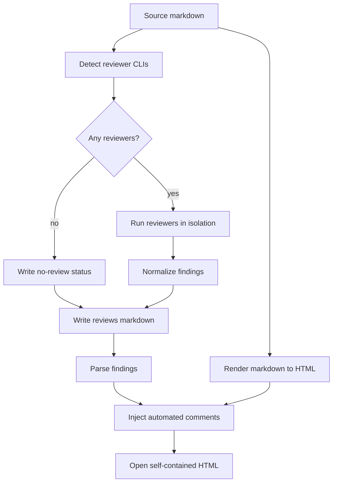

# Request Plan Review Automated Comments Design

## Goal

Extend `request-plan-review` so rendering a markdown plan or spec also runs
available external AI reviewers and displays their findings as comments in the
generated HTML.

The review target is always the original markdown file. Reviewer findings are
anchored to source markdown line numbers, then mapped onto the rendered HTML
through existing `data-source-line` annotations.

This follows the shape of GSD's `gsd:review` command: detect external AI CLIs,
build one review prompt, invoke each available reviewer independently, collect
responses, and write a human-readable reviews markdown file.

Reference:
`https://github.com/gsd-build/get-shit-done/blob/main/commands/gsd/review.md`

## User Decisions

- Reviews run automatically as part of `request-plan-review`.
- Reviewer discovery uses locally available external AI CLIs.
- If no reviewers are available, HTML rendering still succeeds.
- Automated findings use the existing comment template instead of a separate
  review UI.
- Reviews are written beside the generated HTML as
  `docs/request-plan-review/<basename>.reviews.md`.
- Reviewers inspect the original markdown, not the rendered HTML.

## Architecture

The feature adds a review-on-render pipeline around the existing renderer.

1. Read the source markdown file.
2. Detect available external AI CLI reviewers.
3. If reviewers exist, run each reviewer against the source markdown.
4. Normalize reviewer responses into a strict finding format.
5. Write `docs/request-plan-review/<basename>.reviews.md`.
6. Convert markdown to HTML using the existing renderer rules.
7. Parse findings from the reviews markdown.
8. Inject parsed findings into the HTML as initial automated comments.
9. Open the generated HTML.

The output HTML remains self-contained. It must not depend on reading the
sidecar reviews file at browser runtime.

## Components

### Reviewer Discovery

The skill should detect reviewer CLIs with `command -v`.

Initial candidates:

| Reviewer | Command |
| --- | --- |
| Claude | `claude` |
| Gemini | `gemini` |
| Codex | `codex` |
| OpenCode | `opencode` |
| Qwen Code | `qwen` |
| Cursor | `cursor` |

The renderer runs every detected reviewer. There are no per-render flags in the
first version. A future version can add allowlists or skip flags if automatic
review becomes too slow.

### Review Prompt

Each reviewer receives:

- Source markdown path.
- Full source markdown content.
- Instructions to review the plan/spec, not the generated HTML.
- Instructions to focus on executability, missing steps, contradictions,
  risk, testing gaps, unclear ownership, and unsafe assumptions.
- A strict output format that includes source line locations.

The prompt should discourage broad rewrite suggestions. Findings should be
specific, actionable, and tied to a source line or range.

### Reviews Markdown Format

The sidecar file path is:

```text
docs/request-plan-review/<basename>.reviews.md
```

The format is intentionally readable and parseable:

```markdown
# Automated Reviews: docs/superpowers/plans/example.md

## Reviewer: claude

### Finding: Missing failure path
Severity: high
Location: docs/superpowers/plans/example.md:42-48
Quote:
> original markdown snippet

Comment:
This step assumes the command succeeds but does not define what to do if the
generated HTML has no source-line annotations.

## Reviewer: gemini

No findings.
```

Allowed severity values:

- `critical`
- `high`
- `medium`
- `low`
- `note`

Reviewer failures are recorded in the same file:

```markdown
## Reviewer: claude

Review failed.

Reason:
Process timed out after 120 seconds.
```

### Parser Contract

The parser only treats a block as a finding when it has:

- `### Finding: <title>`
- `Severity: <severity>`
- `Location: <path>:<line>` or `Location: <path>:<start>-<end>`
- `Comment:`

`Quote:` is optional but recommended. Invalid finding blocks are ignored and
recorded in a terminal warning.

## HTML Comment Injection

The generated HTML receives an inline data script before `runtime.js` runs:

```html
<script>
window.__AUTOMATED_REVIEW_COMMENTS__ = [
  {
    "id": "A1",
    "source": "automated",
    "reviewer": "claude",
    "severity": "high",
    "title": "Missing failure path",
    "startLine": 42,
    "endLine": 48,
    "selectedText": "original markdown snippet",
    "comment": "This step assumes the command succeeds..."
  }
];
</script>
```

This requires a new template slot:

```html
/* SLOT:REVIEW_DATA */
```

The renderer fills the slot with an empty array when no automated comments
exist.

### Existing Comment Template Reuse

`runtime.js` should initialize its comments array with automated comments before
rendering the comments panel.

Automated comments use the same card shape as manual comments, with small
metadata additions:

- Reviewer name in the card header.
- Severity chip in the card header or body.
- `A1`, `A2`, `A3` IDs to avoid colliding with manual `1`, `2`, `3` IDs.

Manual comments keep existing behavior. Deleting an automated comment only
removes it from the current browser session; it does not rewrite
`<basename>.reviews.md`.

## Line Mapping

The renderer already annotates block-level HTML with `data-source-line`.
Automated comments use that same anchor model.

Mapping rules:

1. If an element starts on `startLine`, attach the badge and highlight there.
2. If no element starts on `startLine`, use the nearest later element within
   `endLine`.
3. If no element exists inside the range, use the nearest later element in the
   document and mark the card as unanchored.
4. If the file path in `Location:` does not match the rendered source file,
   keep the comment in the panel but do not place an inline badge.

For multi-line ranges, the first matched element receives the badge. The card
shows the full source range.

## Failure Behavior

Review execution must not block HTML generation permanently.

| Failure | Behavior |
| --- | --- |
| No reviewer CLIs detected | Generate HTML and `.reviews.md` with a no-review status. |
| One reviewer fails | Record failure in `.reviews.md`; keep other results. |
| Reviewer times out | Record timeout; continue. |
| Output cannot be parsed | Record parse warning; ignore invalid findings. |
| Finding line cannot be mapped | Show comment in panel as unanchored. |

Recommended initial timeout: 120 seconds per reviewer.

## Data Flow



## Testing

### Unit-Level Checks

- Reviewer discovery returns only commands present on `PATH`.
- Reviews markdown parser accepts valid finding blocks.
- Parser ignores incomplete finding blocks without throwing.
- Location parser handles single lines and ranges.
- HTML injection escapes JSON safely.

### Integration Checks

- With no reviewers available, HTML still renders and reviews markdown records
  that automated reviews were not run.
- With a mock reviewer returning one finding, the sidecar reviews markdown is
  created and the HTML contains `window.__AUTOMATED_REVIEW_COMMENTS__`.
- With a finding on a known source line, the runtime places an automated badge
  near the corresponding rendered block.
- With an unmappable finding, the comment appears in the comments panel without
  breaking page initialization.

### Browser Checks

- Light and dark mode render automated comment cards legibly.
- Manual comments can still be added after automated comments.
- Copy All includes both automated and manual comments in a stable order.
- Deleting a comment in the browser does not affect the sidecar reviews file.

## Out of Scope

- Rewriting the source markdown based on automated review findings.
- Persisting browser-side delete or resolve state back to disk.
- Per-reviewer configuration UI.
- Review of rendered HTML visual fidelity.
- Translation support.
- Live collaboration.

## Open Risks

- External CLI invocation syntax varies by tool. The implementation plan must
  define exact command shapes and safe fallbacks per reviewer.
- Reviewer output may drift from the requested format. The parser should be
  strict and the prompt should include a concrete example.
- Automatic review can be slow. The first version favors correctness and
  non-blocking failure behavior over aggressive parallelism.
