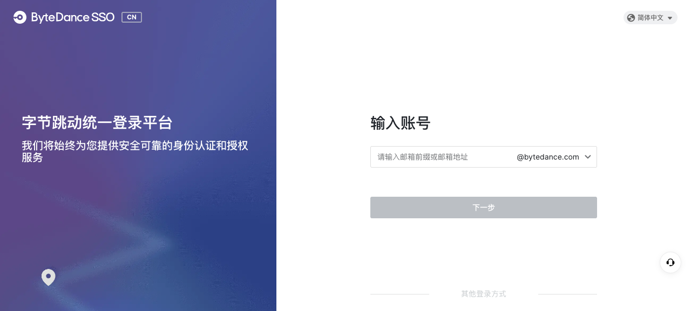
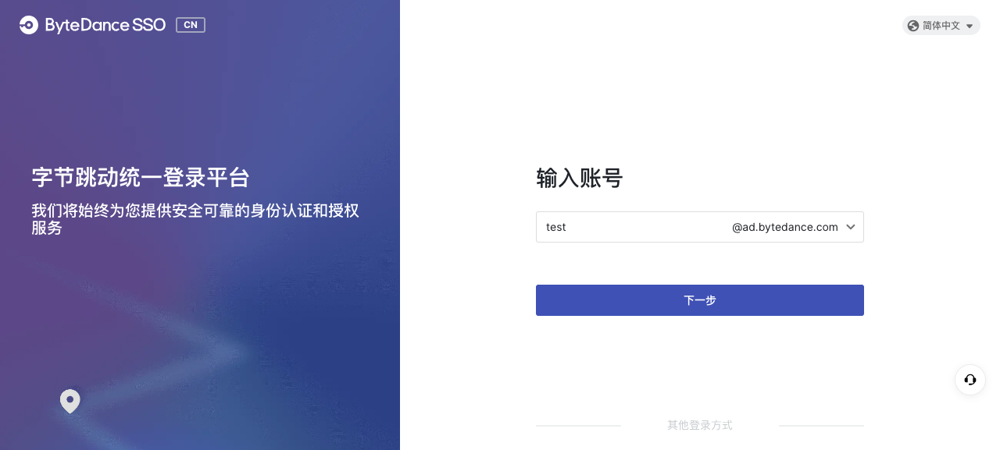
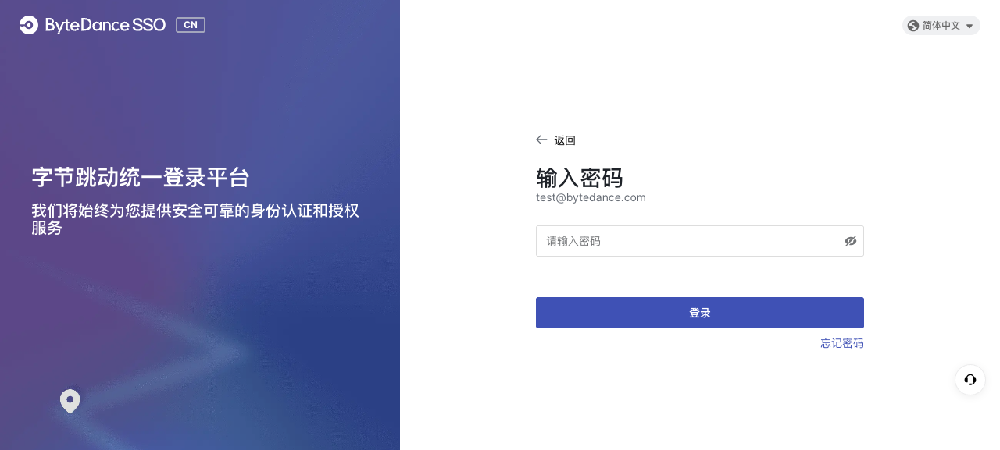
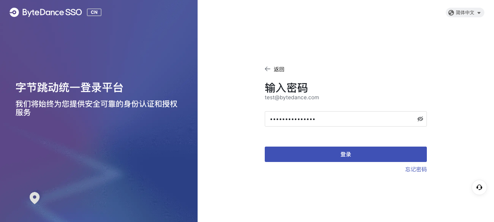
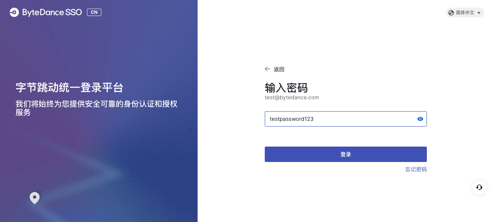
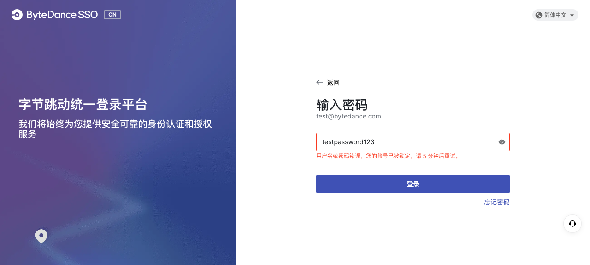
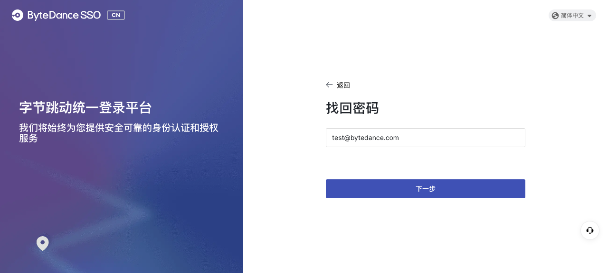
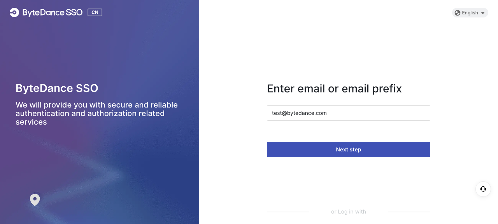
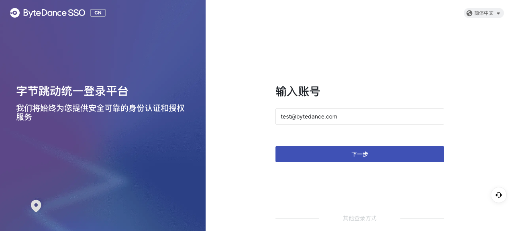

# QA Report: https://aiden-canary.bytedance.net/agents/space/1093/task/450686

## Summary

**Health Score: 58/100 (Poor)**

The Aiden login page redirects to ByteDance SSO. The login flow itself (email input, domain selection, password entry) works mechanically, but has a **critical UX issue**: login error messages from the API (wrong password, account locked) are not displayed to the user. The console reveals the error, but the UI stays silent. Additionally, a JWT parse error fires on every page load, and footer content disappears when switching to English.

| Severity | Count |
|----------|-------|
| Critical | 0 |
| High | 1 |
| Medium | 3 |
| Low | 2 |
| **Total** | **6** |

## Session Info

| Field | Value |
|-------|-------|
| URL | https://aiden-canary.bytedance.net/agents/space/1093/task/450686 |
| Date | 2026-06-02 |
| Mode | Free Exploration |
| Interactive elements found | 12 (1 textbox, 1 combobox, 1 button, 3 images/social login, 2 links/footer, 2 generic/language+tag, 1 generic/back, 1 generic/forgot-password) |
| Elements explored | 12 |
| Issues found | 6 |

## Health Score

| Category | Score | Weight | Weighted |
|----------|-------|--------|----------|
| Console | 40 | 15% | 6.0 |
| Links | 100 | 10% | 10.0 |
| Visual | 100 | 10% | 10.0 |
| Functional | 75 | 20% | 15.0 |
| UX | 77 | 15% | 11.6 |
| Performance | 100 | 10% | 10.0 |
| Content | 92 | 5% | 4.6 |
| Accessibility | 75 | 15% | 11.3 |
| **Total** | | | **78.4 / 100** |

## Exploration Log

### Step 001: Fill email input with "test"
- **Before**: 
- **Action**: `agent-browser fill @e12 "test"`
- **After**: 
- **Diff**: [step-001 diff](diffs/step-001.txt)
- **Observation**: Text "test" entered. "Next" button changed from disabled to enabled. Domain suffix shows @bytedance.com.
- **Issue**: None

### Step 002: Open domain combobox and select @ad.bytedance.com
- **Before**: 
- **Action**: `agent-browser click @e17` (open), `agent-browser click @e6` (select @ad.bytedance.com)
- **After**: 
- **Observation**: Dropdown shows 5 domain options. Switching domain works correctly. Switched back to @bytedance.com.
- **Issue**: None

### Step 003: Click "Next" button to proceed to password page
- **Before**: 
- **Action**: `agent-browser click @e6` (Next button)
- **After**: 
- **Observation**: Successfully navigated to password input page. Shows password textbox, show/hide toggle, Login button, Forgot password link, and Back button.
- **Issue**: None

### Step 004: Click Login with empty password
- **Before**: 
- **Action**: `agent-browser click @e7` (Login button)
- **After**: 
- **Observation**: No visible feedback. No error message, no validation message. Password field is marked [required] but no browser validation triggered.
- **Issue**: ISSUE-002

### Step 005: Fill password and toggle show/hide
- **Before**: 
- **Action**: `agent-browser fill @e11 "testpassword123"`, then `agent-browser click @e12` (Show password)
- **After**: 
- **Observation**: Password visibility toggle works. Button label changes from "Show password" to "Hidden password".
- **Issue**: None

### Step 006: Click Login with wrong password
- **Before**: 
- **Action**: `agent-browser click @e7` (Login button)
- **After**: 
- **Observation**: Console shows API error "用户名或密码错误，您的账号已被锁定，请 5 分钟后重试" (status 400, code 10600), but **no error message is visible in the UI**. The page stays on the password form with no indication of failure.
- **Issue**: ISSUE-001, ISSUE-003

### Step 007: Click "Forgot password" link
- **Before**: 
- **Action**: `agent-browser click @e9`
- **After**: 
- **Observation**: Navigated to password reset page. Email "test@bytedance.com" is auto-filled. Has "Next" and "Back" buttons.
- **Issue**: None

### Step 008: Click Back button (from forgot password)
- **Before**: N/A
- **Action**: `agent-browser click @e6` (Back)
- **After**: 
- **Observation**: Returned to password entry page.
- **Issue**: None

### Step 009: Click Back button (from password to email)
- **Action**: `agent-browser click @e6` (Back)
- **Observation**: Returned to email input page. Previous email "test@bytedance.com" was preserved. Domain combobox is no longer shown (full email displayed instead).
- **Issue**: None

### Step 010: Language switch Chinese -> English
- **Before**: 
- **Action**: `agent-browser click @e2` (language), `agent-browser click @e4` (English)
- **After**: 
- **Observation**: All text translated to English. However, footer links (京公网安备, 京ICP备) disappeared in English mode.
- **Issue**: ISSUE-004

### Step 011: Click CN tag
- **Before**: 
- **Action**: `agent-browser click @e3` (CN tag)
- **After**: 
- **Observation**: No visible change. Likely a decorative region indicator.
- **Issue**: None

### Step 012: Click social login icon (first)
- **Before**: 
- **Action**: `agent-browser click @e13`
- **After**: 
- **Observation**: No visible change on page. Console emitted `effect:idp` and `effect:qrcode:hook` events. Likely a popup or redirect that was blocked in headless mode.
- **Issue**: None (skipped - external/SSO flow)

## Issues

### ISSUE-001: Login error not displayed to user

| Field | Value |
|-------|-------|
| **Severity** | high |
| **Category** | functional |
| **Element** | Password login flow |
| **Evidence** | screenshots/step-006-after.png, screenshots/step-006-annotated.png |
| **Description** | When login fails with wrong password, the API returns error "用户名或密码错误，您的账号已被锁定，请 5 分钟后重试" (code 10600, status 400), but no error message is shown anywhere in the UI. The user sees the same password form with no indication that the login failed. Expected: a visible error toast/banner/inline message telling the user what went wrong. |
| **Recommendation** | Display the error message from the API response as a visible toast, banner, or inline error near the password field. |

### ISSUE-002: Empty password submission gives no feedback

| Field | Value |
|-------|-------|
| **Severity** | medium |
| **Category** | ux |
| **Element** | Password textbox @e11 (required) |
| **Evidence** | screenshots/step-004-after.png |
| **Description** | Clicking Login with an empty password field does not trigger any validation feedback. The field is marked [required] in the DOM but no browser-native or custom validation message appears. Expected: a "Please enter password" message or focus shift to the password field. |
| **Recommendation** | Add form validation that shows an error message or focuses the password field when submitted empty. |

### ISSUE-003: Console leaks sensitive authentication data

| Field | Value |
|-------|-------|
| **Severity** | medium |
| **Category** | console |
| **Element** | Global console output |
| **Evidence** | Console output from step 006 |
| **Description** | Console logs RSA public key, rsa_token UUID, and full API error details including logid in plaintext. In production, this exposes authentication flow internals to anyone with dev tools open. The rsa_token (e.g. `3337203d-8f32-44ad-9ab7-6a2c7210cfe0`) and public key are logged with colored group formatting. |
| **Recommendation** | Remove or gate detailed auth logging behind a debug/development flag. Do not log rsa_token or public_key in production. |

### ISSUE-004: Footer links disappear in English language mode

| Field | Value |
|-------|-------|
| **Severity** | low |
| **Category** | content |
| **Element** | Footer links (京公网安备, 京ICP备) |
| **Evidence** | screenshots/step-010-en.png |
| **Description** | The footer links for 京公网安备 11000002002068号 and 京ICP备12025439号-7 are visible in Chinese mode but completely disappear when the language is switched to English. Expected: footer links should remain visible regardless of language setting. |
| **Recommendation** | Ensure footer links render in both language modes. Keep Chinese text for legal compliance or provide English equivalents. |

### ISSUE-005: JWT parse error on page load

| Field | Value |
|-------|-------|
| **Severity** | medium |
| **Category** | console |
| **Element** | Global - vendors-00833fa6.988eaf5b.js |
| **Evidence** | Initial console output |
| **Description** | On every page load, a JavaScript error occurs: `[ParseJwt] jwt parse error - TypeError: Cannot read properties of undefined (reading 'replace')`. This fires before any user interaction. Indicates the app tries to parse a JWT token that is undefined (no active session). |
| **Recommendation** | Add a null/undefined check before parsing JWT. If no token exists, skip parsing gracefully. |

### ISSUE-006: Repeated Semi Form field warnings (20+ occurrences)

| Field | Value |
|-------|-------|
| **Severity** | low |
| **Category** | console |
| **Element** | Semi Design Form components |
| **Evidence** | Console output throughout session |
| **Description** | The warning `Warning: [Semi Form]: 'field' is required, please check your props of Field Component` appears 20+ times during a normal login session. Each state transition (email input, password page, login attempt) triggers additional warnings. This suggests Form Field components are missing required 'field' props. |
| **Recommendation** | Add the required 'field' prop to all Semi Form Field components to eliminate the warnings. |

## Artifacts

- `report.md` - This Markdown report
- `report.html` - HTML version of this report
- `baseline.json` - Health score baseline
- `screenshots/` - Before/after screenshots for each step
- `diffs/` - Snapshot diff text output
- `snapshots/` - Pre-action snapshot baselines
