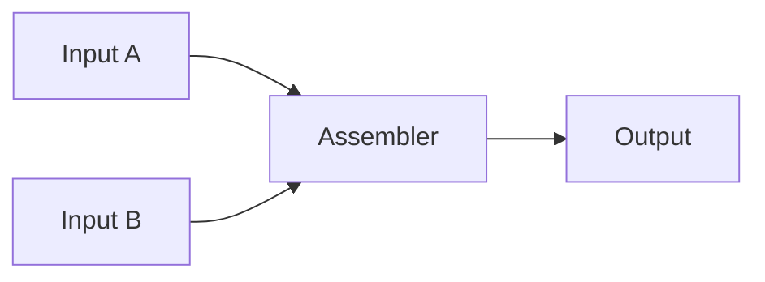
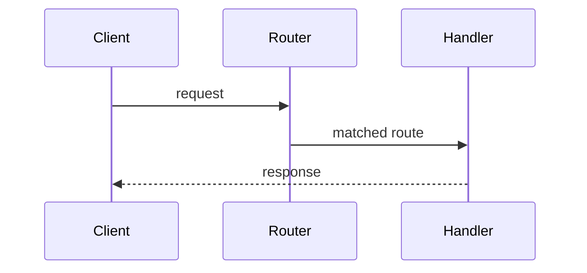
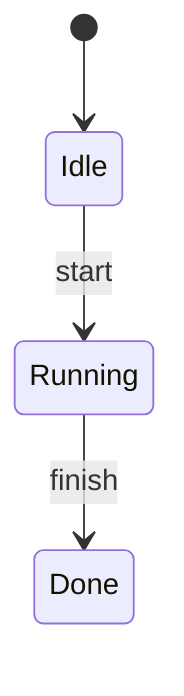

# Storyboard Patterns

Storyboard units are compact scene players. A `storyboard` keeps the essay shape but adds choreography: each scene changes the Mermaid diagram at the moment the explanation changes.

## Pattern 1: Pipeline Assembly

Use for build systems, template renderers, code generation, and deploy flows.

Scene order:

1. Inputs enter the pipeline.
2. Transformation joins or validates inputs.
3. Output is emitted.

Preferred Mermaid:



## Pattern 2: Request Lifecycle

Use for HTTP servers, CLIs, message queues, and event handlers.

Scene order:

1. Entry point receives work.
2. Middleware or routing chooses behavior.
3. Handler produces result.

Preferred Mermaid:



## Pattern 3: State Transition

Use for workflows, parsers, auth sessions, and lifecycle managers.

Scene order:

1. Initial state.
2. Transition trigger.
3. Final or error state.

Preferred Mermaid:



## Annotation Rules

Use annotations only when the code explains something the diagram cannot. The diagram teaches relationships; the code drawer teaches source-level proof.

```javascript
code: {
  file: "skills/codemermaid/scripts/validate-units.js",
  lang: "js",
  source: "if (!result.ok) {\n  console.error('Validation failed:');\n  process.exit(1);\n}",
  highlights: [
    { line: 1, note: "Validation owns the gate before output is written." },
    { lines: [2, 3], note: "All failures print before the process exits." }
  ]
}
```
