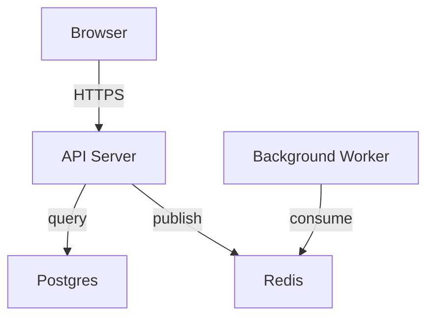
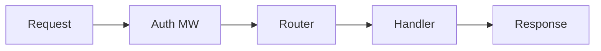
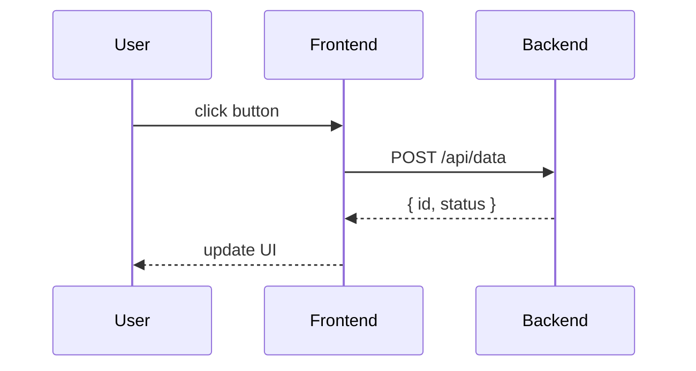
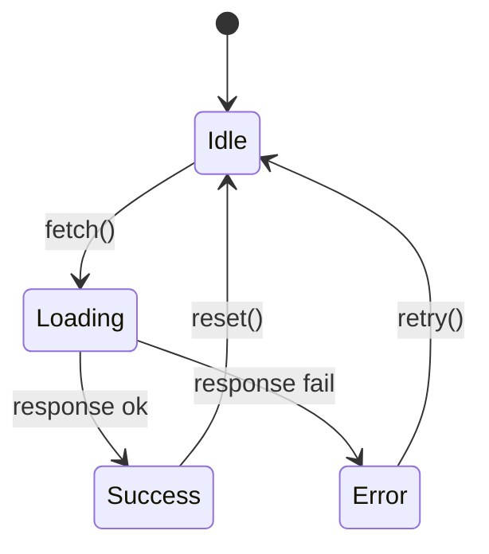

# Diagram Patterns

## Mermaid Diagram Types (for `diagram` units)

All `diagram` units use Mermaid.js syntax rendered via the beautiful-mermaid browser bundle. The Raycast dark theme is configured in `mermaid-bridge.js` — do NOT inline theme variables in individual diagrams.

### Flowchart — top-down architecture (graph TD)



Mermaid syntax:
```
graph TD
  Client["Browser"] -->|"HTTPS"| Server["API Server"]
  Server -->|"query"| DB["Postgres"]
  Server -->|"publish"| Queue["Redis"]
  Worker["Background Worker"] -->|"consume"| Queue
```

### Flowchart — left-to-right data flow (graph LR)



Mermaid syntax:
```
graph LR
  Input["Request"] --> Middleware["Auth MW"]
  Middleware --> Router["Router"]
  Router --> Handler["Handler"]
  Handler --> Response["Response"]
```

### Sequence diagram (sequenceDiagram)

For request/response flows, login sequences, cross-service interactions.



Mermaid syntax:
```
sequenceDiagram
  participant U as User
  participant F as Frontend
  participant API as Backend
  U->>F: click button
  F->>API: POST /api/data
  API-->>F: { id, status }
  F-->>U: update UI
```

Arrow types:
- `->>` solid arrow (request)
- `-->>` dashed arrow (response)
- `--)` open arrow (async)

### State diagram (stateDiagram-v2)

For state machines, lifecycle flows, modal states.



Mermaid syntax:
```
stateDiagram-v2
  [*] --> Idle
  Idle --> Loading: fetch()
  Loading --> Success: response ok
  Loading --> Error: response fail
  Success --> Idle: reset()
  Error --> Idle: retry()
```

### Subgraphs (grouped nodes)

For layer diagrams grouping modules into architectural tiers.

```
graph TD
  subgraph Entry["Entry Layer"]
    HTTP["HTTP Handlers"]
    CLI["CLI Commands"]
  end
  subgraph Core["Core Layer"]
    Auth["Auth Service"]
    User["User Service"]
  end
  subgraph Data["Data Layer"]
    DB["Postgres"]
    Cache["Redis"]
  end
  HTTP --> Auth
  CLI --> User
  Auth --> DB
  User --> Cache
```

## Mermaid Edge Styles

| Style | Syntax | Use for |
|-------|--------|---------|
| Solid arrow | `A --> B` | Direct dependency |
| Labeled arrow | `A -->\|"label"\| B` | Described relationship |
| Dashed arrow | `A -.-> B` | Optional/indirect dependency |
| Dashed labeled | `A -.->\|"optional"\| B` | Optional with description |
| Bidirectional | `A <--> B` | Two-way dependency |

## Mermaid Node Rules

- Node IDs are kebab-case: `auth-mw`, `user-store`, `api-server`
- Node labels use bracket syntax: `AuthMW["auth middleware"]`
- Same module = same node ID across all pages
- Keep ≤ 8 nodes per diagram; split larger graphs into subgraphs or multiple diagrams
- Edge labels use pipe-quote syntax: `A -->|"descriptive label"| B`

## Minimal SVG Reference (for `code-graph` units only)

`code-graph` units use raw SVG because the runtime needs `data-node-id` attributes for click-sync between code lines and graph nodes. beautiful-mermaid cannot produce these attributes.

Keep code-graph mini graphs small: 4-6 nodes is the usual range. Every clickable SVG node must include `data-node-id`, and every `highlights[].graphNode` in the paired code snippet must match one of those ids.

### SVG Skeleton

```html
<svg viewBox="0 0 {WIDTH} {HEIGHT}" xmlns="http://www.w3.org/2000/svg" shape-rendering="geometricPrecision" text-rendering="geometricPrecision">
  <defs>
    <marker id="arrowhead" viewBox="0 0 10 7" refX="10" refY="3.5" markerWidth="8" markerHeight="6" orient="auto-start-reverse">
      <polygon points="0 0, 10 3.5, 0 7" fill="#9c9c9d"/>
    </marker>
  </defs>
  <!-- Nodes and edges here -->
</svg>
```

### Node

```html
<g class="node" data-node-id="auth-service">
  <rect x="0" y="0" width="140" height="40" rx="8" fill="#161718" stroke="#252829" stroke-width="1.5"/>
  <text x="70" y="25" text-anchor="middle" fill="#f9f9f9" font-family="Inter, sans-serif" font-size="13" font-weight="500">AuthService</text>
</g>
```

### Edge

```html
<line x1="140" y1="20" x2="200" y2="20" stroke="#9c9c9d" stroke-width="1.5" marker-end="url(#arrowhead)"/>
```

### Design Tokens

| Token | Value |
|-------|-------|
| Node fill | `#161718` |
| Node stroke | `#252829` |
| Node text | `#f9f9f9`, Inter 13px/500 |
| Active node fill | `#FF6363` |
| Edge line | `#9c9c9d`, 1.5px |
| Edge arrow | `#9c9c9d` |
