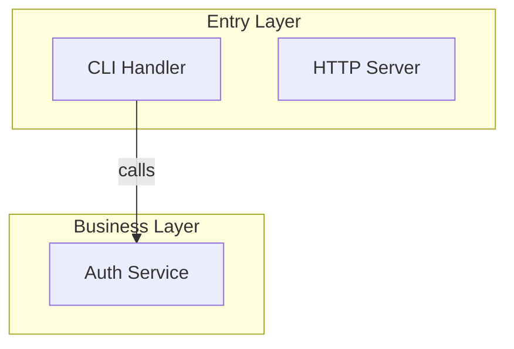

# Mermaid Interactive Codebase Course

Generate a multi-page interactive HTML site that teaches a codebase as scrollable essays — Mermaid diagrams as anchors, typed pedagogical units (concept, code-walk, guess-first, compare, surprise, takeaway, diagram) carrying the lesson. Zero build tools, zero npm. Each output page is self-contained.

## When to Use

- "Generate an interactive course for this codebase"
- "Create a visual walkthrough of this project's architecture"
- "Make an interactive module dependency diagram"
- "Build a tutorial page from this codebase"

## When NOT to Use

- Slide-based presentations → use `presentation` skill (Slidev)
- Pure Markdown output → write `.md` with ````mermaid` blocks directly
- Need drag-and-drop node editing → use React Flow, not this skill

## Output

Directory: `docs/codebase-course/`

  index.html                    <- Entry page (perspective + module cards)
  architecture.html             <- Architecture perspective (essay)
  <perspective>.html            <- Other perspectives (essays)
  module-<name>.html            <- Per-module deep dives (essays)

Each file is fully self-contained — CSS/JS inlined at build time from `templates/partials/`.

## Phase 1: Scan

Read the codebase exhaustively. The goal is to discover ALL meaningful modules, not just the obvious ones.

### Step 1.1: Structural Scan

1. **Root directory** — list all top-level folders and files
2. **Source directories** — for each top-level folder, list its contents recursively (2 levels deep)
3. **Entry files** — `main.*`, `index.*`, `app.*`, `server.*`, `cmd/`, `src/`, `lib/`, `pkg/`
4. **Config files** — `package.json`, `go.mod`, `Cargo.toml`, `pyproject.toml`, `Makefile`, `docker-compose.yml`, equivalent
5. **Framework detection** — language, framework, runtime from config and imports
6. **Test directories** — `test/`, `tests/`, `spec/`, `__tests__/`, `*_test.*`

### Step 1.2: Deep Module Discovery

For EACH source directory found above, determine if it qualifies as a module:

- A **module** is any directory or file that has a clear single responsibility
- Read the first 30 lines of every entry file to understand purpose
- Use Grep to find `import`, `require`, `use`, `from` patterns — map dependency edges
- Check `exports`, `module.exports`, `pub`, `public` — identify public interfaces

**What counts as a module:**
| Type | Examples |
|------|---------|
| Top-level source dir | `src/auth/`, `src/api/`, `src/models/` |
| Standalone config file | `tsconfig.json`, `docker-compose.yml`, `.env.example` |
| Utility/helper dir | `src/utils/`, `src/helpers/`, `src/lib/` |
| Plugin/extension dir | `plugins/`, `extensions/`, `modules/` |
| Data layer | `src/db/`, `src/store/`, `src/repositories/` |
| Build/CI config | `Makefile`, `Dockerfile`, `.github/workflows/` |
| Skill/command dir | `.agents/skills/`, `.opencode/commands/` |
| Single important file | `skills-lock.json`, `CLAUDE.md`, routing config |

**What to skip:**
- `node_modules/`, `vendor/`, `.git/`, `dist/`, `build/`, cache dirs
- Generated files, lock files (except `skills-lock.json` if meaningful)
- Test fixtures, static assets with no logic

### Step 1.3: Dependency Mapping

For every module discovered, trace its imports:

```
Module A → imports from → Module B, Module C
Module B → imports from → Module D
Module C → imports from → Module D (optional)
```

This becomes the edge list for the Mermaid graph.

Use Glob and Grep extensively. Read actual code. Do NOT guess.

## Phase 2: Analyze

From scan results:

1. **Architecture pattern** — MVC, microservices, monolith, event-driven, hexagonal, layered, etc.
2. **Data flow** — trace the primary request path entry → response, and secondary flows
3. **Module graph** — full dependency graph from Phase 1.3, identify cycles and layers
4. **Key abstractions** — interfaces, base classes, core types that define the system's vocabulary
5. **Module categorization** — group modules into layers:

| Layer | Typical Modules |
|-------|----------------|
| Entry | HTTP handlers, CLI commands, main entry points |
| Core | Business logic, domain models, services |
| Data | Database, repositories, ORM, state management |
| Infra | Config, logging, middleware, error handling |
| Output | Templates, serializers, API responses |
| DevX | Build tools, CI/CD, skills, commands |

**Prioritization:** If the codebase has more than 12 modules, organize into sub-graphs. The top-level diagram shows layers/modules. The detail panel for each module shows its internal structure.

5. **User perspective requirements** — parse user prompt for explicit perspective requests. If user says "must show data flow" or "include a sequence diagram", these are mandatory perspectives that cannot be omitted
6. **Auto-infer perspectives** — from project characteristics, select supplementary perspectives:
   - Has HTTP handlers → Data Flow perspective
   - Has database/ORM → Data Model perspective
   - Has state management → State Machine perspective
   - 10+ modules → Module Dependency perspective
   - Has CI/CD config → Build Pipeline perspective
7. **Merge perspective list** — user-specified (mandatory) + auto-inferred (supplementary), deduplicated. Architecture is always included. Every discovered module must be reachable from at least one perspective page

## Phase 3: Build Page Data

Each per-module and per-perspective page is one JS object with `learningPromise`, optional `prereqs`, optional anchor `diagram`, and a `units[]` array. Read `references/units-examples.md` for concrete patterns and `references/voice-examples.md` for tone.

### COURSE (per-module page, `module-<name>.html`)

```javascript
const COURSE = {
  module: "auth",
  learningPromise: "After reading, you'll understand how token validation flows through middleware before any handler runs.",
  prereqs: ["HTTP middleware", "JWT structure"],
  diagram: "graph TD ...",  // optional anchor diagram
  units: [ /* see UNIT shapes below */ ]
};
```

### PERSPECTIVE (per-perspective page, e.g. `architecture.html`)

```javascript
const PERSPECTIVE = {
  perspective: "architecture",
  learningPromise: "After reading, you'll see why this codebase splits responsibilities into 5 layers and what each one's actually for.",
  prereqs: ["MVC pattern"],
  diagram: "graph TD ...",  // REQUIRED for perspective pages
  units: [ /* same UNIT shapes; cross-module refs are inline markdown links in body fields */ ]
};
```

### INDEX (entry page, `index.html`)

```javascript
const INDEX = {
  project: { name, description, language, framework },
  perspectives: [{ title, description, page, unitCount }],
  modules:      [{ title, description, page, unitCount }]
};
```

### Unit kinds

```javascript
{ kind: "concept",     title, body }                                           // 60-150 words
{ kind: "code-walk",   title, file, code, highlightLines, explanation, layout?, steps?, anchorNode? }
{ kind: "guess-first", question, reveal: { code?, explanation } }              // collapsed
{ kind: "compare",     title, left: { label, code }, right: { label, code }, lesson }
{ kind: "surprise",    title, body }                                           // 1-3 sentences callout
{ kind: "takeaway",    body }                                                  // recap card
{ kind: "diagram",     title, mermaid, caption, zoomable? }                    // architecture/sequence figure; zoomable defaults true
{ kind: "storyboard",  title, caption?, scenes: [{ name, mermaid, explanation?, code?, focus? }] } // multi-scene Mermaid player with optional paired code
```

### code-walk layouts

| Layout    | Shape                                                                 | Use when                                                       |
|-----------|-----------------------------------------------------------------------|----------------------------------------------------------------|
| `stacked` (default) | Single column: code, then prose                              | One short explanation, no per-line beats                       |
| `split`             | Sticky code left, prose right (collapses < 880px)            | Multiple beats tied to specific lines, would otherwise scroll-back |
| `stepped`           | Sticky code left, ordered `steps[]` right; scroll-driven highlight migration | One narrative walk through a function in 3-5 beats |

`stepped` requires `steps: [{ highlightLines, beat }]` instead of flat `highlightLines + explanation`. **Hard cap: at most one `stepped` code-walk per module.**

### Voice rules

A teacher pointing at the thing. Signposted, opinionated, comparing to familiar mental models. See `references/voice-examples.md` for flat-vs-pointed pairs the AI MUST imitate. Anti-patterns: neutral description, academic filler ("it is important to note"), passive voice ("as we can see").

### Per-unit budgets

| Unit | Limit |
|------|-------|
| `concept` | 60–150 words |
| `code-walk` | 8–15 lines code + 50–150 words explanation |
| `guess-first` | question ≤ 2 sentences, reveal ≤ 150 words |
| `compare` | ≤ 12 lines per side, lesson ≤ 80 words |
| `surprise` | 1–3 sentences |
| `takeaway` | 2–4 sentences |
| **Per page** | **4–8 units (hard max 10)** |

### Pedagogy enforcement (mandatory)

Every generated page MUST satisfy these rules. Run `node skills/mermaid-course/scripts/validate-units.js path/to/page.json` after assembly; the build fails on violation:

- Every module MUST have a non-empty `learningPromise`.
- Every module's `units[]` MUST contain ≥ 1 `guess-first` OR ≥ 1 `surprise`.
- Every module's `units[]` MUST end with a `takeaway`.
- Every perspective's `units[]` MUST start with a `concept` and end with a `takeaway`.
- ≤ 1 `stepped` code-walk per page.
- ≤ 3 `storyboard` units per page, with at least one non-storyboard text unit between storyboard units.
- ≤ 10 units per page.

### Real code only

`code-walk.code` must be exact copies from real source files. Never invent or simplify. If a function exceeds 15 lines, show the important slice with `// ...` to mark elision.

### Storyboard units

Use `storyboard` when the reader needs to watch a system change across 2-5 scenes. Good fits: template assembly, request lifecycle, state transitions, build pipelines, parser phases, data synchronization. Bad fits: one static architecture overview, long prose explanations, or anything that needs arbitrary 2D canvas layout.

Read `references/storyboard-patterns.md` before writing storyboard units. Follow the approved Variant B Cinema Strip shape: large Mermaid stage, scene strip, collapsible code drawer, and P3 aside-panel annotations.

```javascript
{
  kind: "storyboard",
  title: "How Phase 6 assembles one page",
  caption: "One output page is slot replacement plus validation.",
  scenes: [
    {
      name: "Read shell",
      mermaid: "flowchart LR\n  A[template-essay.html] --> B[slot markers]",
      explanation: "The shell owns page structure. The content is still missing."
    },
    {
      name: "Inline partials",
      mermaid: "flowchart LR\n  A[_base.css] --> C[HTML]\n  B[_essay.js] --> C",
      code: {
        file: "skills/mermaid-course/SKILL.md",
        lang: "markdown",
        source: "1. Read the shell template\n2. Read the partials\n3. Inline the partials",
        highlights: [
          { line: 2, note: "Reusable CSS and JS become page-local assets." },
          { line: 3, note: "The output stays self-contained after replacement." }
        ]
      },
      explanation: "This is where reusable pieces become one file."
    }
  ]
}
```

Storyboard rules:

- `scenes.length` is 2-5. Use 3 scenes as the default.
- Every scene has a short `name` and non-empty `mermaid`.
- `explanation` is 1-3 sentences.
- `code.source` is copied from real source or from the current skill instructions. Do not invent code.
- Use `code.highlights`, not `highlightLines`, for storyboard code.
- A single-line annotation uses `{ line, note }`.
- A multi-line annotation uses `{ lines: [start, ...end], note }`.
- Cap annotations at 5 per scene; split the scene when more are needed.
- Use Mermaid image nodes only for local paths or data URLs. Do not use remote image URLs.
- Page budget: at most 3 storyboard units per page, with at least one text unit between storyboard units.

## Phase 4: Build Mermaid Graphs

Mermaid plays two roles. Never share one graph between them.

### Role 1 — Anchor diagram

The page-level `diagram` field on COURSE/PERSPECTIVE. Job: orientation, not navigation.

- ≤ 8 nodes recommended (hard cap is reader patience).
- `graph TD` for layered architecture; `graph LR` for sequential flows.
- Use `["bracket labels"]` for readable node names.
- **No `click nodeId callback` directives.** Click handling is wired by `_essay.js` via the `anchorNode` binding on units.
- Optional. Omit if the page doesn't benefit from a mini-map.

To enable scroll-linked highlighting, set `anchorNode: "<mermaidNodeId>"` on the unit(s) you want bound. The reader's scroll position drives which node lights up; tap a node to scroll back. Units without `anchorNode` are ignored.

### Role 2 — Architecture / sequence / state figure

The new `diagram` unit kind. Lives inline in `units[]`.

```javascript
{ kind: "diagram", title: "Auth handshake", mermaid: "sequenceDiagram\n  ...", caption: "...", zoomable: true }
```

- Nodes represent real components, message flows, states, dependencies — independent of reading order.
- No scroll-linking. No `anchorNode`. Just a captioned figure.
- Counts toward the 4–8 unit budget.
- `zoomable` defaults to `true`; set `false` only for tiny figures where zoom would be theater.
- Other diagram types fit naturally here: `sequenceDiagram` (request flow), `classDiagram` (data models), `stateDiagram-v2` (lifecycle).

### Subgraph rules (Role 1, large repos)

For 8+ modules, group into `subgraph` blocks by layer. For 15+ modules, generate multiple narrower perspectives instead of one mega-diagram.



### Edge labels

`-->|"label"|` describes the relationship verb (reads, triggers, registers in, imports). `-.->` for optional/indirect dependencies.

### Cross-page node IDs

The same module uses the same node ID across all pages it appears on (e.g., `auth` is `auth` everywhere).

## Phase 5: Generate Page List

| File | Shell template | Page CSS partial | Page JS partial | Data | Condition |
|------|----------------|------------------|-----------------|------|-----------|
| `index.html`            | `template-index.html` | `_index.css` | `_index.js` | `INDEX`       | Always |
| `architecture.html`     | `template-essay.html` | `_essay.css` | `_essay.js` | `PERSPECTIVE` | Always |
| `<perspective>.html`    | `template-essay.html` | `_essay.css` | `_essay.js` | `PERSPECTIVE` | One per non-architecture perspective |
| `module-<name>.html`    | `template-essay.html` | `_essay.css` | `_essay.js` | `COURSE`      | One per discovered module |

All files go in `docs/codebase-course/`. Filenames are kebab-case except the fixed `index.html`.

## Phase 6: Assemble

For each page in the file list (Phase 5):

1. **Read the shell template**: `templates/template-essay.html` or `templates/template-index.html`.
2. **Read the partials**:
   - `templates/partials/_base.css` (always)
   - `templates/partials/_essay.css` OR `_index.css` (per page kind)
   - `templates/partials/_runtime.js` (always)
   - `templates/partials/_essay.js` OR `_index.js` (per page kind)
3. **Inline the partials** by replacing slot markers in the shell:
   - `{{COMMON_STYLES}}` ← contents of `_base.css`
   - `{{PAGE_STYLES}}` ← contents of `_essay.css` or `_index.css`
   - `{{COMMON_SCRIPTS}}` ← contents of `_runtime.js`
   - `{{PAGE_SCRIPTS}}` ← contents of `_essay.js` or `_index.js`
4. **Fill page-specific slots** (see below).
5. **Validate** by piping the page-data object as JSON to `node skills/mermaid-course/scripts/validate-units.js -`. Abort the build on failure.
6. **Write** the resolved HTML to `docs/codebase-course/<filename>.html`.

Every emitted HTML stays self-contained — partials are inlined at assembly time, not loaded at runtime. Shared CSS/JS lives in the skill's `partials/` for DRY authoring; the output is independent files.

### Page-specific slots — `template-essay.html`

| Slot | Source |
|------|--------|
| `{{PROJECT_NAME}}` | from Phase 1 |
| `{{PAGE_TITLE}}` | perspective title or module name |
| `{{LEARNING_PROMISE}}` | `page.learningPromise` |
| `{{LEARNING_PROMISE_RECAP}}` | shorter restatement of the promise (≤ 1 sentence) |
| `{{PREREQ_CHIPS}}` | `page.prereqs.map(p => '<li>' + p + '</li>').join('')` |
| `{{BACK_LINK}}` | `index.html` |
| `{{BACK_LABEL}}` | `Index` |
| `{{NEXT_LINK}}` | next page in reading order, or `index.html` |
| `{{NEXT_LABEL}}` | name of the next page |
| `{{PAGE_DATA}}` | the COURSE or PERSPECTIVE object as a valid JS literal (NOT a JSON string) |

### Page-specific slots — `template-index.html`

| Slot | Source |
|------|--------|
| `{{PROJECT_NAME}}` | from Phase 1 |
| `{{PROJECT_DESCRIPTION}}` | one-line description |
| `{{LANGUAGE}}` | from Phase 1 |
| `{{FRAMEWORK}}` | `<span class="badge">Next.js</span>` or empty string |
| `{{INDEX_DATA}}` | the INDEX object as a valid JS literal |

## Design System

Built-in Raycast-inspired dark theme. For the full design reference (CSS variables, typography, shadows, colors, spacing), read `references/design-system.md`.

## Important Rules

1. **Real code only** — never invent, simplify, or modify code snippets.
2. **Cover every module** — every module discovered in Phase 1 must appear in at least one perspective page AND have its own `module-<name>.html`.
3. **Self-contained output** — each emitted HTML inlines all CSS/JS. Partials live in the skill's `templates/partials/` for DRY authoring, not at runtime.
4. **Vanilla JS only** — no React, no build tools.
5. **No Mermaid click directives** on essay pages. Anchor-diagram navigation comes from `_essay.js` reading `anchorNode` bindings on units.
6. **Validate before writing** — `node scripts/validate-units.js` must pass for every page.
7. **Test in browser** — open each generated `.html` and verify scroll-link, stepped-walk, and zoom interactions.
8. **Consistent node IDs** — same module = same node ID across all pages.
9. **User perspective overrides** — user-specified perspectives are mandatory; auto-inferred are supplementary.

## Common Mistakes

| Mistake | Fix |
|---------|-----|
| Anchor highlight doesn't migrate | Check unit has `anchorNode` matching a node ID in the page's `diagram` |
| Stepped code-walk highlight stuck | Each `steps[]` item must have `highlightLines` (array, 1-based) and `beat` (prose) |
| Zoomed Mermaid SVG looks blurry | Ensure `_essay.css` has NO `will-change: transform` on `.zoom-stage`; keep `shape-rendering: geometricPrecision` |
| Zoom opens to empty stage | SVG clone must get explicit `width`/`height` attributes from `getBoundingClientRect()` of the source |
| Validator fails on a module | Read the error — usually missing `guess-first`/`surprise`, missing trailing `takeaway`, or > 1 stepped walk |
| Storyboard drawer feels noisy | Use fewer annotations, cap at 5 notes per scene, and split crowded scenes into two smaller scenes |
| Storyboard image fails validation | Mermaid image nodes must use local paths or data URLs, never remote URLs |
| Code block unreadable | `_base.css` sets `font-family: Geist Mono, line-height: 1.7` on `pre.code-block` |
| Cross-module link in body doesn't render | Use markdown link syntax `[label](module-foo.html)`; `renderMarkdownLinks()` parses it |

## File Organization

```
skills/mermaid-course/
  SKILL.md                            # This file (6-phase workflow)
  references/
    design-system.md                  # CSS/typography/shadow reference
    storyboard-patterns.md            # Mermaid storyboard patterns and annotation rules
    units-examples.md                 # 2-3 examples per unit kind
    voice-examples.md                 # Flat-vs-pointed prose pairs
  templates/
    template-essay.html               # Shell for perspective and module pages
    template-index.html               # Shell for the entry page
    partials/
      _base.css                       # Shared tokens, typography, layout, hero
      _essay.css                      # Anchor diagram, units, zoom overlay
      _index.css                      # Card grid
      _runtime.js                     # Mermaid init, markdown link parser, helpers
      _essay.js                       # Scroll-link, stepped-walk, zoom controls
      _index.js                       # Index runtime (currently minimal)
  scripts/
    validate-units.js                 # Pedagogy enforcement
    validate-units.test.js            # Tests for the validator
```

## Relationship to Other Skills

- **presentation** — Slidev-based slides (slide deck). Use `mermaid-course` for interactive exploration, `presentation` for linear slide-based talks.
- **Slidev skill** — Syntax reference for Slidev. `mermaid-course` does NOT use Slidev.
