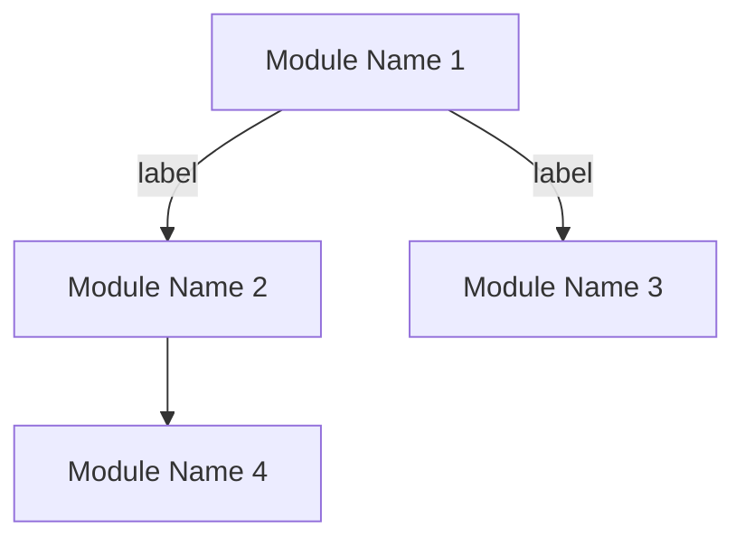
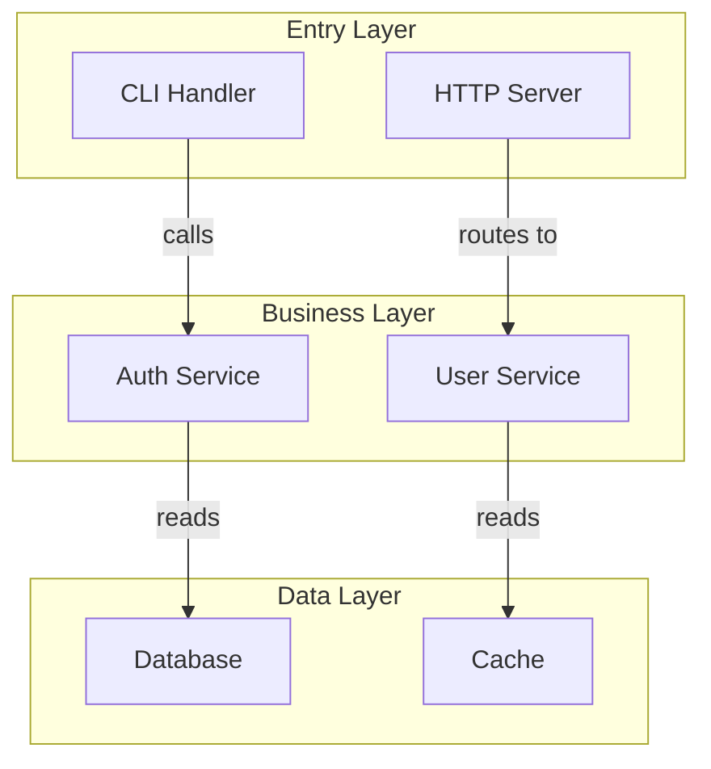

# Mermaid Interactive Codebase Course

Generate a single self-contained HTML file that teaches a codebase through interactive Mermaid diagrams with click-to-explore detail panels. Zero build tools, zero npm, opens directly in any browser.

## When to Use

- "Generate an interactive course for this codebase"
- "Create a visual walkthrough of this project's architecture"
- "Make an interactive module dependency diagram"
- "Build a tutorial page from this codebase"

## When NOT to Use

- Slide-based presentations → use `presentation` skill (Slidev)
- Pure Markdown output → write `.md` with ````mermaid` blocks directly
- Need drag-and-drop node editing → use React Flow, not this skill

## Output

Directory: `docs/codebase-course/`

  index.html                    <- Entry page (perspective + module cards)
  architecture.html             <- Architecture perspective
  <perspective>.html            <- Other perspectives (agent decides)
  module-<name>.html            <- Per-module deep dives (agent decides)

## Phase 1: Scan

Read the codebase exhaustively. The goal is to discover ALL meaningful modules, not just the obvious ones.

### Step 1.1: Structural Scan

1. **Root directory** — list all top-level folders and files
2. **Source directories** — for each top-level folder, list its contents recursively (2 levels deep)
3. **Entry files** — `main.*`, `index.*`, `app.*`, `server.*`, `cmd/`, `src/`, `lib/`, `pkg/`
4. **Config files** — `package.json`, `go.mod`, `Cargo.toml`, `pyproject.toml`, `Makefile`, `docker-compose.yml`, equivalent
5. **Framework detection** — language, framework, runtime from config and imports
6. **Test directories** — `test/`, `tests/`, `spec/`, `__tests__/`, `*_test.*`

### Step 1.2: Deep Module Discovery

For EACH source directory found above, determine if it qualifies as a module:

- A **module** is any directory or file that has a clear single responsibility
- Read the first 30 lines of every entry file to understand purpose
- Use Grep to find `import`, `require`, `use`, `from` patterns — map dependency edges
- Check `exports`, `module.exports`, `pub`, `public` — identify public interfaces

**What counts as a module:**
| Type | Examples |
|------|---------|
| Top-level source dir | `src/auth/`, `src/api/`, `src/models/` |
| Standalone config file | `tsconfig.json`, `docker-compose.yml`, `.env.example` |
| Utility/helper dir | `src/utils/`, `src/helpers/`, `src/lib/` |
| Plugin/extension dir | `plugins/`, `extensions/`, `modules/` |
| Data layer | `src/db/`, `src/store/`, `src/repositories/` |
| Build/CI config | `Makefile`, `Dockerfile`, `.github/workflows/` |
| Skill/command dir | `.agents/skills/`, `.opencode/commands/` |
| Single important file | `skills-lock.json`, `CLAUDE.md`, routing config |

**What to skip:**
- `node_modules/`, `vendor/`, `.git/`, `dist/`, `build/`, cache dirs
- Generated files, lock files (except `skills-lock.json` if meaningful)
- Test fixtures, static assets with no logic

### Step 1.3: Dependency Mapping

For every module discovered, trace its imports:

```
Module A → imports from → Module B, Module C
Module B → imports from → Module D
Module C → imports from → Module D (optional)
```

This becomes the edge list for the Mermaid graph.

Use Glob and Grep extensively. Read actual code. Do NOT guess.

## Phase 2: Analyze

From scan results:

1. **Architecture pattern** — MVC, microservices, monolith, event-driven, hexagonal, layered, etc.
2. **Data flow** — trace the primary request path entry → response, and secondary flows
3. **Module graph** — full dependency graph from Phase 1.3, identify cycles and layers
4. **Key abstractions** — interfaces, base classes, core types that define the system's vocabulary
5. **Module categorization** — group modules into layers:

| Layer | Typical Modules |
|-------|----------------|
| Entry | HTTP handlers, CLI commands, main entry points |
| Core | Business logic, domain models, services |
| Data | Database, repositories, ORM, state management |
| Infra | Config, logging, middleware, error handling |
| Output | Templates, serializers, API responses |
| DevX | Build tools, CI/CD, skills, commands |

**Prioritization:** If the codebase has more than 12 modules, organize into sub-graphs. The top-level diagram shows layers/modules. The detail panel for each module shows its internal structure.

5. **User perspective requirements** — parse user prompt for explicit perspective requests. If user says "must show data flow" or "include a sequence diagram", these are mandatory perspectives that cannot be omitted
6. **Auto-infer perspectives** — from project characteristics, select supplementary perspectives:
   - Has HTTP handlers → Data Flow perspective
   - Has database/ORM → Data Model perspective
   - Has state management → State Machine perspective
   - 10+ modules → Module Dependency perspective
   - Has CI/CD config → Build Pipeline perspective
7. **Merge perspective list** — user-specified (mandatory) + auto-inferred (supplementary), deduplicated. Architecture is always included. Every discovered module must be reachable from at least one perspective page

## Phase 3: Build COURSE Data

Define a JavaScript object with:

```
COURSE = {
  flowOrder: ["nodeId1", "nodeId2", ...],
  "nodeId1": {
    label: "Module Name",
    summary: "One sentence what this module does.",
    files: ["path/to/file1", "path/to/file2"],
    steps: [
      {
        title: "Step Title",
        code: "actual code from source file",
        highlightLines: [3, 4, 5],
        explanation: "What this code does and why it matters."
      }
    ]
  }
}
```

**Rules:**
- `code` must be exact copies from real files — never invent or simplify
- `highlightLines` uses 1-based line numbers, highlight the most important lines
- `steps` should follow a logical teaching order (what it is → how it works → why it matters)
- `flowOrder` defines the guided navigation sequence — follow the dependency/layer order (entry → core → data → infra)
- 1-5 steps per module, 8-15 lines of code per step
- If a function is longer than 15 lines, show only the important part with `// ...` comment
- **Cover every module discovered in Phase 1** — do not skip modules. If a module seems "simple", give it 1 step with its most important code
- Each module's `steps` must show real code — not just description text. Every module should have at least one code snippet from an actual file

### INDEX Data (for index.html)

```javascript
const INDEX = {
  project: { name: "Project Name", description: "One-line description", language: "TypeScript", framework: "Next.js" },
  perspectives: [
    { title: "Architecture Overview", description: "12 modules across 5 layers", page: "architecture.html", diagramType: "graph TD" }
  ],
  modules: [
    { title: "user-service", description: "User management and authentication", page: "module-user-service.html", steps: 3 }
  ]
};
```

### PERSPECTIVE Data (for perspective pages)

```javascript
const PERSPECTIVE = {
  title: "Request Lifecycle",
  backLink: "index.html",
  graph: "sequenceDiagram\n  participant Client\n  ...",
  nodes: [
    { id: "auth", label: "Auth Middleware", summary: "Validates JWT tokens and sets user context.", deepLink: "module-auth.html" }
  ]
};
```

- `PERSPECTIVE` is used for cross-module perspective pages (architecture, data flow, etc.)
- `COURSE` is used for per-module deep-dive pages (unchanged)
- Node IDs must be consistent across all pages

## Phase 4: Build Mermaid Graph

Define the flowchart that matches the module graph:



**Graph rules:**
- Use `graph TD` (top-down) for architecture diagrams
- Use `["bracket labels"]` for readable node names
- Use `-->|"label"|` for labeled edges describing the relationship
- Use `-.->` for optional/indirect dependencies
- Add `click nodeId callback` for every node
- Edge labels describe the relationship verb (reads, triggers, registers in, imports)
- **For 8+ modules**: use `subgraph` to group modules by layer
- **For 15+ modules**: create a top-level diagram showing layers only, with each layer clickable leading to a sub-diagram

**Sub-graph example for layered architecture:**


**Multi-page graph rules:**
- Each perspective page gets its own independent Mermaid graph
- Module pages use `COURSE` data (existing behavior)
- Perspective pages use `PERSPECTIVE` data (new)
- Node IDs must be consistent across pages (e.g. `auth` node is `auth` everywhere)
- Every node in a perspective page must have a `click nodeId callback` directive

**Other diagram types** for inside the detail panel:
- `sequenceDiagram` — request flow, data flow
- `classDiagram` — data models, type hierarchies
- `stateDiagram-v2` — lifecycle, state machines

## Phase 5: Generate Page List

From the perspective list (Phase 2) and module list (Phase 1), determine which files to generate:

| File | Template | Data | Condition |
|------|----------|------|-----------|
| `index.html` | `template-index.html` | `INDEX` | Always |
| `architecture.html` | `template-course.html` | `PERSPECTIVE` | Always (architecture is mandatory) |
| `<perspective>.html` | `template-course.html` | `PERSPECTIVE` | One per non-architecture perspective |
| `module-<name>.html` | `template-course.html` | `COURSE` | One per discovered module |

File naming: `index.html` is fixed. All other filenames are kebab-case, agent-decides. All files go in `docs/codebase-course/`.

## Phase 6: Assemble

Read both templates. For each page in the file list (Phase 5), fill placeholders and output to `docs/codebase-course/`.

### Using template-index.html

Replace these placeholders:
- `{{PROJECT_NAME}}` — from Phase 1
- `{{PROJECT_DESCRIPTION}}` — one-line project description
- `{{LANGUAGE}}` — from Phase 1
- `{{FRAMEWORK}}` — badge HTML string like `<span class="badge">Next.js</span>`, or empty string if none
- `{{INDEX_DATA}}` — the `INDEX` JavaScript object as a literal (not JSON string — must be valid JS)

### Using template-course.html

Replace these placeholders:
- `{{PROJECT_NAME}}` — from Phase 1
- `{{LANGUAGE}}` — from Phase 1
- `{{MERMAID_GRAPH}}` — Mermaid graph definition from Phase 4
- `{{BREADCRUMB_TITLE}}` — page title (e.g. "Architecture Overview", "user-service")
- `{{BACK_LINK}}` — always `index.html`

Then replace the data section:
- Module pages: replace `COURSE` object in SECTION 1
- Perspective pages: replace `COURSE` with `PERSPECTIVE` and set `PAGE_MODE = 'perspective'` in SECTION 1

### Perspective Mode vs Module Mode

The runtime in `template-course.html` supports two modes:

**Module mode** (default): `COURSE` data with `flowOrder`, click nodes show code steps.

**Perspective mode**: `PERSPECTIVE` data, click nodes show summary + "Deep dive" link to module page. To activate, set `const PAGE_MODE = 'perspective';` and replace `COURSE` with `PERSPECTIVE` in SECTION 1. The runtime checks `PAGE_MODE` and adjusts rendering.

## Design System

Built-in Raycast-inspired dark theme. For the full design reference (CSS variables, typography, shadows, colors, spacing), read `references/design-system.md`.

## Important Rules

1. **Real code only** — never invent, simplify, or modify code snippets
2. **Cover every module** — no module discovered in Phase 1 may be omitted from the graph or COURSE data. Every node must have at least 1 step with real code
3. **`securityLevel: 'loose'`** — without this, Mermaid blocks all click callbacks
4. **500ms init delay** — Mermaid renders asynchronously; edge animations need `setTimeout(initEdges, 500)`
5. **Test in browser** — open the generated .html and verify clicks, navigation, and animations work
6. **Single file** — everything in one .html, no external CSS/JS files
7. **No React** — this skill uses vanilla JS only to avoid CDN dual-instance issues
8. **Exhaustive scanning** — read every source directory, not just the first few. A 20-module codebase should produce 20 nodes in the graph
9. **Cover every module** — every module discovered in Phase 1 must appear in at least one perspective page AND have its own `module-<name>.html`
10. **Consistent node IDs** — the same module uses the same node ID across all pages
11. **User perspective overrides** — if the user specifies perspectives, those are mandatory; auto-inferred perspectives are supplementary only

## Common Mistakes

| Mistake | Fix |
|---------|-----|
| Click does nothing | Add `securityLevel: 'loose'` to mermaid config |
| Edge animations not visible | Wrap in `setTimeout` after `load` event |
| Nodes too small/large | Adjust `nodeSpacing` and `rankSpacing` in flowchart config |
| Code block unreadable | Use `font-family: Geist Mono`, `line-height: 1.7` |
| Right panel empty on click | Check `window.callback` is defined, node IDs match COURSE keys |
| Mermaid syntax error | Validate graph: no special chars in node labels without `["brackets"]` |

## File Organization

```
skills/mermaid-course/
  SKILL.md                       # This file (6-phase workflow)
  references/
    design-system.md             # Full CSS/typography/shadow reference
    template-index.html          # Entry page — card navigation
    template-course.html         # Sub-page — Mermaid + detail panel + breadcrumb
```

## Relationship to Other Skills

- **presentation** — Slidev-based slides (slide deck). Use `mermaid-course` for interactive exploration, `presentation` for linear slide-based talks.
- **Slidev skill** — Syntax reference for Slidev. `mermaid-course` does NOT use Slidev.
