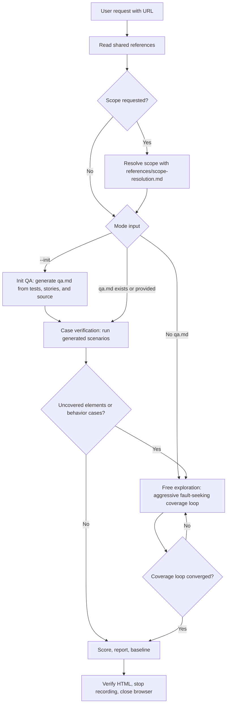

# QA

Systematically test a web page as a user, record evidence for every action, and produce Markdown and HTML QA reports. Free exploration is aggressive fault-seeking QA: it tries boundary inputs, interruption paths, sequence abuse, and recovery behavior. qa.md case verification remains deterministic checklist-style execution. This skill discovers and reports issues only.

## Inputs

- URL: required target page.
- qa.md: optional `<scenario>` file.
- `--init`: generate qa.md from E2E tests, stories, unit/component tests, and relevant source code before verification.
- Output directory: defaults to `~/.config/supermario/qa/YYYY-MM-DD-<qa-name>/`.
- Convergence threshold: default 2 stable passes; set with `--converge-stable-passes N`.
- Browser profile: optional `agent-browser --profile <name-or-path>` only when user-provided or confirmed.
- Recording: enabled by default as `{OUTPUT_DIR}/session.webm` unless the user opts out.

If the user gives a URL, start immediately. Ask only when the URL is missing or the target cannot be opened.

When no output directory is provided, derive a short lowercase `qa-name` from the target host, route, or requested scope. Resolve `{OUTPUT_DIR}` to `~/.config/supermario/qa/YYYY-MM-DD-<qa-name>/`.

The convergence threshold controls how many consecutive passes find no new in-scope elements before coverage stops. Default: `stablePassesRequired = 2`.

## Hard Rules

- Use `agent-browser` directly. Never use `npx agent-browser` or another browser automation tool.
- Do not default to `--profile Default`. Open without a profile unless the user explicitly provides one.
- If the target requires login, ask for a provided or dedicated `agent-browser` profile before QA. Prefer a small profile path such as `~/.agent-browser/profiles/<name>`.
- When a profile is provided, put it before the subcommand on every relevant command.
- Test from the browser only. Never inspect the target app source code to decide whether behavior is correct. In init QA, tests, stories, and source code may be read only to generate coverage hypotheses for qa.md; live browser evidence still decides PASS or FAIL.
- Capture evidence for every action before judging it.
- Treat product-authored operation guidance as actionable exploration input. Guidance from `aria-describedby`, `aria-description`, visible helper text, tooltips, placeholders, and snapshot text must be exercised when in scope, or explicitly skipped with a reason. Do not treat guidance as documentation-only evidence.
- Judge every action from the before, target, and after screenshots plus snapshot diff, console, and errors. Screenshots are not archival-only; the after screenshot must be visually inspected before assigning PASS, FAIL, Pass with issue, Inconclusive, or Excluded.
- Start recording by default before the first exploratory interaction and save it as `{OUTPUT_DIR}/session.webm`.
- Use `agent-browser diff snapshot --baseline` as the primary change detector after each action.
- Check `agent-browser console` and `agent-browser errors` after each interaction.
- Write the report incrementally.
- Do not delete output artifacts mid-session.
- If an issue is not reproducible, mark it intermittent rather than confirmed.

## Required References

Read these shared references before judging or reporting:

- `references/evidence-and-reporting.md`
- `references/behavior-testing.md`
- `references/issue-taxonomy.md`
- `references/stopping-criteria.md`
- `references/scope-resolution.md` when the user asks to focus on part of the page

Then read the mode-specific reference:

| Situation | Read |
|-----------|------|
| User passed `--init` | `references/init-qa.md`, then `references/case-verification.md` |
| qa.md exists or was provided | `references/case-verification.md` |
| No qa.md | `references/free-exploration.md` |
| Scenarios leave uncovered interactive elements | `references/free-exploration.md` |

## Mode Routing



Scope changes where QA explores; it does not change the selected mode. Multi-page exploration stays disabled unless the user explicitly requests multi-page or same-origin following.

## Mode Contract

- Free exploration is aggressive fault-seeking QA by default.
- Case verification is checklist-style and must execute qa.md exactly as written.
- Do not inject boundary inputs, interruption paths, or sequence-abuse actions into qa.md scenarios.
- Aggressive exploration applies to:
  - pure free mode when no qa.md exists;
  - uncovered behavior and elements after qa.md scenario verification;
  - uncovered behavior and elements after init QA self-verification.
- If the user requests `qa.md only`, `scenario only`, `strict verification`, or equivalent language, skip aggressive supplemental exploration and report that uncovered behavior was intentionally not explored.
- Report checklist scenario results separately from aggressive exploration findings.

## Scope Detection

Detect scope before executing any mode. Read `references/scope-resolution.md` when the request describes a component, section, panel, modal, dialog, card, form, chart, table, or says `only`, `focus`, `scope`, `component`, `section`, `panel`, `modal`, `dialog`, `card`, or `form`.

If a scope is resolved, execute the selected mode inside that resolved scope. Scope changes where QA explores; it does not change whether the mode is free exploration, case verification, or init QA.

Use `templates/qa-report-template.md` and `templates/qa-report-template.html` for final artifacts. The HTML template is the only allowed report shell. Do not hand-write a replacement `report.html`; fill or extend the template instead. If the template cannot represent a required report feature, update the template first, then generate the report from it.

## Setup

1. Resolve {OUTPUT_DIR}. If omitted, use `~/.config/supermario/qa/YYYY-MM-DD-<qa-name>/`.
2. Create `{OUTPUT_DIR}/screenshots`, `{OUTPUT_DIR}/diffs`, and `{OUTPUT_DIR}/snapshots`.
3. Detect mode: `--init` generates qa.md then verifies it; provided/existing qa.md runs case verification; otherwise run free exploration.
4. Start recording with `agent-browser record start {OUTPUT_DIR}/session.webm {URL}`, then `agent-browser wait --load networkidle`. If a profile was specified, apply it consistently before the subcommand.
5. If opening reaches login/SSO, ask for a dedicated browser profile. If recording is disabled by user request, use `agent-browser open {URL}` and state that in the report.
6. Capture initial evidence: `agent-browser screenshot --annotate {OUTPUT_DIR}/screenshots/initial.png`, `agent-browser snapshot -i`, the ARIA description scan below, `agent-browser console`, and `agent-browser errors`.

```bash
agent-browser eval '(() => Array.from(document.querySelectorAll("[aria-describedby], [aria-description]")).map(el => { const ids = (el.getAttribute("aria-describedby") || "").split(/\s+/).filter(Boolean); const text = node => (node?.textContent || "").replace(/\s+/g, " ").trim(); const selector = el.getAttribute("data-testid") ? `[data-testid=${JSON.stringify(el.getAttribute("data-testid"))}]` : el.id ? `#${CSS.escape(el.id)}` : el.tagName.toLowerCase(); return { selector, tag: el.tagName.toLowerCase(), role: el.getAttribute("role") || "", ariaLabel: el.getAttribute("aria-label") || "", text: text(el).slice(0, 160), ariaDescription: el.getAttribute("aria-description") || null, ariaDescribedBy: ids.map(id => { const target = document.getElementById(id); return { id, found: !!target, tag: target?.tagName.toLowerCase() || null, text: text(target) }; }) }; }))()' > {OUTPUT_DIR}/snapshots/initial-aria-descriptions.json
```
7. Count interactive elements by role and infer behavior testing models using `references/behavior-testing.md`.

## Execution

Follow the selected reference exactly:

- For free exploration, run the queue and action strategy in `references/free-exploration.md`.
- For qa.md verification, parse and execute scenarios with `references/case-verification.md`.
- For `--init`, generate qa.md with `references/init-qa.md`, then immediately verify the generated scenarios.

When case verification completes, free-explore uncovered interactive elements and behavior testing cases unless strict qa.md-only verification was requested.

## Coverage Applicability

Coverage applies by mode:

- Free exploration: required and aggressive. Maintain `coverage.json` and run the convergence loop for fault-seeking behavior variants plus element coverage.
- Scoped free exploration: required and aggressive, but only inside the resolved scope and overlays triggered by that scope.
- Case verification: checklist first. Execute qa.md exactly as written, then run aggressive supplemental exploration for uncovered in-scope behavior and elements unless the user requested strict qa.md-only verification.
- Scoped case verification: checklist first. Supplemental aggressive exploration is limited to uncovered in-scope behavior, in-scope elements, and overlays triggered by that scope.
- Init QA: generate qa.md, verify generated scenarios exactly, then run aggressive supplemental exploration for uncovered behavior and elements unless the user requested strict generated-scenario verification only.
- Multi-page: disabled unless the user explicitly requests multi-page or same-origin following.

## Cleanup

After all required interactions are complete:

1. Compute the final 8-dimension health score using `references/evidence-and-reporting.md`.
2. Re-read the report and make summary counts match actual issues.
3. Generate `{OUTPUT_DIR}/report.html` from `{OUTPUT_DIR}/report.md` by starting from `templates/qa-report-template.html`. Every step and issue must link real evidence images. Preserve the template shell, log filtering/search, click-to-zoom screenshots, and `{OUTPUT_DIR}/session.webm` embedding/linking when recording is enabled.
4. Save `{OUTPUT_DIR}/baseline.json`.
5. Verify `report.html` renders and preserves template markers including `.hero`, `.tldr`, `.score-grid`, `.log-filter`, `.step-photos`, `[data-log-filter]`, `[data-log-search]`, `mediumZoom` or `window.qaImageZoom`, and `<video ... session.webm ...>`.
6. Stop recording with `agent-browser record stop` and close with `agent-browser close`; use the profile prefix when a profile was used.
7. Ask whether to create or update qa.md from discovered actions and observed expected behavior; skip if the user declines.

## Artifacts

Write `{OUTPUT_DIR}/report.md`, `{OUTPUT_DIR}/report.html`, `{OUTPUT_DIR}/baseline.json`, `{OUTPUT_DIR}/session.webm`, and evidence under `screenshots/`, `diffs/`, and `snapshots/`.
