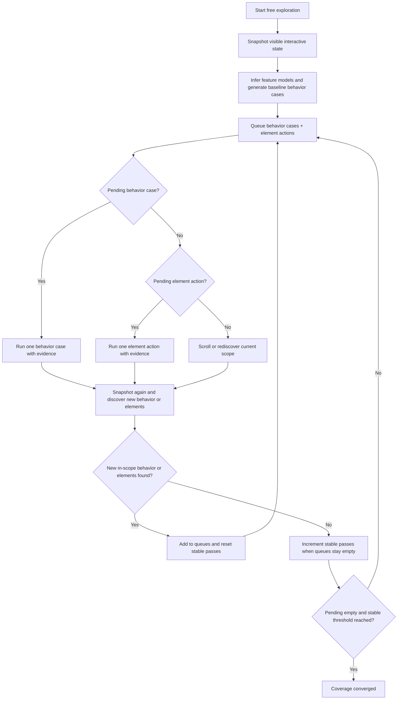

# Free Exploration

Use this mode when no qa.md exists, or after case verification to cover behavior and interactive elements that scenarios did not exercise. Free exploration is aggressive exploratory QA: it seeks bugs by exercising normal workflows plus boundary inputs, interruption paths, sequence abuse, recovery behavior, state consistency, and console/error risk.

## Coverage Ledger

Free exploration must maintain `{OUTPUT_DIR}/coverage.json`. Do not rely on conversation memory to decide what remains.

Use this shape:

```json
{
  "scope": null,
  "status": "running",
  "coverageThresholds": {
    "stablePassesRequired": 2
  },
  "stablePasses": 0,
  "rawInteractiveElements": {
    "initial": 0,
    "latest": 0,
    "distribution": {}
  },
  "coverageActions": {
    "discovered": 0,
    "visited": 0,
    "skipped": 0,
    "outOfScope": 0,
    "pending": 0
  },
  "behaviorCases": {
    "planned": [],
    "pending": [],
    "tested": [],
    "skipped": [],
    "variants": {
      "normal": 0,
      "boundary": 0,
      "interruption": 0,
      "sequence": 0,
      "recovery": 0,
      "state": 0,
      "console-risk": 0
    }
  },
  "discovered": [],
  "pending": [],
  "visited": [],
  "skipped": [],
  "outOfScope": [],
  "halted": null
}
```

Example behavior case:

```json
{
  "key": "scope|composer|trigger sequence|at|interruption",
  "model": "composer",
  "behaviorName": "trigger sequence",
  "variant": "interruption",
  "intent": "fault-seeking",
  "riskLevel": "high",
  "status": "pending",
  "reason": "Popover cancellation can leave stale query text, broken focus, or inconsistent editor state."
}
```

`coverageThresholds.stablePassesRequired` defaults to 2. If the user sets `--converge-stable-passes N` or gives an equivalent natural-language instruction, use that value and record it in `coverage.json`.

`rawInteractiveElements` counts current browser snapshot elements by role. `coverageActions` counts planned interaction traits/actions derived from those elements. Do not label coverage action counts as element counts in the report.

Generate behavior cases with `references/behavior-testing.md` before executing raw element actions. Behavior cases are not optional polish; they are part of QA testing.

Each coverage action uses a stable key:

```text
scopeKey + "|" + path + "|" + role + "|" + accessibleName + "|" + nearbyText + "|" + actionKind
```

Do not use `@eN` as the stable key. Refs are only valid for the current snapshot.

## Fault-Seeking Variants

Every behavior case should record one `variant`. Use these product-agnostic variants:

| Variant | Meaning |
|---------|---------|
| `normal` | Prove the basic happy path still works. |
| `boundary` | Try edge input or limits: empty, whitespace, long text, non-ASCII, emoji, special characters, multiline, invalid value, or no-match query. |
| `interruption` | Interrupt an in-progress workflow with Escape, outside click, focus change, close control, cancel control, or route-safe dismissal. |
| `sequence` | Combine or repeat actions: open-close-reopen, trigger A then trigger B after cleanup, select then continue typing, delete then retry. |
| `recovery` | Verify the UI remains usable after cancel, failed validation, no-match state, dismissed overlay, or skipped unsafe action. |
| `state` | Check visible state consistency: focus, selected, expanded, disabled, busy, checked, pressed, invalid, counters, badges, chips, or placeholder state. |
| `console-risk` | Treat the interaction as likely to expose console errors, warnings, rejected promises, or failed critical requests. |

Use `intent: "fault-seeking"` for behavior cases generated to find bugs. Use `intent: "coverage"` only for mechanical element actions that do not represent a user-facing behavior.

## Queue

1. Run `agent-browser snapshot -i --json`.
2. Normalize each visible enabled interactive element into a stable key.
3. Infer feature models and add behavior cases from `references/behavior-testing.md` to `behaviorCases.planned` and `behaviorCases.pending`.
4. Expand each high-risk behavior model into fault-seeking variants before adding mechanical element actions.
5. Add unseen in-scope elements to `discovered` and `pending` only after behavior case generation.
6. Sort `behaviorCases.pending` by risk first (`high`, `medium`, `low`), then by user workflow order, then sort `pending` top-to-bottom, left-to-right when position is known; otherwise keep snapshot order.
7. Before each action, rematch the stable key to the current `@eN`.
8. Move completed work from `behaviorCases.pending` to `behaviorCases.tested` or `behaviorCases.skipped`, and from `pending` to `visited`, `skipped`, or `outOfScope`.
9. After every interaction, run `agent-browser snapshot -i --json` again and add newly revealed in-scope behavior cases or elements to the queues.

## Coverage Loop Overview

Free exploration is not element-only traversal. It starts by generating baseline behavior cases from `references/behavior-testing.md`, then runs one coverage loop that prioritizes behavior testing before mechanical element actions.



The loop may execute element actions, but fault-seeking behavior cases remain first-class work. Do not report free exploration as complete while `behaviorCases.pending` contains untested high-risk or medium-risk cases. Low-risk cases may be skipped only with a clear reason in `behaviorCases.skipped`.

## Per-Element Workflow

For each queued element:

1. Screenshot before:

```bash
agent-browser screenshot {OUTPUT_DIR}/screenshots/step-{NNN}.png
```

2. Capture the baseline snapshot:

```bash
agent-browser snapshot > {OUTPUT_DIR}/snapshots/step-{NNN}-before.txt
```

3. Highlight the target element and capture the target screenshot:

```bash
agent-browser highlight @eN
agent-browser screenshot {OUTPUT_DIR}/screenshots/step-{NNN}-target.png
```

4. Execute the operation based on the element role.
5. Wait for the page to settle:

```bash
agent-browser wait 1000
```

6. Screenshot after:

```bash
agent-browser screenshot {OUTPUT_DIR}/screenshots/step-{NNN}-after.png
```

7. Capture the snapshot diff:

```bash
agent-browser diff snapshot --baseline {OUTPUT_DIR}/snapshots/step-{NNN}-before.txt > {OUTPUT_DIR}/diffs/step-{NNN}.txt
```

8. Run `agent-browser snapshot` only if the diff needs more context.
9. Save console and error output:

```bash
agent-browser console > {OUTPUT_DIR}/console-step-{NNN}.txt
agent-browser errors > {OUTPUT_DIR}/errors-step-{NNN}.txt
```

10. Compare `console-step-{NNN}.txt` against `console-initial.txt` and the previous step's console output. Treat any new console delta as an issue candidate unless it is clearly benign test noise and documented as ignored. New `[error]`, unhandled promise rejection, failed critical request, and React duplicate key warning output such as `Warning: Encountered two children with the same key` must be reported or explicitly justified.
11. Judge the interaction against the 7-item checklist and `references/issue-taxonomy.md`.
12. If an issue is found, assign `ISSUE-NNN`, capture an annotated screenshot, and append it to the report immediately.
13. Write the step to the report. The report entry must include `` tags (HTML) or `` (Markdown) linking the before screenshot (`step-{NNN}.png`), target screenshot (`step-{NNN}-target.png`), after screenshot (`step-{NNN}-after.png`), and annotated screenshot if any. A step without screenshot links is incomplete.

## Convergence Loop

Continue until the queue converges:

1. If `behaviorCases.pending` has an item, process exactly one behavior case using the same evidence workflow.
2. If `pending` has an item, process exactly one item through the per-element workflow.
3. After the action, discover again with `agent-browser snapshot -i --json`.
4. If new in-scope stable keys or behavior cases appear, add them to the appropriate pending queue and set `stablePasses` to 0.
5. If both pending behavior cases and pending element actions are empty, scroll the scope container. If no scope exists, scroll the page.
6. Discover again with `agent-browser snapshot -i --json`.
7. If no new stable keys or behavior cases appear, increment `stablePasses`.
8. If new stable keys or behavior cases appear, add them to pending and set `stablePasses` to 0.
9. Stop only when `pending` is empty, `behaviorCases.pending` is empty, `stablePasses >= coverageThresholds.stablePassesRequired`, the scroll boundary is reached, and no open menu, popover, or dialog remains unexplored.

For scoped exploration, apply every convergence check only to the resolved scope and to overlays triggered by that scope.

## P0 Halt

If an interaction appears to trigger a P0 bug:

1. Mark the issue as `critical` and `P0 candidate`.
2. Capture after screenshot, target screenshot, snapshot diff, console, and errors.
3. Attempt one minimal reproduction from a clean page state:

```bash
agent-browser reload
agent-browser wait 1000
```

4. Repeat only the shortest action sequence that caused the P0.
5. If reproduced, mark the issue as `confirmed P0`.
6. Set `coverage.json.status` to `halted`.
7. Set `coverage.json.halted`:

```json
{
  "issueId": "ISSUE-001",
  "reason": "confirmed P0: submit causes unrecoverable blank screen",
  "lastStep": "step-007",
  "remainingPending": 12
}
```

8. Stop coverage. Do not continue exploring polluted state.

If the issue does not reproduce, mark it intermittent and continue only if the page returns to a trustworthy state.

## Action Strategy

| Role | Action | Details |
|------|--------|---------|
| button | `agent-browser click @eN` | Wait up to 2s and observe the response |
| textbox / searchbox | `agent-browser type @eN "content"` | Use meaningful values: emails get `test@example.com`, search gets `test query` |
| combobox | `agent-browser click @eN` then select an option | Screenshot the opened options before choosing |
| checkbox / switch | `agent-browser click @eN` | Toggle once, then observe state and dependent UI |
| radio | `agent-browser click @eN` | Select one option in the group |
| menuitem | `agent-browser click @eN` | Open the menu first, then click the item |
| slider | `agent-browser eval` or drag | Move to a midpoint or clearly different value |
| tab | `agent-browser click @eN` | Verify the selected panel changes |
| dialog | `agent-browser dialog accept` or `agent-browser dialog dismiss` | Record dialog text before responding |

## 7-Item Checklist

- Console: no new JavaScript errors, React warnings, unhandled promise rejections, failed critical requests, or unexplained console delta.
- Functional: the action produces the expected state change or clear feedback.
- Visual: no overlap, clipping, layout jump, unreadable state, or broken media appears.
- UX: the interaction is discoverable, reversible when appropriate, and gives timely feedback.
- Accessibility: the element has a meaningful role/name/state and keyboard-visible behavior remains coherent.
- Content: copy is accurate, complete, and not placeholder text.
- Performance: the page responds within a reasonable time and does not appear stuck.

## Skip Rules

Do NOT interact with:

- Links that navigate to external domains.
- Download links.
- Disabled or hidden elements.
- Elements already covered by a previous action or scenario.
- Destructive actions unless the page clearly provides a safe sandbox or confirmation path.

If a skipped element looks risky or important, mention it in the report as skipped with the reason.

## Scrolling And Stopping

After visible elements are explored, scroll through the page and run `agent-browser snapshot -i` again. Add newly visible interactive elements to the queue.

Stop only when:

- All non-skipped visible interactive elements have before/after evidence.
- Newly revealed elements from scrolling or opened panels have been handled.
- `references/stopping-criteria.md` is satisfied.
