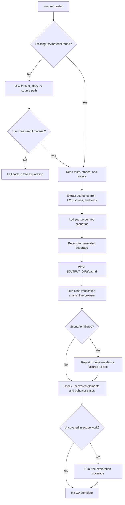

# Init QA

Use this mode when the user passes `--init`. Generate qa.md from existing E2E tests, stories, unit or component tests, and relevant source code, then immediately run case verification with the generated file.

## Init QA Flow



Existing tests, stories, and source only expand generated scenario coverage. Browser evidence still decides every PASS or FAIL.

## Detect Existing QA Material

Scan the project root for common directories and files:

| Path Pattern | Source Type |
|--------------|-------------|
| `cypress/e2e/` | Cypress |
| `e2e/` | Playwright |
| `tests/e2e/` | Playwright |
| `playwright/` | Playwright |
| `stories/` | Storybook / component examples |
| `*.stories.*` | Storybook / component examples |
| `__tests__/` | Unit or component tests |
| `*.test.*` | Unit or component tests |
| `*.spec.*` | Unit, component, or E2E tests |
| `src/`, `app/`, `pages/`, `components/` | Relevant source code |

```bash
ls -d cypress/e2e e2e tests/e2e playwright stories __tests__ src app pages components 2>/dev/null
rg --files | rg "(\\.stories\\.|\\.test\\.|\\.spec\\.|/stories/|/e2e/|/tests/e2e/)"
```

If none are found, ask the user for a test, story, or source path. If the user has no useful existing QA material, fall back to normal free exploration.

## Detect Relevant Source

After detecting existing QA material, locate source files that implement the requested page, route, story, or resolved scope. Source reading is required in init QA because tests and stories often cover only happy paths and miss component-specific behavior.

Use lightweight repository search before opening files:

```bash
rg -n "{route|story-id|component-name|visible-label|test-id}" src app pages components stories test tests e2e 2>/dev/null
rg --files | rg "(src|app|pages|components|stories|storybook|\\.stories\\.|\\.tsx$|\\.jsx$|\\.vue$|\\.svelte$)"
```

Read only the files needed to understand the target surface:

- Route, page, or story file for the URL under test.
- Component files that render in-scope controls.
- Storybook stories, fixtures, mocks, decorators, play functions, and args that reveal variants or states.
- Unit and component tests that reveal props, keyboard behavior, edge cases, validation, state transitions, or expected empty/error states.
- Local hooks, reducers, state machines, command registries, picker data sources, validation schemas, and keyboard handlers used by those components.
- Shared UI primitives only when the page behavior depends on them, such as popover close behavior, combobox filtering, token deletion, or upload handling.

Do not bulk-read the entire repository. Prefer the smallest source slice that explains what controls exist and which workflows are possible.

Source code is an input for generating scenario coverage, not a substitute for browser evidence. Never mark behavior PASS or FAIL because the source says so. Generated expectations from source are hypotheses that must be verified against the live page with screenshots, snapshot diffs, console, and errors.

## Extract Scenarios

For each detected E2E, story, unit test, or component test file:

- Use `describe`, `it`, `test`, `scenario`, story names, or Storybook export names as scenario names.
- Use `page.goto()`, `cy.visit()`, or equivalent navigation calls as the scenario `url`.
- Convert interaction calls into `<action>` entries.
- Convert assertions into `<expect>` entries.
- Convert selectors into natural-language descriptions when possible.
- Convert story args, fixtures, and play functions into source-backed action/expect pairs when they describe visible user states.

Interaction mappings:

| Framework | Source | Generated action |
|-----------|--------|------------------|
| Cypress | `cy.get().click()` | `Click {element}` |
| Cypress | `cy.get().type()` | `Fill {field} with {value}` |
| Cypress | `cy.contains().click()` | `Click {text}` |
| Playwright | `page.click()` | `Click {element}` |
| Playwright | `page.fill()` | `Fill {field} with {value}` |
| Playwright | `locator.click()` | `Click {element}` |
| Playwright | `locator.fill()` | `Fill {field} with {value}` |
| Jest/Vitest | `fireEvent.click()` | `Click {element}` |
| Testing Library | `userEvent.type()` | `Fill {field} with {value}` |
| Testing Library | `userEvent.click()` | `Click {element}` |
| Storybook | `play()` interactions | Convert each user-visible interaction to `<action>` |
| Storybook | story `args` / variants | Convert visible state or variant to `<expect>` |
| RSpec | `click_button` / `click_link` | `Click {label}` |
| RSpec | `fill_in` | `Fill {field} with {value}` |

Assertion mappings:

| Framework | Source | Generated expectation |
|-----------|--------|-----------------------|
| Cypress | `cy.contains('text')` | `Text "text" appears` |
| Cypress | `cy.get('.error').should('be.visible')` | `Error message is visible` |
| Playwright | `expect(page.locator()).toContainText('text')` | `Contains text "text"` |
| Playwright | `expect(page).toHaveURL('/path')` | `Navigates to /path` |
| Jest/Vitest | `expect(element.textContent).toContain('text')` | `Contains text "text"` |
| Testing Library | `expect(screen.getByRole(...)).toBeVisible()` | `{role/name} is visible` |
| Storybook | `expect(canvas.getByText('text'))` | `Text "text" appears` |
| RSpec | `expect(page).to have_text('text')` | `Contains text "text"` |

When a test has multiple actions before its first assertion, add neutral expectations such as `No error appears` after intermediate actions.

## Add Source-Derived Scenarios

After extracting scenarios from E2E, stories, and tests, read the relevant source files and add scenarios for behaviors that are visible in source but missing from existing QA material.

Look for:

- Trigger characters and token flows: mentions, slash commands, emoji, macros, file references, chips, or structured editor tokens.
- Toolbar entries that open the same flows as typed triggers.
- Picker behavior: filtering, no-match states, selected options, disabled options, Escape close, outside click close, keyboard navigation, and selection.
- Form and editor boundaries: empty submit state, long text, multiline text, paste, non-ASCII text, emoji, leading/trailing whitespace, Backspace/Delete, Escape, and reset behavior.
- State transitions: disabled/enabled controls, queued counters, loading/busy states, selected values, collapsed/expanded sections, badges, and inline edit modes.
- Validation and errors: required fields, invalid values, permission states, rejected uploads, unavailable repositories, and empty states.
- Safe contained actions in menus, popovers, dialogs, and dropdowns.

Convert each discovered behavior into user-facing action/expect pairs. Use visible labels, ARIA names, placeholder text, and product language instead of implementation names when possible.

If source reveals a behavior but the expected result is ambiguous, write the narrowest observable expectation, such as:

```xml
<action>Type @zzzz-no-match in the editor</action>
<expect>The reference picker shows a no-match or empty state without clearing the typed query</expect>
```

Do not write expectations that require inspecting internal state. Every `<expect>` must be judgeable from the browser page, accessibility snapshot, screenshot, console, or errors.

## Reconcile Generated Coverage

Merge E2E-derived, story-derived, unit/component-test-derived, and source-derived scenarios before writing qa.md:

- Keep E2E scenarios as the backbone for complete user journeys.
- Use stories to add component variants, visual states, empty/error states, and interaction play flows.
- Use unit and component tests to add edge cases, keyboard behavior, state transitions, and validation expectations.
- Use source-derived scenarios for uncovered controls and behavior variants that are not visible in tests or stories.
- If multiple sources imply the same behavior, keep one scenario and enrich it with missing edge cases.
- If sources disagree, keep both expectations only when they describe distinct user-visible states; otherwise record the conflict in the report and verify the live page.
- Tag scenario names clearly enough to show origin, such as `checkout valid card from E2E`, `composer empty state from Storybook`, `picker keyboard behavior from unit test`, or `composer slash command from source`.

## Generated qa.md Shape

```xml
<scenario name="login with wrong password" url="/login">
  <action>Fill email with test@example.com</action>
  <expect>No error appears</expect>

  <action>Fill password with wrong-password</action>
  <expect>No error appears</expect>

  <action>Click the submit button</action>
  <expect>An error message appears: "Email or password is incorrect"</expect>
</scenario>
```

Write generated qa.md to `{OUTPUT_DIR}/qa.md`.

## Scope And Coverage

If a resolved scope exists before init QA:

- Generate qa.md only from E2E actions, story states, unit/component expectations, and source-derived behavior that apply to the resolved scope when that relationship can be determined.
- Generate source-derived scenarios only from source files and controls that apply to the resolved scope.
- If existing tests or stories cannot be mapped to the resolved scope, keep the generated qa.md complete but mark out-of-scope scenarios before execution.
- After generated qa.md self-verification, run coverage for uncovered elements.
- In scoped init QA, uncovered coverage is limited to in-scope elements.

## Self-Verify

After generating qa.md:

1. Read `references/case-verification.md`.
2. Execute all generated scenarios against the live page.
3. Include this line in the report: `Generated N scenarios from E E2E files, T unit/component test files, B story files, and S source files. Self-verify: X PASS, Y FAIL`.
4. Treat FAIL results as drift between generated expectations and browser behavior.
5. When a FAIL comes from a story-derived, test-derived, or source-derived expectation, cite the generated scenario name but use only browser evidence in the issue block.

Ask whether the user wants to keep or edit the generated qa.md only after self-verification completes.
