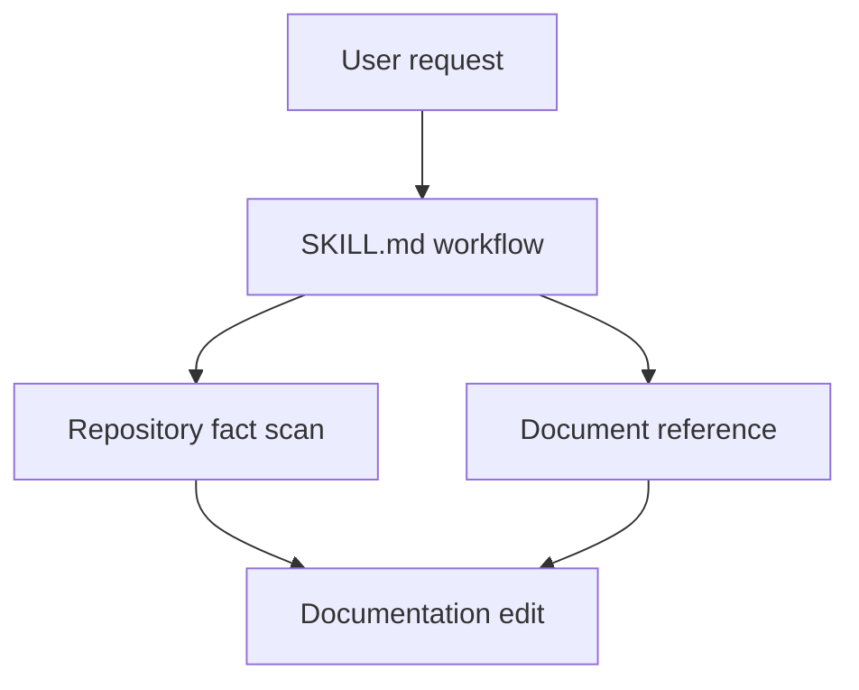

# Architecture Reference

Architecture docs explain the system shape so a reader can make changes without reading every file first.

## Reader Questions

Answer:

1. What is inside the system boundary?
2. What is outside the boundary?
3. What are the main modules?
4. How does data or control move through the system?
5. Which design decisions matter?
6. Where should a new feature fit?

## Recommended Shape

Use sections that match the repository:

- System Boundary.
- Module Map.
- Data Flow or Request Flow.
- Key Decisions.
- Extension Points.
- Non-Goals.
- Operational Notes.

Skip sections that do not apply.

## System Boundary

State what the project owns and what it relies on:

```markdown
## System Boundary

This package owns documentation generation from local repository files. It does not host documentation, publish packages, or manage remote CI state.
```

## Module Map

Name modules from real directories or files. Include each module's responsibility.

```markdown
| Module | Responsibility |
| --- | --- |
| `skills/write-docs/SKILL.md` | Routes document requests and defines the writing workflow. |
| `skills/write-docs/references/` | Stores document-specific writing rules. |
```

## Diagrams

Use Mermaid when a diagram reduces reading effort.

Prefer this:



Do not draw diagrams from guesses. Read the files first.

## Data Flow or Request Flow

Trace one real path:

```markdown
## Documentation Flow

1. The user names a document or target file.
2. The skill infers the document type.
3. The skill scans repository facts.
4. The skill reads the matching reference.
5. The skill writes or edits the document.
6. The skill self-checks facts, style, options, and links.
```

## Key Decisions

Explain decisions with consequences:

```markdown
## Key Decisions

### References Stay Separate

`SKILL.md` handles workflow, while `references/*.md` handles document-specific judgment. This keeps the skill readable and lets README rules evolve without rewriting architecture or tutorial guidance.
```

## Options and Configuration

If architecture explains configuration, connect options to design:

```markdown
Configuration is normalized at startup, then passed into the renderer as a single object. This keeps output deterministic and prevents deep modules from reading environment state directly.
```

If an options table appears, use:

```markdown
| Option | Type | Default | Example | Description |
| --- | --- | --- | --- | --- |
```

## Architecture Self-Check

Before finishing, verify:

- Every module name comes from a real file or directory.
- Every diagram matches the described modules.
- Data flow steps name real boundaries.
- Key decisions explain trade-offs, not preferences alone.
- Non-goals prevent common misreadings.
